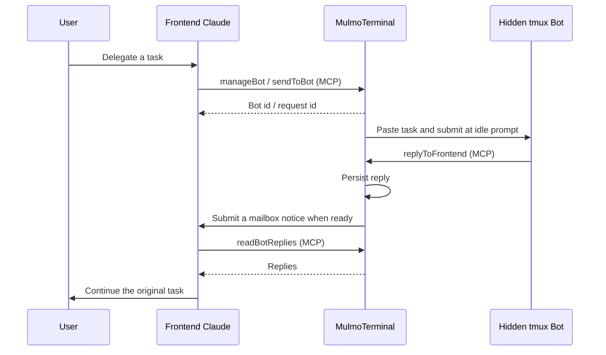

# Background Bots

A Bot runs interactive Claude Code in a persistent tmux session. It has no terminal in MulmoTerminal. Ask the frontend to use the `bot` skill to create, list, send tasks, compact, or kill Bots.

Example: “Create a Bot to inspect the tests, and ask it to identify coverage gaps.” The frontend creates it, queues the request, and can continue another task. Once the Bot replies, the frontend automatically starts another turn to read the result and report what matters. You do not need to send “any updates?”.



MCP receipt alone does not run a frontend turn. The host sends a fixed mailbox notice through its existing PTY, then the frontend reads the actual reply through MCP. A hook-backed input lease delays automatic input during work, drafts, dialogs, and concurrent typing. Queued requests execute one at a time per Bot. `/compact` joins the same queue; its role remains in the appended system instructions.

The first version runs **Claude Bots** in tmux and defaults to the creating frontend's working directory. Creating Bots, sending tasks, and compacting require a live Claude frontend for automatic replies. Other frontend sessions can list or inspect Bots, respond to CLI questions, kill Bots, and read their own replies. It uses neither `-p` nor a model polling loop. Other CLI adapters need their own reliable idle/draft/submit signals before automatic wakeup is enabled.

Creation accepts optional `cwd` to start in another existing directory. Use an absolute path or `~/...` (expanded on the host). Omitting it preserves the frontend-directory default; relative, missing or non-directory paths are rejected before creating a Bot. The selected directory is persisted for restart and is used for the Bot's directory configuration. It does not change when another terminal contacts the Bot.

```json
{ "action": "create", "name": "mag2-bot", "role": "Edit Life is Beautiful articles", "cwd": "~/git/ai/mag2" }
```

Bot state and mailboxes live in `~/.mulmoterminal/bots/<port>/state.json`. Durable markers in `~/.mulmoterminal/bot-sessions/` also hide transcripts after kill or compaction. A host restart reconnects surviving tmux sessions. The host restores Bot readiness after a lifecycle signal or two stable tmux captures of a recognized idle, empty input box (dim suggestions are allowed). Busy screens, drafts, dialogs and unknown layouts keep delivery pending. This screen recovery is limited to surviving hidden Bots. Reattached frontend drafts are conservatively considered occupied until a user submits a turn. Missed Bot turns become explicit errors when a later idle signal arrives; uncertain requests are never blindly replayed. Pending mailbox notifications may be repeated after a crash; reply ids support deduplication.

Bots obey existing CLI permissions. A login, trust, or permission dialog may block a hidden Bot; list its state and explain the setup issue while preserving its context. Do not automatically kill or recreate a Bot after an error. There is no Bot terminal and the host never automatically approves permission dialogs. Bots are shared across terminals connected to the same MulmoTerminal server (port). Each request records its requesting conversation: replies, questions, compact completion, and interruption errors go only to that conversation. The Bot retains its original directory and shared context. Any frontend terminal can list, inspect, answer CLI questions, or explicitly kill it; sending tasks and compacting require a live Claude frontend. Running Bot names are unique across the server; duplicate creation returns the existing Bot details without modifying it. When a saved id has ended, refresh the list and select the current Bot instead of creating another one. Existing v1/v2 state is migrated automatically to v3, preserving the destinations of old requests and unread replies.

## CLI questions without an open frontend

The host persists CLI questions separately from task results. A question does not complete or discard the original task. `manageBot` list includes `waitingPrompt`, and `inspect` exposes the question, its option ids, answer state, and incomplete request ids. Any frontend on the same server can inspect and answer it, including when the original terminal has been closed. The original requester's mailbox retains notifications until they can be delivered/read; another frontend discovers outstanding questions through the shared list.

```json
{ "action": "inspect", "botId": "<bot-id>" }
{ "action": "respond", "botId": "<bot-id>", "promptId": "<current-prompt-id>", "optionId": "1" }
```

Only the first response claims the question. The host commits that claim before writing keys, checks the current menu before each navigation step and Enter, and holds the Bot until lifecycle/idle evidence shows the dialog has ended. Stale ids, changed screens, competing tmux clients, and uncertain answers are not blindly retried. A crash during the answer preserves uncertainty rather than sending Enter again. Capture and Enter are consecutive on the host, but the external CLI can redraw independently; the terminal protocol has no atomic compare-and-submit operation. A host input lease cannot freeze the CLI.

Creation accepts `resumePolicy: "summary"` (the default) or `"ask"`. The default automatically chooses the summary option on a specifically recognized Claude resume dialog after stable observations, without needing a frontend. It does not choose “Don't ask me again” or alter global Claude settings. `ask` leaves the decision as a durable CLI question. Ordinary context auto-compaction remains Claude's own feature.

Known numbered single-choice menus can be answered by option id within the user's authorization. Wrapped/multiselect/free-text/login screens that do not match the supported parser are recorded with no executable options. The host also records a diagnostic when a request has no observed lifecycle progress or screen change for two minutes; this does not prove the CLI has stopped. These states appear as `needs_attention`, with the task preserved and no arbitrary keys or task replay. This adapter does not claim universal support for future Claude dialogs. The screen/input tests use representative layouts; a real expired-cache resume dialog still needs live verification.

## 日本語

Botはtmux上で動くClaude Codeの対話セッションです。ターミナルとして表示されず、ユーザーはフロントのClaudeとの会話だけで操作します。

「Botを作ってテストの不足を調べて」と依頼すると、フロントがBotを作成して仕事を渡します。結果はMCP経由で保存され、フロントが待機中になったら自動的に続きを開始します。ユーザーが「終わった？」と聞く必要はありません。入力途中や確認ダイアログ中は返信の通知を保留します。

`bot`スキルで一覧・作成・依頼・compact・killを操作できます。compactしてもBotの役割と識別子は維持されます。初期版はフロントとBotの両方がClaudeの場合に対応します。再起動後やCLIの確認待ちで状態を判定できない場合は保留し、依頼を勝手に再実行しません。

作成時の `cwd` はオプションです。`cwd: "~/git/ai/mag2"` のように指定すると、そのディレクトリと設定で起動します。絶対パスまたは `~/...` を指定でき、省略時は会話の作業ディレクトリを継承します。存在しないパスやファイル、相対パスは作成前に拒否します。別のセルを開く必要はありません。指定したディレクトリは再起動後も維持され、既存Botのディレクトリを変更するものではありません。

同じMulmoTerminalサーバー内の複数ターミナルから、同じBotを一覧・利用・compact・killできます。返信はBotを作成したターミナルではなく、その仕事を依頼したターミナルに届きます。Botの作業ディレクトリとコンテキストは共通で、別ポートのサーバー間では共有しません。

稼働中のBot名はサーバー内で一意です。同名での作成は既存Botの情報を返して拒否し、役割やコンテキストを変更しません。送信先が終了済みなら一覧を取り直し、現在のBot IDを選びます。送信エラーや状態不明を理由に自動でkill・再作成しません。すでに重複しているBotは自動削除せず、ユーザーが選びます。

再起動後、隠れたBotはライフサイクル通知、または入力欄が空で待機中と確認できるtmux画面の安定した2回の読み取りで復帰します。入力候補の薄い文字は許容しますが、入力途中・実行中・ダイアログ・未知の画面では送信を保留します。通常のフロントterminalの入力保護は維持します。

CLIの確認待ちもサーバーに保存します。Bot一覧の `waitingPrompt` または `manageBot` の `inspect` で質問を取得し、別のterminalからも `respond` に質問IDと選択肢IDを渡して回答できます。最初の回答だけを適用し、確認待ちの間も元の依頼を保持します。元のterminalを開き直す必要はありません。画面確認とEnter送信はホスト内で連続して行いますが、CLI側の独立した画面更新を停止する仕組みはなく、確認と送信の完全な原子性は保証できません。

既定の `resumePolicy: "summary"` では、対応する「要約から再開」の確認画面だけを認識して自動選択します。`"ask"` ならフロントからの回答を待ちます。その他の確認には自動回答しません。画面が変わった場合や回答結果が不明な場合は再入力せず、状態を残します。認識できない画面は診断情報として通知し、Botのterminalは表示しません。
