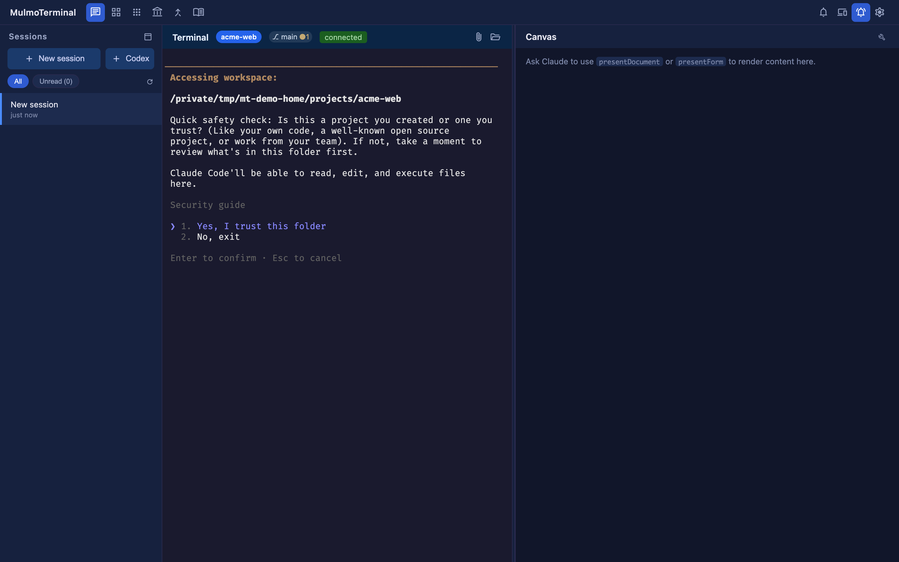
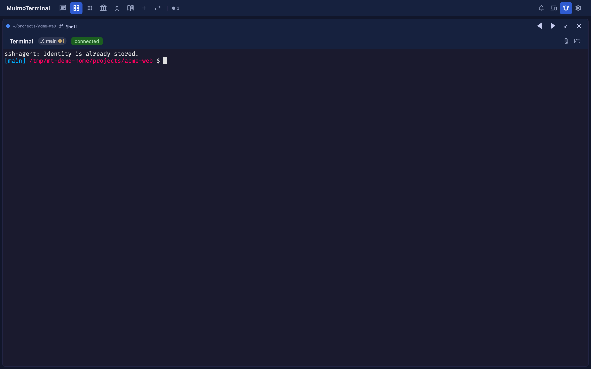
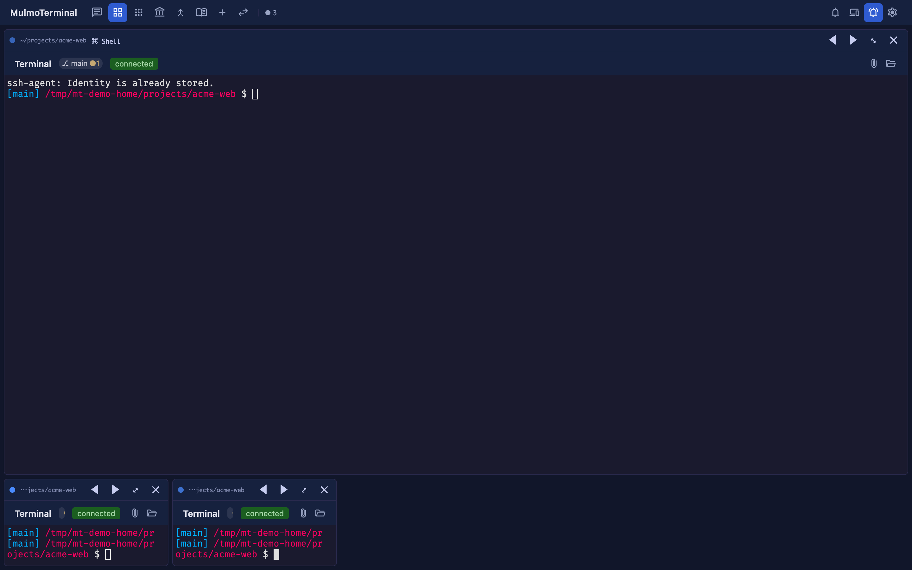

# Basics — what you can do in the grid today
{: .no_toc }

- TOC
{:toc}

---

## The grid is "a board of agents"

The grid view is the screen for **supervising many AI agents in parallel**. Each cell is one independent
agent (or terminal). While one is thinking, you push another cell forward and pick up **only the ones that
call you** — **amber** for a cell awaiting input or a permission, a **blue ring** for a turn that finished and
awaits review — the goal is to run many agents solo instead of babysitting them all.

MulmoTerminal has two display modes; switch between them with the **chat / grid** icons in the top toolbar.

- **Single view** — the screen for **focusing** on one agent (conversation on the left, a GUI panel on the right for diagrams, forms, images, documents, video, and more).
- **Grid view** — the screen for **supervising many agents at once**, tiled side by side. This is the star of this guide.

## Launching an agent (launcher form)

Empty cells in the grid show a **launcher form**. This is where you choose **what** to run and **where**.

| Part | Role |
|---|---|
| **Claude / Codex** toggle | Choose the **agent** to run in this cell |
| **WORKING DIRECTORY** | Enter the working directory (`▶` to launch). Frequently used directories are offered as clickable *cwd preset* **chips** that fill the field (the chip's ▶ launches right away) |
| **Model picker** (when Claude is selected) | Pick the backend / model for this session only (→ [providers](providers.html)) |
| **OR ISOLATE IN A WORKTREE** | In a git repo, enter a task name and hit **＋ New worktree** to create an isolated worktree and launch there |
| **OR LAUNCH** | Start a non-agent **launch command** (`Shell` / `codex` / anything) as a persistent terminal |

## Reading a cell — "what each agent is doing and where"

The header of a running cell has two rows. Together they capture that agent's **status, location, and current work**.

- **Row 1 (info):** status dot, directory, git chip (`⎇ branch ●changes`), **model / context size**,
  what that agent is **doing right now**, and expand / close.
- **Row 2 (controls):** connection status, 📎 insert a file path, 📂 reveal in the file manager (the default
  buttons — [replaceable in config](config.html#header)), GitHub, and the **timeline 🕘** (tool-call history).

> **Status shows up as color.** A bluish border means **working** (thinking), **amber means awaiting input or a
> permission** (Needs input), a **blue ring + glow means a finished, unreviewed turn** (Done — review; a green dot
> in the thumbnails), and neutral means idle. A sound plays too, so you know you've been **called without watching
> the screen**. This is the heart of the grid.

## Tiling many, pages, and reordering

- Add cells with **New terminal (＋)** in the toolbar. Up to **9 cells** per page; overflow moves to the next page (tab).
- Enter reorder mode with **Toggle grid cell ordering**, then swap positions with each cell's `◀ ▶`.

## Zooming into one (the cockpit roster)

Hit a cell's **⤢** (expand) to show that agent large — and next to it, the **cockpit roster**: a text list
with one row per session (the default). Each row carries the directory, an **AI summary**, the last prompt,
the latest reply, a status word (running / planning / done / idle …), and the branch's **PR phase** badge
(draft / CI fail / changes / ready / merged …). **Click a row to swap** which terminal is enlarged; the ⋮ menu
reorders rows. You stay zoomed in while still reading, in plain text, what everyone else is doing and how far
along it is — this is the main screen for running many agents.

The **▤ / ☰** button in the top-right corner switches between the roster and the **filmstrip** (a thumbnail
strip; click a thumbnail's header margin to switch cells). **⤡** returns to the grid.

## Mixing Claude and Codex

In the same grid, you can launch **Claude** or **Codex** per cell. Both share the same terminal experience,
persistence, GUI panel, and visibility machinery. Use each for its strengths, or throw the same task at both and compare.

---

Next: [Scenarios — usage by scenario](scenarios.html)
