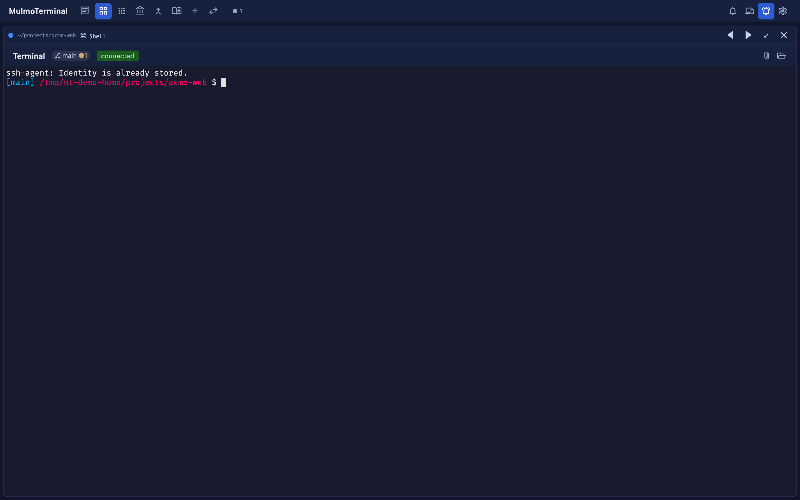
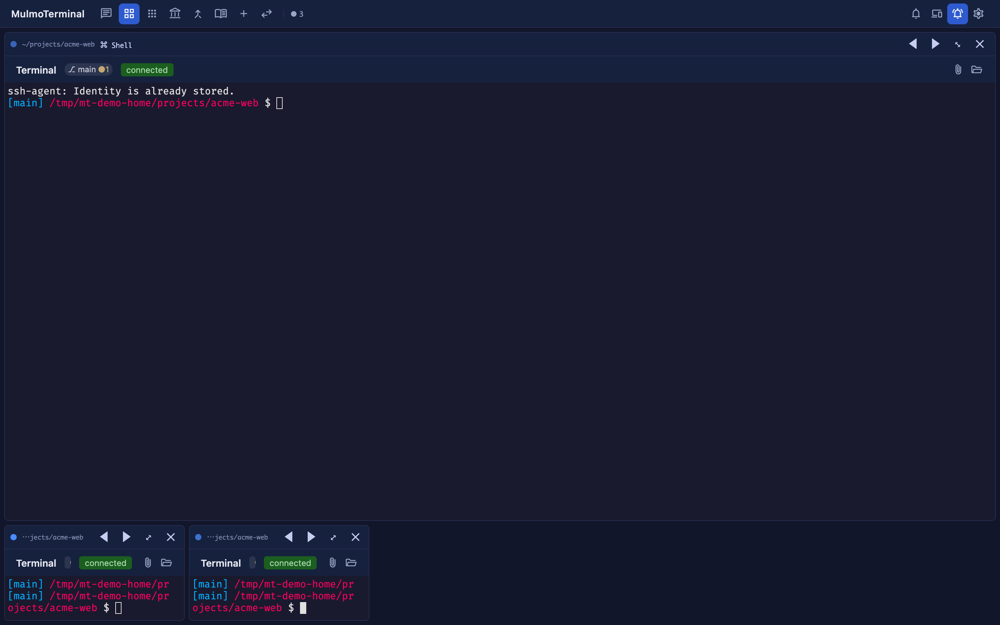

# Basics — what you can do in the grid today
{: .no_toc }

- TOC
{:toc}

---

## The grid is "a board of agents"

The grid view is the screen for **supervising many AI coding agents (Claude Code, Codex) in
parallel**. Vibe coding with one agent needs one terminal; going **parallel** is what makes this
screen necessary. Each cell is one independent
agent (or terminal). While one is thinking, you push another cell forward and pick up **only the ones that
call you** — **amber** for a cell awaiting input or a permission, a **green ring** for a turn that finished and
awaits review — the goal is to run many agents solo instead of babysitting them all.

**The grid is the app.** `http://localhost:34567/` lands here (the URL settles on `/terminals`), and
there is no second screen to switch to: focusing on one agent is **zooming its cell**, which gives
it the window and opens the **GUI panel (Canvas)** beside it — where that agent's tool calls render
as diagrams, forms, images, documents and slides rather than printed text.


{: .note }
> **Changed in 4.0.0.** Until 3.x there was a separate *single view* at `/chat` with its own
> toolbar. It is gone; everything it had is in the grid, and `/chat` now lands on the grid like any
> other unknown URL. → [4.0.0 setup guide](v4.0.0.html)

The top toolbar is one row, split by a rule into **which view you are in** and **what you do inside
it**:

| Group | Buttons |
|---|---|
| **Switch view** (left of the rule) | **Grid** and **Collections** — the two places to be |
| Pinned collections and feeds (left of the rule, its own group) | The favourites you promoted to the toolbar — one press each, from either view. Nothing shows until you promote one (→ [A favourite you open all day](config.html#toolbar-pins)) |
| Inside Collections | **Feeds**, **Wiki**, **Accounting**, **Files** appear once you are in the content section |
| Inside the grid | **Pull requests**, **Worklog**, **New terminal**, cell ordering, the status tally |
| Always | sound, roster / filmstrip, **Settings** |

A full-screen surface (Collections, Wiki, PRs, Accounting, Files) **returns to the view you opened
it from** when you close it.

## Launching an agent or a shell (launcher form)

Empty cells in the grid show a **launcher form**. This is where you choose **what** to run and **where**.


| Part | Role |
|---|---|
| **Agent Picker** (**Claude / Codex / Antigravity / Grok / Muse / Shell**) | Choose what runs in this cell — an **agent**, or **Shell**: your OS default shell (`$SHELL`), with nothing to install and nothing to configure. This is the control that starts a real agent session; the **launch commands** below run your own command line verbatim. What each agent needs, how it resumes, and how it reaches the GUI tools: → [Which coding agent](agents.html) |
| **WORKING DIRECTORY** | Enter the working directory (the play button launches it). Frequently used directories are offered as clickable *cwd preset* **chips** that fill the field (the chip's play button launches right away). They are recorded from wherever you launch, except worktrees — one of those is a single task's branch, deleted with the task. A **WORKSPACE** chip always leads that row (→ [which directory to launch in](#launch-dir)) |
| **Model picker** (when Claude is selected) | Pick the backend / model for this session only (→ [providers](providers.html)) |
| **Canvas / Workspace data / External accounts** toggles (with an agent selected) | Register a GUI tool group (`render` / `data` / `media` / `external`) as an MCP server **for the directory, not for this session**. With **Claude or Codex** picked they are **absent while the workspace is selected** — everything is available there without registering anything. With **Antigravity or Grok** picked they stay, in the workspace too: they are those two agents' only way to get GUI tools anywhere (→ [Antigravity and Grok register everywhere](#antigravity-gui-tools)) |
| **OR ISOLATE IN A WORKTREE** | In a git repo, enter a task name and hit **New worktree** to create an isolated worktree and launch there. Existing worktrees are listed below it |
| **OR RESUME HERE** | Conversations that already exist in this directory, **for the agent the Agent Picker has selected** — click one to continue it. The heading names the agent when it is not Claude (`or resume a codex conversation here`) |
| **OR LAUNCH** | Start a configured **launch command** (`codex`, `htop`, anything) as a persistent terminal |

**A worktree holds one session.** It is tied to a branch, so it is never started twice: a row with
nothing on it starts the first session, `resume` continues the one it already has, and `in use`
cannot be clicked because that session is open in another terminal.
→ [Isolating work in a git worktree](worktree.html#one-session)

**OR RESUME HERE** works the same way: a session marked `● open` is being viewed somewhere and is
refused, because opening it here would detach whoever has it. "Somewhere" includes another browser
tab and a second `mulmoterminal` running on this machine.

**`● running` means it is still alive with nobody attached** — what a server restart leaves behind,
since sessions survive it. The row can be resumed as usual, and the **stop** button beside it ends
that session without touching the conversation: the transcript stays, so the same row can be
resumed later. What is lost is whatever the agent was doing at that moment, which is why it asks
first. Rows marked `● open` have no stop button — close those from the terminal that has them.

**The list belongs to the picked agent.** Each agent keeps its history in its own place — Claude in
`~/.claude/projects`, Codex in `~/.codex/sessions`, Grok in `~/.grok/sessions`, Antigravity in its
own brain directory — and only that agent can continue what it wrote. So switching the Agent Picker
replaces the list, and a conversation is always resumed by the agent that started it. Two limits
worth knowing: **Shell shows no list** (a shell has nothing to resume), and the **Antigravity** list
can only show conversations *MulmoTerminal* started — agy records nothing that maps a conversation
to a directory, so the directory comes from MulmoTerminal's own log and a conversation started in
the Antigravity IDE will not appear here.

**Change the directory and these lists empty at once.** Everything under **WORKING DIRECTORY** —
**OR RESUME HERE**, the worktree rows, **OR RUN A SCRIPT** — was read for the directory that was in
the field at the time, so the moment you type or pick a different one they are replaced by a single
`Loading this directory's sessions, worktrees and scripts…` row until the new ones arrive. Rows left
standing through that wait would be the previous directory's under the new directory's name, and
clicking one resumes exactly the session it offers.

**Shell** takes the same working directory and the same play button as an agent. A shell has no
model, no MCP registration and no worktree, so those rows disappear while it is picked — and the
cell it opens is a persistent terminal (running / exited), not an agent session.


### Which directory to launch in — the workspace or a project {#launch-dir}

**What you put in WORKING DIRECTORY decides which GUI tools that cell gets.**
The reference point is the **workspace** — the server's default working directory (`CLAUDE_CWD`).
It is settled in this order: `--cwd`, then the `CLAUDE_CWD` environment variable, then the directory you ran `npx mulmoterminal` in.
When you lose track of which one it is, the `Workspace: …` line printed at startup is the answer.
Collections, Wiki and Accounting read and write there whichever cell you are in (only the Files pane beside an enlarged cell follows that cell's directory).

| The cell's working directory | Claude / Codex | Antigravity / Grok |
|---|---|---|
| **The workspace itself** | **Every GUI tool, with nothing to register** | No such rule. They get **only the tool groups registered for that directory** |
| **A project directory** | **Only the tool groups registered for that directory** — register one with the MCP toggles when you want GUI tools | Same |

**A Claude session reads its own MCP config in either directory** (`.mcp.json`, `claude mcp add`, your claude.ai connectors). Before 4.4.0 a workspace cell was the one place that could not see them (→ [4.4.0 setup guide](v4.4.0.html)).
Your [MCP servers](config.html#settings-modal) (`userMcpServers`) are merged into **a Claude session launched in the workspace, and only that**. A cell in a project directory does not get them, and neither does Codex (what Codex is handed is MulmoTerminal's own GUI tools; its own MCP config is a `~/.codex` matter).

**To keep doing what you did in the single view in 3.x, launch in the workspace.**
That is the directory the single view ran in, so a Claude or Codex cell started there carries the same thing — drawing into the Canvas, working with collections, with no toggle to turn on.
Claude or Codex, it is the same — pick either in the **Agent Picker** and launch in the workspace (→ [4.3.0 setup guide](v4.3.0.html)).
**A launch command is not one of these**, even when the command you typed is `claude`: a launch command runs verbatim, so it is a terminal with that program in it and carries no GUI tools. The Agent Picker is what starts an agent session.

{: .note }
> **If you also run MulmoClaude, make the workspace the directory MulmoClaude uses** (`~/mulmoclaude` by default).
> **It is not the directory you cloned MulmoClaude into** — it is the shared place both apps keep their data.
> To make it the default, run `npx mulmoterminal` from there or pass `--cwd ~/mulmoclaude` — it is settled when the server starts, so changing it means restarting it.
> The preset skills and help docs are seeded only when the default working directory is that workspace.
> → [Environment variables](config.html#env) (`CLAUDE_CWD` / `MULMOCLAUDE_WORKSPACE_PATH`)

**The workspace is one chip away.**
A **WORKSPACE** chip always sits at the head of the launcher's chip row, apart from the recent directories and named for its role rather than its folder, with an icon of its own.
Its play button launches there; the chip itself only fills WORKING DIRECTORY.
While the workspace is selected **with Claude or Codex picked**, the MCP toggles are gone, replaced by `GUI TOOLS — All of them, automatically`, because there is nothing left to register. Pick **Antigravity** or **Grok** and the toggles come back, workspace or not — see below.


**In a project directory, register what you need with the MCP toggles.**
**Canvas** (`render` / `media`) is the panel beside an enlarged cell, **Workspace data** (`data`) is collections and the books, and **External accounts** (`external`) is Google, X and the like.
A toggle registers **the directory, not the session**, so it takes effect on the next session started there — it never reaches a session already running.

### Antigravity and Grok register everywhere — the workspace included {#antigravity-gui-tools}

**Antigravity and Grok have no such rule.** Even in the workspace, their GUI tools are whatever
**that directory** has registered — so an `agy` or `grok` session in the workspace with nothing
registered has **no GUI tools at all**, while the same session in a project you once flipped Canvas
on for has them. That is the shape of the surprise: `presentDocument` works in your project and is
missing in the workspace, which is the one place everything is supposed to work.

The reason is structural, not an oversight. Claude and Codex are handed a **per-session** MCP config
when the session starts (`--mcp-config`, `-c mcp_servers.…`), so the workspace can simply hand them
everything. Neither of the other two takes such a flag: each reads its servers from a **file in the
working directory** — `agy` from `.agents/mcp_config.json`, which MulmoTerminal writes from that
directory's toggles (→ [2.8.0 setup guide](v2.8.0.html)), and `grok` from `.grok/config.toml`, which
MulmoTerminal registers through grok's own `grok mcp add -s project` so the rest of your file is left
as you wrote it. A file per directory cannot be given to one session and not another, so there is
nothing for "you are in the workspace" to change.

**To give an Antigravity or Grok session GUI tools — in the workspace or anywhere else:**

1. In an empty cell's launcher, pick **Antigravity** or **Grok** in the Agent Picker.
2. Put the directory in **WORKING DIRECTORY** (the **WORKSPACE** chip, if that is where you want it).
3. The **Canvas / Workspace data / External accounts** toggles stay visible — they do not disappear
   for these two the way they do for Claude and Codex. Flip on what you need: **Canvas** (`render`)
   is the one that carries `presentDocument`, `presentChart`, `presentHtml` and `presentForm`.
4. **Launch a new session.** A toggle registers the *directory*, so it never reaches a session that
   is already running — the one you have open keeps whatever it was given at spawn.

You can check it from the outside: `<that directory>/.agents/mcp_config.json` (Antigravity) or
`<that directory>/.grok/config.toml` (Grok) should now list a `mulmoterminal-render` server. In the
session, the tool is called `mcp__mulmoterminal-render__presentDocument` — both agents always use the
per-group server ids, never the `mt` id a workspace Claude session sees.

## Reading a cell — "what each agent is doing and where"

The header of a running cell has two rows. Together they capture that agent's **status, location, and current work**.



- **Row 1 (what to compare):** status dot, project badge, git chip (`⎇ branch ●changes`), **model /
  context size**, what that agent is **doing right now**, a note you can write, and reorder /
  expand / set aside / close.
- **Row 2 (what to read and do):** the **directory path** — click it for a menu with *Reveal in the
  file manager*, *Browse files in the app* (the file tree beside this terminal — it enlarges the
  cell first if it is tiled), *New terminal here*, and the repo's *Repository /
  Issues / Pull requests* — then **Run**, **Skills**, **Insert a file path** (the default buttons —
  [replaceable in config](config.html#header)), and **Activity timeline** (tool-call history). The
  connection state appears here only while it is connecting or has failed.

**Right-click a row in the file tree** to put that file's path at the terminal's cursor —
*Insert relative path* or *Insert absolute path*, and `Shift+F10` on the row does the same from the
keyboard (arrows move between the items). Directories work too. The relative one appears only while
the tree and the terminal are in the same directory, since that is when it means the same thing at
both ends.

> **Status shows up as color.** A bluish border means **working** (thinking), **amber means awaiting input or a
> permission** (Needs input), a **green ring + glow means a finished, unreviewed turn** (Done — review; the
> thumbnails and roster rows use that same green), and neutral means idle. A sound plays too, so you know you've been **called without watching
> the screen**. This is the heart of the grid.

## Tiling many, pages, and reordering

- Add cells from the **launch panel**: the toolbar's **＋** opens it on the workspace, and the **＋** on a
  terminal's own header opens it on that terminal's directory. The cell appears when you start something.
  Up to **9 cells** per page; overflow moves to the next page (tab).
- The ordering button cycles three modes — **auto** (attention-first: cells needing you float up), **manual** (arrange them yourself with each cell's move buttons), and **priority** (the order each project declares as `orderPriority` in its `.mulmoterminal.json`, see [Configuration](config.html#order-priority)).


## Zooming into one (the cockpit roster)

Hit a cell's **Expand** (expand) to show that agent large — and next to it, the **cockpit roster**: a text list
with one row per session (the default). Each row carries the directory, an **AI summary**, the last prompt,
the latest reply, a status word (running / planning / done / idle …), and the branch's **PR phase** badge
(draft / CI fail / changes / ready / merged …). **Click a row to swap** which terminal is enlarged; the ⋮ menu
reorders rows. You stay zoomed in while still reading, in plain text, what everyone else is doing and how far
along it is — this is the main screen for running many agents.


The **Show list roster / Show thumbnail strip** button in the top-right corner switches between the roster and the **filmstrip** (a thumbnail
strip; click a thumbnail's header margin to switch cells). **Restore** returns to the grid.



### Switching the enlarged terminal from the keyboard {#keyboard-zoom-switch}

You can bind keys that move the enlargement to the next / previous terminal — the keyboard equivalent of
clicking a roster row, so you can walk the whole board without reaching for the mouse. The order followed is
the one on screen, so it respects the roster's current sort (including attention-first ordering).

{: .important }
> **Nothing is bound out of the box.** Any key this claims is a key the program inside the terminal stops
> receiving, so that trade is yours to make: add a `keymap` to `~/.mulmoterminal/config.json` and the
> shortcuts turn on. With no `keymap`, they stay off entirely.

```json
{
  "keymap": {
    "zoom-next": "PageDown",
    "zoom-prev": "PageUp"
  }
}
```

→ **Binding syntax, the full action list, and which combinations can never be bound:
[Configuration → Keyboard shortcuts](config.html#keymap).**

Two behaviours worth knowing:

- **They only work while zoomed.** In the normal grid nothing happens, because an un-zoomed grid has no
  "current terminal" — the enlarged cell *is* the selection.
- **They stop at both ends** rather than wrapping. With only two terminals this means roughly half of your
  presses do nothing: previous-on-the-first and next-on-the-last are deliberately no-ops.

Collapsing with **Restore** returns you to the page holding the terminal you were just looking at, not the page you
originally zoomed in from.

{: .warning }
> **A bound key is taken away from the program inside the terminal.** Bind `PageDown` and, while zoomed, it
> no longer reaches `less`, `vim`, or Claude Code's own paging. Modifiers are matched exactly, so binding the
> bare key leaves **`Shift`+`Page Up` / `Shift`+`Page Down`** alone — they still scroll the terminal's
> scrollback, which is the usual way out. An active IME conversion always passes through, so a candidate list
> paging with Page Down keeps working.

On a Mac laptop keyboard there are no dedicated Page Up / Page Down keys; use **`Fn`+`↑`** and **`Fn`+`↓`**.

## Mixing Claude, Codex, Antigravity and Grok {#claude-and-codex}

In the same grid, you can launch **Claude**, **Codex**, **Antigravity** (`agy`) or **Grok** per cell — or **Shell**, when
you only want a terminal. The agents share the same terminal experience, persistence, GUI panel, and visibility
machinery. Use each for its strengths, or throw the same task at several and compare.

Antigravity needs `agy` on your `PATH`. `ANTIGRAVITY_BIN` / `ANTIGRAVITY_MODEL` / `ANTIGRAVITY_HOME` override the
binary, the model, and where it keeps conversations. One difference worth knowing: its GUI-panel registration is
written **per directory** (`.agents/mcp_config.json`, kept out of your `git status`), not per session, because
that is the only project-scoped file `agy` reads.

Grok needs `grok` on your `PATH`. `GROK_BIN` / `GROK_MODEL` / `GROK_HOME` override the binary, the model, and
where it keeps sessions. It registers the GUI panel per directory too, in `.grok/config.toml` — but through
grok's own `grok mcp add -s project`, so anything else you have in that file is left exactly as you wrote it.
Grok resumes like Claude rather than like the other two: MulmoTerminal chooses the session id up front, so a
reloaded cell continues the same conversation with nothing to look up.

---

Next: [Scenarios — usage by scenario](scenarios.html)
