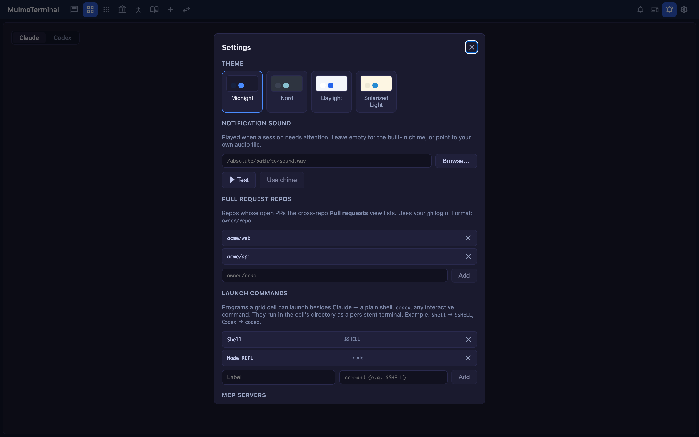

# Configuration
{: .no_toc }

- TOC
{:toc}

Settings live in three places: the **settings modal (⚙)**, the **global config `~/.mulmoterminal/config.json`**, and the **per-project `<project>/.mulmoterminal.json`**. Buttons and chips are merged from both files.

---

## Settings modal (⚙)

Open it from the ⚙ in the toolbar.



| Item | Description |
|---|---|
| **THEME** | Midnight / Nord / Daylight / Solarized Light |
| **DIRECTORY APPEARANCE** | "🎨 Configure appearance…" — set a directory's name badge, colors, and header interactively |
| **NOTIFICATION SOUND** | The sound played when a cell needs you (empty for the built-in chime, or any audio file) |
| **WEB PUSH NOTIFICATIONS** | The "Notify my devices when a task finishes" toggle (off by default → [Mobile notifications](notifications.html)) |
| **GOOGLE ACCOUNT** | Google sign-in for the Calendar link (not the RemoteHost Connect) |
| **PULL REQUEST REPOS** | The repos aggregated by the cross-repo PR/Issue view (`owner/repo`) |
| **LAUNCH COMMANDS** | Commands you can launch besides Claude in a grid cell (`{ label, command }`) |
| **MCP SERVERS** | Your own MCP servers to add to single-view sessions |
| **COST (ESTIMATED)** | Estimated cost readouts for Session / Today / Month |

## Global config `~/.mulmoterminal/config.json`

```json
{
  "cwdPresets": [
    { "label": "acme-web", "path": "/Users/you/projects/acme-web" },
    { "label": "acme-api", "path": "/Users/you/projects/acme-api" }
  ],
  "launchers": [
    { "label": "Shell", "command": "$SHELL" },
    { "label": "Node REPL", "command": "node" }
  ],
  "prRepos": ["acme/web", "acme/api"],
  "userMcpServers": [],
  "buttons": [],
  "chips": null
}
```

| Key | Role |
|---|---|
| `cwdPresets` | Working-directory chips in the launcher (`{ label, path }`; click to fill the field, ▶ to launch) |
| `launchers` | The launch commands that appear under "OR LAUNCH" in a grid cell |
| `prRepos` | The repos targeted by the cross-repo PR/Issue view |
| `buttons` / `chips` | Header buttons / chips (merged with project settings → [Customizing the header](#header)) |
| `providers` | Anthropic-compatible backends (→ [Using another model via OpenRouter](providers.html)) |
| `soundFile` | Custom notification sound (absolute path to an audio file; also settable from the modal) |
| `pushEnabled` | Where the Web Push toggle is stored (default `false` → [Mobile notifications](notifications.html)) |
| `worklogEnabled` / `worklogIntervalHours` | The periodic dev-work log (default off / 6 hours) |

## Running on another model (providers) {#providers}

Claude Code can talk to any Anthropic-compatible backend. The backend goes in `providers` in
`config.json`, the **key in the server's environment** (never in a config file), and the default model
in a project's `.mulmoterminal.json` — with a per-session override at launch.

```json
{
  "providers": [
    { "id": "openrouter", "label": "OpenRouter", "baseUrl": "https://openrouter.ai/api", "tokenEnv": "OPENROUTER_API_KEY", "maxOutputTokens": 16000 }
  ]
}
```

Note that `baseUrl` must not end in `/v1`, and `tokenEnv` is the **name** of a variable, not the key.

→ **Full walkthrough, the measured model list, how to add your own models, and troubleshooting:
[Using another model via OpenRouter](providers.html).**

## Per-project `.mulmoterminal.json` {#per-dir}

Place this at the project root to change the appearance, sound, and header of **terminals (grid cells) opened in that directory**.

### Which model to use

```json
{
  "provider": "openrouter",
  "model": "moonshotai/kimi-k2.7-code"
}
```

The backend and model this directory's sessions start on. Omit `provider` and give only `model` to
pick a different model on Anthropic itself. → [Using another model via OpenRouter](providers.html)

### Name badge and colors

```json
{
  "name": "acme-web",
  "badgeColor": "#2563eb",
  "headerColor": "#0b2545",
  "headerTextColor": "#e6f0ff",
  "cellColor": "#0e1117",
  "cellBorderColor": "#1f6f4f",
  "dotColor": "#22c55e",
  "buttonColor": "#a7f3d0"
}
```

All values are `#rrggbb`. The working / needs-you status colors take priority over these background colors (which show when idle).

### The terminal itself (xterm palette)

Where `headerColor` and friends tint the **chrome** (header / cell frame), **`colors` (and `theme`) tint the terminal
itself (xterm)**. `colors` overrides xterm's ITheme — `background` / `foreground` / `cursor` and the 16 ANSI colors
(`red`, `green`, …).

```json
{
  "name": "🌌 van-gogh",
  "headerColor": "#0b1a4a",
  "headerTextColor": "#f2e29b",
  "colors": { "background": "#0a1330", "foreground": "#f2e29b", "cursor": "#f5b301" }
}
```

Set `theme` to `midnight` / `nord` / `daylight` / `solarized` for a preset palette; `colors` layers per-key
overrides on top. The color-coding screenshot in [Scenario 6](scenarios.html) combines header colors with `colors` to
paint each project — **from the header down to the terminal body**.

### Customizing the header (buttons / chips) {#header}

This is where MulmoTerminal's **Extend** pillar lives. Shape the header of a running terminal to fit your workflow with **a small DSL**.
Any developer can turn their frequent actions into a single click and surface only the information they want to see — that's what this is for.

**Buttons** (`buttons`) — action buttons that act on a running session. Display is an `emoji` or an `icon` (a Material Symbol name) plus a `label`; `order` controls the sort.
With none set, you get the **two defaults** (📎 insert a file path · 📂 reveal in the file manager); setting `buttons` **replaces** that default set.

```json
{
  "buttons": [
    { "id": "compact", "emoji": "🗜️", "label": "Compact", "run": "input", "text": "/compact", "when": "agent == claude" },
    { "id": "gh",      "emoji": "🌐", "label": "Open on GitHub", "run": "open", "open": { "url": "https://github.com/${repo}" }, "when": "isGitRepo" },
    { "id": "reveal",  "emoji": "📁", "label": "Reveal folder", "run": "open", "open": { "reveal": "${dir}" } },
    { "id": "build",   "emoji": "🔨", "label": "Build", "run": "shell", "cmd": "yarn build" }
  ]
}
```

- `run: "input"` … send `text` to the running Claude/Codex (e.g. `/compact`).
- `run: "open"` … `url` (browser, http/https only) / `reveal` (OS file manager: Finder/Explorer/xdg-open) / `files` (in-app explorer) / `pickFile` (OS file dialog, inserts the path) / `terminal` (a new terminal cell in that directory) / `pr` (the current branch's PR in the browser) / `view` (`diff`/`prs`/`wiki`/`collections`/`accounting`).
- `run: "shell"` … run `cmd` in a command cell (the id is resolved server-side, `${variables}` are shell-escaped, and the command never reaches the browser).
- `${variables}` … `dir` `dirName` `branch` `repo` `remoteUrl` `ahead` `behind` `dirty` `agent` `model` `task` `session`.
- `when` … `isGitRepo` / `agent == …` / `repo == …` (`&&` / `||`, with `&&` taking precedence).

**Chips** (`chips`) — reorder / hide the info chips in a grid cell header, plus custom ones. `null` (the default) behaves as before.

```json
{ "chips": ["ctx", "git", { "label": "env", "text": "⎇ ${branch}", "when": "isGitRepo" }] }
```

- Built-in `dir` / `git` / `diff` / `ctx` / `usage` / `status` / `tools` … shown in the order you list them; omit one to hide it.
- Custom `{ label, text, when }` … read-only text (`text` expands `${variables}`).

### ⚡ Skill menu filter (`skills`)

The header's **⚡ Skill ▾** lists the skills available in that directory
(`<project>/.claude/skills` and `~/.claude/skills`). Working-dir (project) skills come
first, then user-scope ones. Picking one runs the skill **in the current session**
(Claude: `/<slug>`; Codex: `Use the "<slug>" skill.`).

Set `skills` to an allowlist to show **only those slugs, in that order**. **Omit it to
show everything.**

```json
{ "skills": ["review-diff", "commit-msg"] }
```

- Skill names (slugs) must start alphanumeric and contain only `a-z 0-9 - _`; a slug that doesn't resolve is ignored.

## Scripts `<project>/script.json`

Your project's scripts that can run in a grid cell (dev server, tests, build, and so on).

```json
{ "scripts": [ { "label": "dev", "command": "yarn dev" }, { "label": "test", "command": "yarn test", "cwd": "." } ] }
```

## Environment variables

| Variable | Default | Role |
|---|---|---|
| `CLAUDE_CWD` / `--cwd` | The directory you run `npx mulmoterminal` in (only `~/mulmoclaude` when the server is started directly) | The default working directory (the PTY's cwd); also set via `--cwd` |
| `PORT` | `34567` | The server port |
| `MULMOTERMINAL_HOME` | `~/.mulmoterminal` | The root for managed git worktrees |

---

← [Back to the feature reference](features.html) / [Guide contents](index.html)
