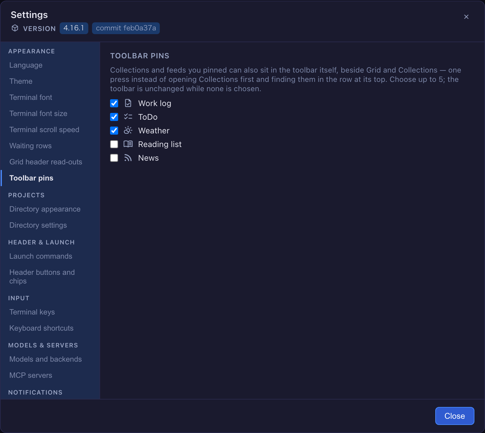

## Find it by what you want to do

| What you want / what's wrong | Where to look |
|---|---|
| A setting you wrote **does nothing** | [When a setting isn't working](#dir-settings-preview) |
| Too many cells — **which one is which project?** | [Colors and name badges](#per-dir) |
| **Shift+Enter submits instead of adding a line** | [Enter — submit vs. newline](#terminal-submit) |
| Notifications are **too noisy** | [Notification sounds](#sounds) |
| **CJK text looks wrong** / the type is too small | [Font](#font-family) · [Font size](#font-size) |
| Copy **without pressing a key** after selecting | [Copy just by selecting](#copy-on-select) |
| Move the enlargement **from the keyboard** | [Keyboard shortcuts](#keymap) |
| Roster rows are **too long or too short** | [Roster rows](#cockpit-lines) |
| A collection you open **all day** takes two presses | [Favourites on the toolbar](#toolbar-pins) |
| Let a session **see another folder** | [Several folders](#add-dirs) |
| Two `yarn dev` **fighting over port 3000** | [A port per worktree](#worktree-env) |
| A **worktree** looks like a different project | [Worktrees inherit this file](#worktree-inherit) |
| **No Canvas** when you enlarge a cell / no GUI tools | [Which directory to launch in](basics.html#launch-dir) |
| **Antigravity or Grok** has no GUI tools, even in the workspace | [Antigravity and Grok register everywhere](basics.html#antigravity-gui-tools) |
| Run on **a model other than Claude** | [Providers](#providers) |
| Start Claude Code through **your own command** (`ollama launch claude …`) | [Custom agents](#custom-agents) |
| Add **your own button** to the header | [Customizing the header](#header) |
| Recolour the whole app **your way** | [Make your own colour scheme](#custom-themes) |
| Tell an issue **you have started on it** | [issueWorkComments](#issue-work-comments) |
| Stop agents **re-asking what you already decided** | [What this project already decided](#decision-digest) |
| Open it from **another machine's browser** | [`MULMOTERMINAL_HOST`](#bind-host) |

---

# Configuration
{: .no_toc }

- TOC
{:toc}

Settings live in three places: the **settings modal (Settings)**, the **global config `~/.mulmoterminal/config.json`**, and the **per-project `<project>/.mulmoterminal.json`**. Buttons and chips are merged from both files.

{: .highlight }
> **You don't have to hand-write any of this.** Run **`/mulmoterminal-config`** in any MulmoTerminal
> session: it asks what you want to change, hands off to the skill that owns it, and also answers
> "how is this set up right now?" — including any key the app **dropped in validation**, which is
> what a setting that silently never applied looks like from the outside.
>
> Go straight to one if you already know the area:
>
> | Skill | Covers |
> |---|---|
> | **`/mulmoterminal-dirs`** | A project's colours, its position in the grid and launcher, name badge, terminal font size. Starts from the directories you actually open, reads what you already have, and follows the same pattern for the ones that have none. (Settings → **Configure appearance…** starts this one.) |
> | **`/mulmoterminal-theme`** | Your own [colour scheme](#custom-themes), appearing in Settings' picker. (Settings → **Create a theme…**) |
> | **`/mulmoterminal-header`** | [Header buttons and chips](#header), global or per project |
> | **`/mulmoterminal-keys`** | [`keymap`](#keymap), [`copyOnSelect`](#copy-on-select), [`terminalSubmit`](#terminal-submit) — the fix for "Shift+Enter submits instead of adding a line" — and [`questionPaneEnabled`](#question-pane). (Settings → **Set up shortcuts…**) |
> | **`/mulmoterminal-model`** | [`providers`](#providers), a per-project model, and [`customAgents`](#custom-agents) |
> | **`/mulmoterminal-notify`** | [Which moments beep or push](#sounds), and what each plays. (Settings → **Configure notifications…**) |
>
> This is how you reach the settings that have **no UI at all**. Hand-editing works too — this page
> documents every field — but the skills validate as they write, which matters for `keymap`, where a
> malformed binding stops the server from starting.
>
> You don't have to remember the names either: the Settings section for each of these ends in a
> button that starts the skill that owns it, in a new session. The two without a Settings section of
> their own — `-header` and `-model` — you run by name.

---

## Settings modal (Settings) — what you can change where {#settings-modal}

Open it from **Settings** (the gear) in the toolbar.

Under the title, a **Version** row says **which build you are running** — `4.7.0` on an npm
install, and on a git checkout a second `commit a1b2c3d` chip beside it, since there the version
is only whatever was last released and the commit is what identifies the build. When something
newer exists, the update notice from the header badge follows on the next line, command included.
That row is what to quote in a bug report.


The **sidebar** groups the sections and shows one at a time; below `sm` (a phone) it becomes a picker
above the section. Twenty-eight sections in nine groups — **Voice input** is there only on a machine
that can transcribe, so most setups see twenty-seven.

A button that hands a section over to a skill — "Create a theme…", "Configure notifications…" —
**asks first**. It starts an agent session in a new grid cell, so the dialog says what will happen
and how to stop it (close that cell); **Cancel** leaves you where you were, with Settings still open.


Settings is available in **English and Japanese**. It follows your browser's language unless you pick
one in **Language** — the first entry in the sidebar, because it is the one setting someone who
cannot read the rest of the screen has to find first. Only this modal is translated so far; the rest
of the app is still English.

- **Appearance** — Language, Theme, Terminal font, Terminal font size, Terminal scroll speed, Waiting rows, Grid header read-outs, Toolbar pins
- **Projects** — Directory appearance, Directory settings
- **Header & launch** — Launch commands, Header buttons and chips
- **Input** — Terminal keys, Keyboard shortcuts, Voice input
- **Models & servers** — Models and backends, MCP servers
- **Notifications** — Notification sounds, Web Push notifications, Phone quick commands
- **Integrations** — GitHub and GitLab, Pull request repos, Google account
- **Sessions** — Sessions and background tasks, Sessions that survived a restart, Cost (estimated)
- **Help** — Help & user guide


| Item | Description |
|---|---|
| **Language** | What language Settings itself is written in — your browser's (the default), English, or 日本語. Per browser, like the theme, and stored in `localStorage` rather than in any config file |
| **Theme** | Midnight / Nord / Daylight / Solarized Light, plus [any you defined yourself](#custom-themes). Picks from what exists; "Create a theme…" starts the `mulmoterminal-theme` skill to write a new one |
| **Terminal font** | The font-family stack every terminal renders in (`fontFamily`) — **global**, unlike the size, because which fonts exist is a property of the machine. Empty means the built-in stack (→ [Terminal font](#font-family)) |
| **Terminal font size** | The xterm font size in px (8–32). Applies to every terminal **in this browser** — a phone and a desktop each keep their own. A directory can override it with `fontSize` ([below](#per-dir)) |
| **Terminal scroll speed** | How far one wheel notch or trackpad swipe moves the terminal (1× is xterm's own). Per browser, like the font size, because it is a property of the pointing device |
| **Waiting rows** | In the roster beside an enlarged cell, a row whose agent is **waiting on you** carries an amber ring and blinks; one that has merely **finished** is green and still. The checkbox turns off the movement, not the colour — and no row blinks when your system asks for reduced motion. The three steppers below it set how many lines each row shows before clamping (`cockpitLines` → [Roster rows](#cockpit-lines)) |
| **Toolbar pins** | Which of your pinned collections and feeds get a button in the toolbar itself, up to five. A tick per pinned entry; none ticked leaves the toolbar as it was (`toolbarPins` → [Favourites on the toolbar](#toolbar-pins)) |
| **Directory appearance** | "Configure appearance…" — set a directory's name badge, colors, terminal palette, and grid position interactively, through the `mulmoterminal-dirs` skill |
| **Directory settings** | What each directory's `.mulmoterminal.json` is **actually doing**. Expand a row for the values in force (colors with a swatch), **which file each came from**, **keys dropped in validation**, and **keys this app never reads**. Read-only — "Explain my settings…" starts the `mulmoterminal-config` skill to say why and fix it (→ [When a setting isn't working](#dir-settings-preview)) |
| **Launch commands** | Commands you can launch besides the agents in a grid cell (`{ label, command }`). A plain shell needs no entry — the launcher's **Shell** toggle opens `$SHELL` unconfigured |
| **Header buttons and chips** | How many buttons and chips your global config declares, read-only — "built-in" when you have configured none. "Set up header buttons…" starts the `mulmoterminal-header` skill (→ [Customizing the header](#header)) |
| **Terminal keys** | [Copy on select](#copy-on-select) (`copyOnSelect`, off), the [question pane](#question-pane) (`questionPaneEnabled`), and which bytes your Claude reads as **submit** ([Enter — submit vs. newline](#terminal-submit), `terminalSubmit`) |
| **Keyboard shortcuts** | Every action and the `send` row, bound or not, read-only. **Everything starts as Not set** — "Set up shortcuts…" starts the `mulmoterminal-keys` skill to bind them in `keymap` (→ [Keyboard shortcuts](#keymap)) |
| **Voice input** | The language you **dictate in** (your browser's, per-clip detection, or a fixed one). Shown only on a machine that can transcribe |
| **Models and backends** | The backends a session can run on and whether each can be **reached right now**, read-only. "Add a backend…" starts the `mulmoterminal-model` skill (→ [Using another model](providers.html)) |
| **MCP servers** | Your own HTTP MCP servers (`userMcpServers`), merged into the **Claude** sessions that have every GUI tool — a cell whose working directory is the **workspace**, and a session the server starts on its own (the phone, a scheduled task) unless it is started in a grid cell's shape, as an issue's seed session is. A cell in a project directory does not get this merge, and neither does Codex (the Claude MCP config **you** wrote — `.mcp.json` and the rest — is read in either directory → [which directory to launch in](basics.html#launch-dir)) |
| **Notification sounds** | Which moments beep and what each plays — one row per kind, with a preset picker and a play button. "Configure notifications…" starts the `mulmoterminal-notify` skill for a per-project sound and which moments push (→ [Notification sounds](#sounds)) |
| **Web Push notifications** | The "Notify my devices when a task finishes" toggle (off by default → [Mobile notifications](notifications.html)) |
| **Phone quick commands** | Phrases offered as chips on the **phone's** terminal view. Tapping one fills the input box; it is sent when you press send (`quickCommands`) |
| **GitHub and GitLab** | What this app writes to a forge as you: whether a cell [says it has started on an issue](#issue-work-comments) (`issueWorkComments`, off by default) and whether a created PR [ends with the clone name](#pr-workdir-footer) (`prWorkdirFooter`, on). Below them, the [self-hosted GitLab hosts](github.html#a-gitlab-of-your-own-self-hosted) to read with `glab` (`gitlabHosts` — takes effect on the next start) |
| **Pull request repos** | The repos aggregated by the cross-repo PR/Issue view (`owner/repo`) |
| **Google account** | Google sign-in for the Calendar link (not the RemoteHost Connect) |
| **Sessions and background tasks** | Whether replies [end with a closing summary](#append-system-prompt) (`appendSystemPrompt`, on — a directory's own setting wins), whether to [keep a digest of decisions](#decision-digest) (`decisionDigest`, off), and the [periodic dev-work log](#all-keys) with its interval in hours (`worklogEnabled`, off — each run costs tokens) |
| **Sessions that survived a restart** | Every terminal still running from an earlier server, **across all directories** — the one place a session in a project you no longer open, or a plain shell, can be seen and ended. Each row says where it runs, what it is (`shell or unknown` when no agent conversation is recorded under it), how long it has been idle, and whether ending it loses anything. **Stop** ends that session only; a conversation with a transcript can be resumed afterwards. A row a terminal is holding shows `● open` instead, and is closed from there. The section also carries `sessionIdleReapDays` — the number of idle days after which the server ends one on its own — and marks the rows that number will take with **ends at next start** |
| **Cost (estimated)** | Estimated cost readouts for Session / Today / Month |
| **Help & user guide** | Links into this guide |

## When a setting isn't working — look here first {#dir-settings-preview}
When a setting you wrote doesn't take, open **Settings → Directory settings**. Per directory, it shows
what that `.mulmoterminal.json` is **actually doing**.

- **The values in force** — colors with a swatch. What you see is what is being used.
- **Which file each came from** — the global `~/.mulmoterminal/config.json` or the project's
  `<project>/.mulmoterminal.json`.
- **`Dropped as invalid:`** — keys thrown away because the shape was wrong.
- **`Not settings this app reads (a typo?):`** — keys this app never reads. `badgeColour` for
  `badgeColor`, or a global-only setting written per-directory.


*Here `badgeColour` (a misspelt `badgeColor`) and `fontSize2` are called out as keys the app never
reads. A setting you wrote that did nothing shows up in exactly this line.*

**A setting that never took effect looks exactly like one you never made, until you can see this.**
Why the misspelt key stays in the file at all: [keys this version doesn't know survive](#unknown-keys).

## Per-project settings — colors, names, ordering (`.mulmoterminal.json`) {#per-dir}

Place this at the project root to change the appearance, sound, and header of **terminals (grid cells) opened in that directory**.

### Which model to use

```json
{
  "provider": "openrouter",
  "model": "moonshotai/kimi-k2.7-code"
}
```

The backend and model this directory's sessions start on. Omit `provider` and give only `model` to
pick a different model on Anthropic itself. → [Using another model via OpenRouter](providers.html)

### Name badge and colors

```json
{
  "name": "acme-web",
  "badgeColor": "#2563eb",
  "headerColor": "#0b2545",
  "headerTextColor": "#e6f0ff",
  "cellColor": "#0e1117",
  "cellBorderColor": "#1f6f4f",
  "dotColor": "#22c55e",
  "buttonColor": "#a7f3d0"
}
```

All values are `#rrggbb`. The working / needs-you status colors take priority over these background colors (which show when idle).

Leave `headerTextColor` out and the header's text — the path, the title, the model / context and token
chips — is derived from `headerColor` so it stays readable on it.

`headerColor` and `headerTextColor` are the **idle** pair, and they apply only while that colour is
what shows. A cell that is working, done, or needs you has replaced the header background with the
theme's status tint, so its text goes back to the theme's own — an ink chosen for your header colour
is not readable on a tint the theme mixed.

To recolour those states, name them:

```json
{
  "headerColor": "#0b2545",
  "headerStatusColors": {
    "working": "#6d28d9",
    "done": { "background": "#166534" },
    "blocked": { "background": "#7c2d12", "text": "#ffe8a3" }
  }
}
```

Only `working`, `done` and `blocked` — there is no `idle`, because `headerColor` is idle. A status
you don't name keeps the theme's tint. **Omit `text` and a readable one is derived** from that
background, so naming a single colour can never come out unreadable.

Or keep your own colour throughout with `"headerStatusTint": "none"`, which leaves `headerColor` in
place while **working** and **done**; the status still reads from the cell border, the status dot and
the pill. It deliberately does not reach **blocked** — that is the state where nothing proceeds until
you answer, so it keeps the theme's amber unless `headerStatusColors.blocked` says otherwise.

Both keys also work in `~/.mulmoterminal/config.json`, where they are the default for every
directory; a `.mulmoterminal.json` that names either one outranks it for that directory.

### A repository that ships `repo.json` {#repo-json}

[`repo.json`](../../repo-json.html) is an **open repository-metadata format**: one small file, at
the repository root, that any tool can read. MulmoTerminal reads it, so a project that ships one
gets a named, coloured, icon-bearing cell without knowing this app exists.

```json
{
  "name": "diffusion-lab",
  "description": "Training and evaluation for latent diffusion models",
  "icon": "docs/logo.png",
  "color": "#7c3aed"
}
```

- **`name`** → the badge.
- **`icon`** → the cell icon. A string, or an array with sizes; the best usable entry wins.
- **`color`** → **all seven** chrome colours. The header is the colour exactly; the badge, border,
  status dot, buttons and cell body are derived from its hue; the header text is derived for
  contrast and is never declared. `color.background` sets the cell body directly.
- **`extensions.mulmoterminal`** → anything this app understands that the open format doesn't —
  `theme`, `orderPriority`, `sound`, and the rest of the keys on this page.

The three files layer, general to specific:

```
repo.json  →  .mulmoterminal.json  →  .mulmoterminal.local.json
the project    this app's settings    this checkout
```

Each replaces whatever keys the one below it set. A repository can ship `repo.json` alone and never
create the other two; equally, a `.mulmoterminal.json` colour wins over `repo.json`'s, which is how
you keep your own palette for a project whose brand colour you would rather not look at all day.

### Several clones of one repository (`.mulmoterminal.local.json`) {#local-config}

Working on one repository in several checkouts at once — `acme`, `acme2`, `acme3` — they are the
same project and should differ in nothing but the colour that tells them apart in the grid. Put a
`.mulmoterminal.local.json` beside the shared file:

```jsonc
// .mulmoterminal.json — the project. Complete on its own, colours included, so somebody with a
// single clone needs nothing else. Safe to commit.
{
  "name": "acme-web",
  "theme": "nord",
  "badgeColor": "#1b3479",
  "headerColor": "#2d4ea9",
  "headerTextColor": "#ffffff",
  "orderPriority": 30
}

// .mulmoterminal.local.json — this checkout only. Add it to .gitignore.
{
  "badgeColor": "#27b4a8",
  "headerColor": "#4ed0c5",
  "orderPriority": 65
}
```

- **The local file wins, key by key.** Keys it does not name keep the shared value.
- **Whole keys, not a deep merge.** A `colors` block in the local file replaces the shared one
  entirely rather than merging into it — one key is one intent, and a palette assembled from two
  files is harder to predict than one you can read in a single place.
- **Everything is still validated.** A local file is not a way past the rules; a colour that isn't
  `#rrggbb` is dropped there exactly as it would be in the shared file.
- **A relative path means the same in both** (`icon`, `sound`, `addDirs`) — they resolve against
  the directory, not against the file.
- **Either file can stand alone.** A checkout may have only a local file, and a malformed one file
  leaves the other still working.
- **Both trigger the live reload**, so editing your own clone's colours recolours the cells at once.

Settings → [Directory settings](#dir-settings-preview) names both paths and lists which keys the
local file took over — which is the answer when you change something and the cell disagrees.

### Project icon (`icon`) {#dir-icon}

`icon` puts an **image** next to the name badge — the project's own logo, so a cell is recognisable
before you have read a word of it:

```jsonc
{
  "icon": "docs/logo.png",                  // a file in this directory
  // "icon": "https://example.com/logo.svg" // or a URL
  // "icon": "data:image/png;base64,iVBO…"  // or an inline image
}
```

It appears in the **cell header**, the **cockpit roster** and the **filmstrip thumbnails** while a
cell is enlarged, on the **launcher's directory chips**, and in the [phone's](phone.md) **terminal list and terminal
screen** — so the same picture identifies the project everywhere it is offered or running.

- **A path is relative to this directory.** An absolute path, or a `../` that escapes the
  directory, is rejected — the same confinement `sound` has, so an opened project cannot point
  MulmoTerminal at files elsewhere on your machine.
- **Formats:** PNG, JPEG, **GIF (an animated one plays)**, WebP, AVIF, SVG, ICO, BMP. A file with
  any other extension is ignored.
- **Commit it to the repository.** That is what makes a fresh clone — and a
  [worktree](#worktree-inherit) cut from it — arrive with the icon already set; the `icon` key is
  carried over as written, so the same relative path resolves in the worktree's own tree.
- An icon that stops resolving (a renamed file, a host that is down) simply doesn't appear. Check
  what the app actually resolved in Settings → [When a setting isn't working](#dir-settings-preview).
- Not to be confused with a header **button's** `icon`, which is a
  [Material Symbols](https://fonts.google.com/icons) name rather than a picture.

### The favicon is picked up on its own {#auto-dir-icon}

You usually do not need to write `icon` at all. A directory that sets **none** shows the icon its
repository already ships:

1. `public/favicon.svg`, then `favicon.svg`
2. `public/apple-touch-icon.png`, then `apple-touch-icon.png`
3. `public/favicon.png`, then `favicon.png`
4. `public/favicon.ico`, then `favicon.ico`
5. a web manifest (`public/site.webmanifest`, `public/manifest.json`, or either at the root) — its
   largest non-`maskable` icon

First hit wins, ordered by how the image survives being drawn at 14px rather than by how common it
is. `docs/logo.png` and `assets/logo.*` are deliberately **not** searched: a "logo" is as often a
wide README banner as an icon, and one of those at 14 square pixels is a smudge.

Two ways to turn it off, meaning different things:

- **`"icon": false`** in a project's own file — no icon on *this* project's cells. Worktrees
  inherit it.
- **`autoDirIcon: false`** in `~/.mulmoterminal/config.json`, or the checkbox in
  Settings → *Directory appearance* — off everywhere. Reach for this if the behaviour itself is
  unwanted; writing `"icon": false` into every repository is not the way.

**A key written wrong does not fall back to the favicon.** `"icon": "logo.png"` pointing at a file
that isn't there leaves the cell with no icon at all, on purpose — a broken setting has to look
broken. Settings → [When a setting isn't working](#dir-settings-preview) lists the key under the
ones that were dropped.

### Sound for this directory

```jsonc
{
  "sound": "./.mulmoterminal/alert.mp3", // every kind, unless overridden below
  "sounds": { "command-failed": "preset:gong" } // one kind only
}
```

Both beat the global settings for terminals opened here, so one project can be told apart from
another by ear. A file path is **relative to this directory** — an absolute path, or a `../`
that escapes it, is rejected. `preset:<id>` works in **`sounds`** (per kind), so a project needs no
audio file of its own — but **not in `sound`**, which takes a relative file path only and silently
drops a preset reference. → [Notification sounds](#sounds)

### The terminal itself (xterm palette)

Where `headerColor` and friends tint the **chrome** (header / cell frame), **`colors` (and `theme`) tint the terminal
itself (xterm)**. `colors` overrides xterm's ITheme — `background` / `foreground` / `cursor` and the 16 ANSI colors
(`red`, `green`, …).

```json
{
  "name": "🌌 van-gogh",
  "headerColor": "#0b1a4a",
  "headerTextColor": "#f2e29b",
  "colors": { "background": "#0a1330", "foreground": "#f2e29b", "cursor": "#f5b301" }
}
```

Set `theme` to `midnight` / `nord` / `daylight` / `solarized` for a preset palette; `colors` layers per-key
overrides on top. The color-coding screenshot in [Scenario 6](scenarios.html) combines header colors with `colors` to
paint each project — **from the header down to the terminal body**.

### Terminal font size (`fontSize`) {#font-size}

`fontSize` sets the px size of the terminal font for this directory, overriding the Settings value:

```json
{ "fontSize": 16 }
```

Valid range is **8–32**. A size outside it is clamped to the nearest end (so `99` becomes 32 rather than
being ignored); a non-number is ignored and the Settings value applies.

Use this rather than the browser's zoom (Ctrl +/−). Zoom scales the page without telling the terminal, so
xterm's character grid stops matching what the shell believes the window to be, and the cursor and line
wraps drift. Setting `fontSize` re-fits the terminal and sends the new width/height to the process, so
everything stays aligned.

### Terminal font (`fontFamily`) {#per-dir-font}

`fontFamily` pins the font stack for this directory's terminals, overriding the global
[`fontFamily`](#font-family):

```json
{ "fontFamily": "'Cica', 'MS Gothic', monospace" }
```

Same rules as the global key — see [Terminal font](#font-family) for how to choose one, what happens
to an invalid stack, and why a CJK face has to be em-square. Handy for a repo whose logs are full of
Japanese while the rest of your work is ASCII.

Unlike the global key, this one needs **no server restart**. It is not filesystem-watched either,
though: MulmoTerminal re-reads a `.mulmoterminal.json` when **Claude's own Write/Edit tools** report
having written it — which is why `/mulmoterminal-dirs` recolours the cell as you watch. Edit the
file **by hand, from outside**, and an already-open terminal keeps the old font until you reload the
browser tab.
### Where this project sits in the grid (`orderPriority`) {#order-priority}

`orderPriority` gives the directory a rank in the grid's **priority** ordering — the third mode on the
toolbar's ordering button, alongside auto (attention-first) and manual (the move buttons):

```json
{ "orderPriority": 10 }
```

- **Lowest first.** Any integer, including negative ones, so a project can sort ahead of everything at `0`.
- **Directories that set nothing come last**, keeping their existing order — adding the key to one project
  doesn't shuffle the rest.
- Equal ranks keep their current order, which is also what happens when several cells share one directory
  (the rank belongs to the *directory*, not the cell).

In the **grid**, only the priority mode reads it — leave the button on auto or manual and nothing changes
there, whatever your projects declare.

The **launcher's directory chips always sort by it**, whichever mode the grid's button is on, so a project
sits in the same place on both screens. The chips otherwise come in the order you last launched them, which
changes under you; declaring ranks is how you pin them down. Directories that declare none stay behind the
ranked ones, in that launch order.

### Worktrees inherit this file {#worktree-inherit}

> Creating worktrees, the rules around them and cleaning them up are in
> [Isolating work in a git worktree](worktree.html). This section is the **inheritance rule for this
> config file**.

A [worktree](glossary.html#git-worktree) cut from the project used to start with nothing in it: no
colours, no name, no model, no rank — one more grey cell at the end of the grid, looking like an
unrelated project.

Now a new worktree is given its own copy, derived from the project's, written to
**`.mulmoterminal.local.json`** ([above](#local-config)) so it layers over any shared config the
repository committed and leaves the worktree's `git status` clean:

- **The identity is copied as written** — `name`, `icon`, `theme`, `colors`, `fontSize`,
  `fontFamily`, `provider`, `model`. Same project, same terminal, same model. `icon` is carried as
  the path you typed rather than the file it resolved to, so a logo committed to the repository is
  found again inside the worktree; one that is gitignored simply doesn't appear there.
- **The chrome colours are rotated a little around the colour wheel** — `badgeColor`,
  `headerColor`, `headerTextColor`, `cellColor`, `cellBorderColor`, `dotColor`, `buttonColor`. Each
  worktree of a project sits one 12-degree step further round than the one before it, so a row of
  them reads as a gradient: recognisably this project, and recognisably not each other.
  Saturation and lightness are untouched, which is why a `headerTextColor` of `#ffffff` stays
  white — a grey has no hue to move.
- **`orderPriority` becomes the project's rank plus one**, so the worktree sits directly after the
  project it was cut from instead of falling to the end. Only when the project declares a rank;
  one that sets none has worktrees that set none either.
- **`sound`, `sounds` and `addDirs` are NOT carried.** Those name paths inside the project
  directory, which the worktree has no copy of, and `addDirs` would resolve against the worktree
  and quietly grant a different set of folders.
- **[`worktreeEnv`](#worktree-env) is copied as written**, because it is a declaration rather than
  a value: the worktree is then reserved its own port and database name from it. A worktree that
  did not carry it would be the one tree of the project whose dev server still fought for 3000.

Two cases where nothing is written, both deliberate:

- **Neither file is gitignored in that repository.** Whichever one MulmoTerminal wrote would show
  up as an untracked change in the worktree's `git status` — which is not just untidy: it refuses
  to remove a worktree that has uncommitted changes, so the tree could no longer be cleaned up.
  Add `.mulmoterminal.local.json` to the repo's `.gitignore` and the next worktree gets its
  colours. A repository set up before this file existed, which ignores `.mulmoterminal.json`
  instead, keeps working — that one is used as a fallback.
- **The worktree already has a local file of its own** (you wrote it, or a previous run did). That
  file is the answer; MulmoTerminal never overwrites it. A committed *shared* config does not stop
  it — that is the file the local one is meant to layer over.

The copy is taken at creation and then belongs to the worktree. Recolour the project afterwards and
existing worktrees keep the shade they were given — edit or delete their own file to change it.

### Customizing the header (buttons / chips) {#header}

This is where MulmoTerminal's **Extend** pillar lives. Shape the header of a running terminal to fit your workflow with **a small DSL**.
Any developer can turn their frequent actions into a single click and surface only the information they want to see — that's what this is for.

> **For your first one, go to [Customizing the header](header.html)** — it walks through reading the
> header and adding a button, with screenshots. This section is the **full field reference**; the
> `${variables}`, every `when` form and pasteable recipes are in the
> [header reference](header-reference.html).

**Buttons** (`buttons`) — action buttons that act on a running session. **Only the `icon` (a Material Symbol name) is drawn**;
`label` becomes the **hover tooltip** (and the accessible name). No text appears on screen, so write a `label` that says what the
button does. With neither `icon` nor `emoji`, you get `bolt`. `order` controls the sort.
With none set, you get a **built-in starter set**: **Insert a file path** · **Open this branch's PR** (git repos, only when a PR exists). Setting `buttons` at any level **replaces the whole default set** (it is _not_ merged on top) — so listing your own, even a **shorter** list, is how you trim, reorder, or swap them.

*Reveal in the file manager*, *Browse files in the app*, *New terminal here* and *Open on GitHub* used to be defaults too. They are **items in the path menu** now — click the directory path on the terminal's header row. They all answered "do something with this directory", which is what the path itself is; keeping four permanent icons for them cost more room than it was worth in a tiled cell. Nothing changed about them as config: list any of them yourself and it works exactly as before, as a button — you will then have it both places, since the menu is fixed.

One of them no longer matches its menu item. *Browse files in the app* **in the menu** opens the file pane beside the enlarged cell (enlarging it first if it is tiled); the same thing **as a button** (`open.files`) opens the **full-screen** Files view, as it always did. That is not an oversight: a button carries whatever path you give it, and the pane can only ever be rooted at the enlarged cell's directory.

```json
{
  "buttons": [
    { "id": "compact", "icon": "compress", "label": "Compact", "run": "input", "text": "/compact", "when": "agent == claude" },
    { "id": "gh",      "icon": "public",   "label": "Open on GitHub", "run": "open", "open": { "url": "https://github.com/${repo}" }, "when": "repo != " },
    { "id": "reveal",  "icon": "folder",   "label": "Reveal folder", "run": "open", "open": { "reveal": "${dir}" } },
    { "id": "build",   "icon": "build",    "label": "Build", "run": "shell", "cmd": "yarn build" }
  ]
}
```

- `run: "input"` … send `text` to the running Claude/Codex (e.g. `/compact`).
- `run: "open"` … write ONE per button. Set several and **only the first of this order** takes effect: `pr` (the current branch's PR — the server resolves it into `url`, so it beats a `url` written alongside) / `url` (browser, http/https only) / `reveal` (OS file manager: Finder/Explorer/xdg-open) / `files` (in-app explorer) / `view` (`prs`/`wiki`/`collections`/`accounting`; `diff` is accepted but has no dedicated screen and currently falls back to the files view) / `terminal` (a new terminal cell in that directory) / `pickFile` (OS file dialog, inserts the path).
- `run: "shell"` … run `cmd` in a command cell (the id is resolved server-side, `${variables}` are shell-escaped, and the command never reaches the browser).
- `run: "action"` … act on the cell itself. One `action` so far: `"restart"` — end the agent and start it again **in the same cell, on the same conversation**, which is how a changed MCP registration, an edited config or an updated plugin takes effect. It costs a **resume** (the conversation is read back from its transcript, with the token cost that implies) and it asks **nothing** first, even mid-turn. There is no built-in Restart button: this and the `terminal-restart` shortcut are the two ways to have one.
- `${variables}` … `dir` `dirName` `branch` `repo` `remoteUrl` `ahead` `behind` `dirty` `agent` `model` `task` `session`. What each holds and when it is empty: [the variable table](header-reference.html#vars). **An unknown name does not blank — `${itStaysLiteral}`**, so a typo is visible.
- `when` … `isGitRepo` / `!isGitRepo` / `var == value` / `var != value` / `var !=` (**an empty right-hand side means "has a value"**). Combine with `&&` / `||` (`&&` binds tighter); **there are no parentheses** → [every `when` form](header-reference.html#when).

**Chips** (`chips`) — reorder / hide the info chips in a grid cell header, plus custom ones. `null` (the default) behaves as before.

```json
{ "chips": ["ctx", "git", { "label": "env", "text": "⎇ ${branch}", "when": "isGitRepo" }] }
```

- **Only `git` / `work` / `diff` / `ctx` / `usage` / [`env`](#worktree-env) respond** — shown in the order you list them; omit one to hide it.
- `dir` (the project badge), `status` (the status dot) and `tools` (the row-2 tool timeline) are **structural to the cell**:
  listing them does nothing and omitting them hides nothing. The schema accepts them, so it is not an error — they are silently ignored.
- Custom `{ label, text, when }` … read-only text. **`text` is what's displayed** (it expands `${variables}`);
  `label` is the **tooltip**, as on a button.

#### `work` — which PR / issue this cell is on {#work-chip}

`#977 → #966`: the branch's pull request, and the issue that PR closes. With a screen full of
cells it is the only thing that answers "which of these is the one I asked about", which is how a
PR ends up half-finished after the cell was reused for something else.

- The issue comes from the PR's own `Fixes #966`. Without a PR, from the branch name
  (`fix/966-…`) — and only after MulmoTerminal has confirmed that issue exists, so a branch like
  `release/2026-07-28-hotfix` doesn't claim issue #2026.
- **It disappears the moment the PR is merged** (or is closed). The work is over; a badge left
  behind is worse than none.
- Before a PR exists the issue shows on its own. A cell with neither shows nothing.
- It needs `gh` installed and logged in, and a GitHub remote — same as the header's PR button.

It is in the default set, so a header you have never configured shows it. **If you set `chips`
yourself, add `"work"` to the list** — a configured list is the whole list.

### Skill menu filter (`skills`)

The header's **Skill** button (the bolt icon) lists the skills available in that directory
(`<project>/.claude/skills` and `~/.claude/skills`). Working-dir (project) skills come
first, then user-scope ones. Picking one runs the skill **in the current session**
(Claude: `/<slug>`; other agents: `Use the "<slug>" skill.`).

Set `skills` to an allowlist to show **only those slugs, in that order**. **Omit it to
show everything.**

```json
{ "skills": ["review-diff", "commit-msg"] }
```

- Skill names (slugs) must start alphanumeric and contain only `a-z 0-9 - _`; a slug that doesn't resolve is ignored.

### Mulmo menu decks (`decks`) {#decks}

The header's **Mulmo** button (beside Skill) shows a mulmoScript **deck** in the Canvas next to the
cell, without asking the agent — a viewer, so it costs no tokens.

Two sources, and it never searches your disk:

1. **`artifacts/stories/` under the workspace** — where the plugin puts the decks an agent makes.
   Always offered, nothing to configure.
2. **`decks`** — paths, relative to this file, of decks kept inside the repository.

```json
{ "decks": ["decks/launch.json", "docs/talks/retro.json"] }
```

- Paths must stay **inside the directory that declares them**. `../other-project/deck.json` and
  absolute paths are dropped: a config file travels with a clone, so a declaration names a deck in
  *this* repository.
- A path that is not a mulmoScript (no `$mulmocast`), or is not there, is dropped silently — the
  menu would open it and the server would refuse.
- Each deck is named by its own `title`, falling back to the file name. At most 50 entries.
- The menu appears on **agent cells** only, and only under a directory MulmoTerminal serves decks
  from: the workspace it was started in, plus the directories in your launcher's saved list — up to
  64 in total, skipping any that is no longer on disk. Those are read **once at startup**, so a
  repository opened for the first time needs a restart. Any other deck is still one right-click away
  in the file tree (**Open in the Canvas**).

### Closing summary for this directory (`appendSystemPrompt`)

```json
{ "appendSystemPrompt": false }
```

Whether this project's sessions are asked to end a reply with a summary. Omit it to follow the
global setting, which is on. → [Turning off the closing summary](#append-system-prompt)

## Make your own colour scheme (`themes`) {#custom-themes}

Beyond the four built-ins (Midnight / Nord / Daylight / Solarized Light), define your own in
`themes` in `~/.mulmoterminal/config.json` and it **appears in Settings' theme picker**. Picking it
recolours the whole app — grid background, headers, panels, and the terminals themselves.

```json
{
  "themes": [
    {
      "id": "my-dark",
      "label": "My Dark",
      "extends": "midnight",
      "colors": { "--bg-base": "#101820", "--bg-panel": "#16202c", "--accent": "#ff8c00" }
    }
  ]
}
```

- **`extends`** — start from a built-in and write **only what you want changed**. You can omit it,
  but then `colors` has to carry **every** variable below: a partial set is not applied at all,
  because the gaps would keep the previous theme's colours and give you a mix of two palettes.
- **`id`** — lowercase, digits and dashes. **A built-in id is refused** (an entry calling itself
  `midnight` is not read, and shows up under [When a setting isn't working](#dir-settings-preview)).
- **`colors`** values must be `#rrggbb`. They go straight into CSS, so this is validated strictly.
- **Light schemes are detected, not declared.** The lightness of `--bg-base` decides it, and the
  status colours (done / waiting / error) switch to their light-background set. Nothing to write.
- **The terminal's own colours are derived**: background from `--bg-base`, text from `--term-fg`,
  selection from `--term-selection`. The 16 ANSI colours come from whatever `extends` names.

**Restart `mulmoterminal` after editing.** The global config is read once at server start, so a
new theme — or a colour you just tweaked — does not arrive on a page reload alone. It is the same
rule as every other key in that file, and it is the one that trips people up while iterating on a
palette.

The twenty variables:

| Variable | What it colours |
|---|---|
| `--bg-base` | The page itself (and what decides light vs dark) |
| `--bg-deep` / `--bg-panel` / `--bg-subtle` / `--bg-elevated` / `--bg-input` | Deeper background, panels, subtle fills, raised surfaces, inputs |
| `--bg-hover` / `--bg-selected` / `--bg-selected-hover` | Hover, selected, selected-and-hovered |
| `--border` | Borders |
| `--accent` / `--accent-bg` / `--accent-bg-hover` / `--on-accent` | The accent, and text drawn on it |
| `--text` / `--text-secondary` / `--text-muted` / `--text-dim` | Four levels of text |
| `--term-fg` / `--term-selection` | Terminal text and selection |

### How to build one

You don't have to decide twenty colours up front. **Start with three and add only what bothers you.**

1. **Pick a base** — `"extends": "midnight"` for a dark scheme, `"daylight"` for a light one.
   Everything you don't write comes from there.
2. **Change the ground and the accent** — `--bg-base` (the page) and `--accent` (links, selected
   outlines, emphasis). Those two alone already read as a different theme.
3. **Sort out the surfaces** — `--bg-panel` (modals, cards) and `--bg-deep` (one layer back). Too
   close to the ground and a panel stops looking like a panel.
4. **Set the text** — `--text` and `--term-fg`. **Pure black or pure white rarely sits well.**
5. **Add the touch states** — `--bg-hover` / `--bg-selected` / `--border`.

Restart the server and reload the page after each step to see it.

{: .highlight }
> **Take the accent from the ground's complement.** A yellow accent on a yellow ground sinks —
> links and selection outlines disappear into it. That is why the Van Gogh below puts orange on
> its wheat-yellow ground and reserves blue for selection.

### Samples

Paste any of these into `themes`. All four were actually used in the app before being written down.


#### Van Gogh — the Arles years

Wheat-field yellow for the ground, a sunflower's centre for the accent. **All-yellow goes flat and
swallows the text**, so selection and hover carry the Arles sky instead. The text is brown rather
than black — his own outlines were.

```jsonc
{
  "themes": [
    {
      "id": "van-gogh",
      "label": "Van Gogh (Arles)",
      "extends": "daylight",
      "colors": {
        "--bg-base": "#fbf1d3",  // pale wheat; also what decides light vs dark
        "--bg-deep": "#f0dfa8",
        "--bg-panel": "#fffcf0",
        "--bg-subtle": "#f8ecc4",
        "--bg-elevated": "#fffcf0",
        "--bg-input": "#fffdf7",
        "--bg-hover": "#f6e2a2",
        "--bg-selected": "#cfe0f7",  // the Arles sky — the complement of all that yellow
        "--bg-selected-hover": "#b6d1f2",
        "--border": "#c08a1e",  // the ochre outline of a sunflower
        "--accent": "#c05f00",  // a sunflower's centre
        "--accent-bg": "#c05f00",
        "--accent-bg-hover": "#a44f00",
        "--on-accent": "#fffcf0",
        "--text": "#3a2c10",  // brown, not black — his own outlines
        "--text-secondary": "#57451a",
        "--text-muted": "#7b6835",
        "--text-dim": "#9c8a5c",
        "--term-fg": "#3a2c10",  // the terminal takes the same brown
        "--term-selection": "#f5d98a"
      }
    }
  ]
}
```

#### Mondrian

Off-white with **black borders**, a red accent, and primary yellow for selection. Pushing
`--border` all the way to black is what makes the screen divide like one of the compositions.

<details markdown="1">
<summary>Show the JSON</summary>

```json
{
  "id": "mondrian",
  "label": "Mondrian",
  "extends": "daylight",
  "colors": {
    "--bg-base": "#f4f1ea",
    "--bg-deep": "#e7e3d9",
    "--bg-panel": "#ffffff",
    "--bg-subtle": "#f7f5f0",
    "--bg-elevated": "#ffffff",
    "--bg-input": "#ffffff",
    "--bg-hover": "#ffe8a3",
    "--bg-selected": "#ffd60a",
    "--bg-selected-hover": "#f5c400",
    "--border": "#14110f",
    "--accent": "#d10a11",
    "--accent-bg": "#d10a11",
    "--accent-bg-hover": "#a90810",
    "--on-accent": "#ffffff",
    "--text": "#14110f",
    "--text-secondary": "#2b2722",
    "--text-muted": "#5d564c",
    "--text-dim": "#8a8175",
    "--term-fg": "#14110f",
    "--term-selection": "#ffe066"
  }
}
```

</details>

#### Picasso — the Blue Period

One blue throughout, with ochre kept for the accent. It is a dark theme, but a bluish white
(`#dbe7ef`) for `--text` gives it a coldness Midnight doesn't have.

<details markdown="1">
<summary>Show the JSON</summary>

```json
{
  "id": "picasso-blue",
  "label": "Picasso Blue",
  "extends": "midnight",
  "colors": {
    "--bg-base": "#0d2438",
    "--bg-deep": "#081a2a",
    "--bg-panel": "#12344e",
    "--bg-subtle": "#173f5c",
    "--bg-elevated": "#143a47",
    "--bg-input": "#071624",
    "--bg-hover": "#1c4d70",
    "--bg-selected": "#215a82",
    "--bg-selected-hover": "#2a6d9c",
    "--border": "#1e4c6b",
    "--accent": "#e0a33e",
    "--accent-bg": "#b8802a",
    "--accent-bg-hover": "#cf9333",
    "--on-accent": "#0d2438",
    "--text": "#dbe7ef",
    "--text-secondary": "#b9cfdd",
    "--text-muted": "#89a4b6",
    "--text-dim": "#65808f",
    "--term-fg": "#dbe7ef",
    "--term-selection": "#1c4d70"
  }
}
```

</details>

#### Matisse

Cream ground, shocking pink. **Borders and selection go green** — the complementary pairing of the
cut-outs. The accent is loud, so `--text` is a greenish black to steady it.

<details markdown="1">
<summary>Show the JSON</summary>

```json
{
  "id": "matisse",
  "label": "Matisse",
  "extends": "daylight",
  "colors": {
    "--bg-base": "#fdf6ec",
    "--bg-deep": "#f2e7d8",
    "--bg-panel": "#ffffff",
    "--bg-subtle": "#fbf0e2",
    "--bg-elevated": "#ffffff",
    "--bg-input": "#ffffff",
    "--bg-hover": "#ffd9e4",
    "--bg-selected": "#bfe3c9",
    "--bg-selected-hover": "#a5d8b4",
    "--border": "#1f6f4a",
    "--accent": "#e5397f",
    "--accent-bg": "#c92c6c",
    "--accent-bg-hover": "#e5397f",
    "--on-accent": "#ffffff",
    "--text": "#16281f",
    "--text-secondary": "#284437",
    "--text-muted": "#4f6b5c",
    "--text-dim": "#7d9487",
    "--term-fg": "#16281f",
    "--term-selection": "#bfe3c9"
  }
}
```

</details>

### When it doesn't work

| What you see | Why |
|---|---|
| **It isn't in the picker** | The `id` matches a built-in, a colour isn't valid, or there is no `extends` and colours are missing. None of those are read |
| **Edits change nothing** | The server wasn't restarted. The global config is read once, at start |
| **You picked it and got the default** | The definition isn't being found; the theme picker says so |
| **Status colours are hard to read** | Light vs dark is derived from `--bg-base`. A mid-tone ground can land on the wrong side — commit to light or dark |
| **Panels have vanished** | `--bg-panel` is too close to `--bg-base` |

A project's `.mulmoterminal.json` can name your theme in [`theme`](#per-dir) too — but that pins
**only the terminal palette** for that directory's cells; the chrome around them stays on whatever
Settings selected.

**If the selected theme is missing** — another machine, a deleted definition — the app paints the
default and Settings says why. The selection itself is kept, so the moment the definition is back
you are on your own colours again.

## Enter — submit vs. newline (`terminalSubmit`) {#terminal-submit}

Whether **Enter submits** your prompt or **inserts a newline** is decided by Claude Code (its
TUI), from the *bytes* the terminal sends it — not by MulmoTerminal. Two byte sequences are in
play:

- **CR** (`\r`) — what a bare **Enter** sends.
- **ESC + CR** (`\x1b\r`) — what **Option/Alt+Enter**, and MulmoTerminal's **Shift+Enter**, send.

Claude Code's **standard** binding reads **CR = submit** and **ESC+CR = newline**. That is
MulmoTerminal's default, so **you don't need this setting unless you have changed it**. Some people
rebind Claude Code the other way round (**CR = newline, ESC+CR = submit**); for them Shift+Enter
would *submit* the prompt, and the phone's "send" would only *type* the text without submitting it.
`terminalSubmit` makes both the keyboard and the phone follow your binding.

```jsonc
{ "terminalSubmit": "cr" }      // default: Enter submits, Shift+Enter makes a newline
{ "terminalSubmit": "esc-cr" }  // reversed: Enter submits with ESC+CR, Shift+Enter makes a newline
```

| Mode | Enter | Shift+Enter · Option/Alt+Enter | Phone "send" (remote view) |
|---|---|---|---|
| `cr` (default) | submit (`\r`) | newline (`\x1b\r`) | submits with `\r` |
| `esc-cr` | submit (`\x1b\r`) | newline (`\r`) | submits with `\x1b\r` |

In **both** modes the *meaning* is the same — **Enter submits, Shift/Option+Enter make a newline** —
only the bytes differ, so they match your Claude binding.

### Which one do I need?

Almost everyone wants the default (`cr`) — leave it unset. Choose `esc-cr` **only if, in
MulmoTerminal, Shift+Enter *submits* your prompt instead of adding a line** (equivalently: a bare
Enter drops to a new line instead of submitting). That is the tell-tale sign your Claude Code is on
the reversed binding. If you're unsure, keep `cr`; switch to `esc-cr` only if Shift+Enter misbehaves.

### How to set it

The quick way is **Settings → Terminal keys**, which offers both modes worded as behaviour. It
takes effect in this tab at once; the phone remote view still picks it up on the next server
start (step 3 below).

By hand instead:

1. Open `~/.mulmoterminal/config.json` (create the file if it doesn't exist) and add the key at the
   top level — for the reversed binding:
   ```json
   { "terminalSubmit": "esc-cr" }
   ```
2. **Reload the browser tab** — the keyboard reads the value when the page loads.
3. **Restart `mulmoterminal`** — the phone remote-view "send" reads the value from the file at
   startup, so a hand-edit needs a restart to take effect there.
4. Verify: a bare **Enter** submits, and **Shift+Enter** drops to a new line.

An invalid value (a typo, or anything other than `"cr"` / `"esc-cr"`) is ignored and falls back to
`"cr"`, so a mistake never leaves Enter in a broken state.

### Notes

- **Claude sessions only** — `terminalSubmit` describes *Claude Code's* binding, so it only affects
  Claude cells. A **shell**, **codex**, or command cell always submits with a plain Enter (`\r`),
  even in `esc-cr` mode — a reversed setting never rewrites a shell's Enter.
- **Prompts MulmoTerminal sends for you** — a session that starts with a first prompt already in
  it (a **Skill** launch button, a chat opened from a collection or custom view) has that prompt
  typed into the box and submitted for you, and that submit follows the mapping too.
- **Smartphones** — a soft keyboard can only send a bare **Enter** (there is no Shift+Enter, and on
  Android the Return key often isn't even a normal Enter). So on a phone Enter follows the table
  above and you can't insert a newline from the on-screen keyboard; compose multi-line prompts from
  the remote view's text box instead.
- **Japanese / other IME input** — while the IME is composing, **Enter confirms the candidate** and
  is never taken as submit or newline, in either mode. Your CJK input is unaffected.

## Notification sounds (`soundKinds` / `sounds`) {#sounds}

Six moments can beep, each with its own sound and its own switch. Running many agents at once
is what turns notifications into noise, so **only the first two are on by default** — the rest
are opt-in, from **Settings → NOTIFICATION SOUNDS** or the config file.

| Kind | When | Default |
| --- | --- | --- |
| `finished` | the turn ended and the output is unread | **on** |
| `waiting` | it stopped to ask — a permission prompt or a question | **on** |
| `command-done` | a Run cell's command exited 0 | off |
| `command-failed` | a Run cell's command exited non-zero, or never started | off |

| `session-exited` | a session's terminal ended — **including when you close the cell yourself** | off |
| `pr-ci-failed` | a directory's PR went red. Only seen **while the roster is on screen**, since that is what polls the phase | off |

```jsonc
{
  "soundKinds": ["waiting", "command-failed"], // beep ONLY when called, or when a build breaks
  "sounds": {
    "waiting": "preset:coin",
    "command-failed": "preset:gong"
  }
}
```

A **Run cell** is the one-shot cell a `script.json` entry or a `run:"shell"` header button
opens. A shell launcher cell keeps an interactive shell alive, so nothing marks where a command
inside it ended — those two kinds never fire there.

`"soundKinds": ["waiting"]` is the setting to reach for first if eight parallel sessions are
wearing you out: you still get called, and nothing else interrupts.

### What each one plays

- **A preset** — `preset:<id>`, one of `chime` `coin` `cheep` `door` `gong` `magic` `meow`.
  They are fetched once into `~/.mulmoterminal/sounds/` and read from there afterwards, so a
  preset keeps working offline. Nothing is downloaded until you pick one.
- **Your own file** — an absolute path, per kind in `sounds` or as the all-kind `soundFile`.
- **Nothing configured** — a built-in chime, synthesized in the browser, with a different
  two-note figure per kind (rising when you are being called, falling when something ended).

A kind with no `sounds` entry falls back to `soundFile`, and a project's own
`.mulmoterminal.json` wins over both — see [Per-project](#per-dir).

## Terminal font — when CJK text looks wrong (`fontFamily`) {#font-family}

The font every terminal renders in. Set it in **Settings → Terminal font**, or put a CSS
font-family stack in `~/.mulmoterminal/config.json`:

```json
{ "fontFamily": "'Cica', 'MS Gothic', monospace" }
```

Then **restart `mulmoterminal`** and reload the browser tab. The global config is read once at
server startup, so a hand-edit doesn't reach the browser until it restarts — the same caveat as
[`keymap`](#keymap) and [`terminalSubmit`](#terminal-submit), and the usual reason a new key looks
like it "didn't work". The **per-directory** key ([below](#per-dir)) needs no restart, but it is not
picked up by a file watcher either — see [below](#per-dir-font) for when it re-reads.

Name the fonts **as your OS lists them**, most-wanted first, and the browser uses the first one that
is installed. Unset (the normal case) you get the built-in stack: **JetBrains Mono → Fira Code →
Menlo → Consolas**, followed by CJK faces for Japanese, Korean, and Chinese, ending in `monospace`.

A **directory** can pin its own with `fontFamily` in its `.mulmoterminal.json` ([below](#per-dir)),
which wins over this one. Unlike the font **size** — a display preference the Settings modal keeps
**per browser** — this is a single value for the whole host, because it names *fonts*, and which
fonts exist belongs to the machine rather than to the phone or laptop looking at it.

### Choosing a font for CJK

Pick one whose **fullwidth glyphs are exactly twice the width of its Latin ones**. The terminal
reserves exactly two columns for a fullwidth character, so a face that disagrees tears every
box-drawing frame — which is most of what an agent TUI draws. Fonts built for this include
**Cica**, **HackGen**, **Sarasa Mono J**, **Noto Sans Mono CJK JP**, **MS Gothic**, and
**BIZ UDGothic**.

### If it doesn't take

- **Nothing changed at all, for any font.** You probably haven't restarted the server. The global
  config is only read at startup — see above. (A per-directory `fontFamily` needs no restart, but a
  hand edit still needs a browser reload — see [Terminal font](#per-dir-font).)
- **Nothing changed for one font.** It isn't installed under that exact name, so the browser skipped
  it and fell through to the next one. Check the spelling against your font book.
- **The whole value was ignored.** A stack is validated as one unit — if any entry is unusable, the
  whole thing is dropped and the built-in stack applies, rather than half of it taking effect.
  Characters CSS treats as syntax (`;` `{` `}` `(` `)` `<` `>` `\` `/` `@` `!`) are rejected, and
  quotes must be a matching pair around a whole name.
- **Everything went proportional.** That is the browser's default font, which means no name in the
  stack matched. MulmoTerminal appends `monospace` when you name no generic family, so this should
  only happen if you ended the stack with a proportional one yourself.

## Copy just by selecting (`copyOnSelect`) {#copy-on-select}

Drag over some terminal output and it is on your clipboard the moment you let go — no key pressed.
The same behaviour PuTTY and iTerm2 have always had, and what Windows Terminal calls `copyOnSelect`.

**Off unless you ask for it**, because it changes your clipboard when you may only have meant to
highlight something while reading.

```json
{ "copyOnSelect": true }
```

There is a checkbox in **Settings → Terminal keys**, applied at once. A hand edit of the file
instead needs a **server restart, then a tab reload** — the server reads this file once at startup,
and the browser takes the value from the server when the page loads.

It coexists with the [`copy` keymap action](#keymap): keep `copy` bound as well if you also want a
key for it, for instance to copy a selection made with the keyboard.

Two things it deliberately does **not** copy, both to protect what you already had on the clipboard:

- **A selection that is only whitespace** — dragging across empty terminal space would otherwise
  replace your clipboard with a run of spaces, silently. Use the `copy` binding if you really want
  the indentation.
- **The same text twice in a row**, which would only add a duplicate to your OS clipboard history.

{: .note }
> **Over plain `http://`, browsers give a page no clipboard access at all** — the API is restricted
> to `https://` and `localhost`. MulmoTerminal falls back to asking xterm to copy the selection the
> way the keyboard shortcut does, which does work there, but it needs the terminal to still hold the
> keyboard focus. If a drag does not seem to land while you are on `http://<some-ip>:PORT`, that is
> where to look first. Reaching the app at `http://localhost:PORT` has no such limit.

## Answering from a side pane (`questionPaneEnabled`) {#question-pane}

When a Claude session stops to ask you something — the `AskUserQuestion` dialog you normally answer
with the arrow keys — the same choices appear as **buttons in a pane beside the enlarged terminal**.

**Off unless you ask for it**, because answering from the pane types into the live dialog: it presses
the arrow keys and Enter in the terminal on your behalf, and a pane driving your keyboard is not
something to arrive by default.

```json
{ "questionPaneEnabled": true }
```

There is a checkbox in **Settings → Terminal keys**. Unlike [copy-on-select](#copy-on-select), a hand
edit of the file needs **no restart and no reload** — the server reads this one from disk for each
question, so the next question your session asks will already use the new setting.

- **The terminal dialog does not go away, and this does not replace it.** The pane is a second way to
  answer the same dialog, so whichever end you use first wins. If you prefer the keyboard you will
  never notice the pane is there.
- **The pane opens by itself on the ENLARGED cell** when that session asks something, and its
  buttons disappear as soon as the question is answered — in the terminal, in the pane, or with Esc.
- **A question that arrives while its cell is tiled is not lost.** The rule is not "it opens when
  the question arrives" but **"the enlarged cell shows the question it is blocked on"** — so
  enlarging that cell later brings the pane up, and so does a reload or a dropped connection
  recovering, which is why you do not lose a question by refreshing the page. It has no button of
  its own; there is nothing to press.
- **Two different ways for the pane to go, and only one of them is remembered.** When the question
  itself ends — answered in the terminal, answered in the pane, or cancelled with Esc in the
  terminal — the pane goes because there is nothing left to answer. **Closing the pane with its own
  × button** is the other one: that is you saying you will answer in the terminal, so it is
  remembered for that dialog and returning to the cell does not put it back. Either way the next
  question in that cell opens normally.
- **Claude sessions only.** The choices arrive on Claude Code's own tool hooks; a codex or shell cell
  has nothing to publish, so no pane opens there.
- **This is the pane, not the phone.** MulmoTerminal on a phone answers the same questions whether
  this is on or off. The switch exists because a pane types into the terminal you are sitting at —
  and on the phone, nobody is at that keyboard.

What the switch gates is the **offer**: with it off, a question is never sent to the browser, so the
pane is not hidden — it has nothing to show, and no button could reveal it.

The **close** is sent either way, and deliberately. Turning the switch off in the middle of a
question would otherwise leave a pane that is already showing buttons with no way to learn the
dialog had ended: pressing one would send Down and Enter into whatever prompt is underneath. A close
for a question that was never offered does nothing, and it carries no question text, so this costs
the off state nothing.

## Keyboard shortcuts (`keymap`) {#keymap}

Keyboard shortcuts are **opt-in**. There are no defaults: with no `keymap` in `config.json`, nothing is
bound and no key is intercepted. That is deliberate — **every key you bind is a key the program inside the
terminal stops receiving**, and only you know whether that trade is worth it for your workflow.

```json
{
  "keymap": {
    "zoom-next": "PageDown",
    "zoom-prev": "Shift+PageUp"
  }
}
```

### Actions

| Action | What it does | Needs a zoomed cell |
|---|---|---|
| `zoom-toggle` | **Enlarge / collapse** — the only action that does. Enlarges the terminal the cursor is in, and collapsing leaves the cursor there | no |
| `zoom-next` | Move the enlargement to the **next** terminal in the on-screen order | yes |
| `zoom-prev` | Same, to the **previous** one | yes |
| `next-attention` | **Move to the next terminal worth looking at** — awaiting input first, then finished-and-unreviewed, then idle; cells mid-turn are skipped. Cycles. **Never enlarges or collapses**: zoomed it moves which terminal is enlarged, un-zoomed it moves the keyboard focus there (the focused cell lifts), switching page if needed | no |
| `terminal-new` | Open the **launch panel** on the default workspace (same as the toolbar's **＋**) | no |
| `terminal-new-here` | Open the **launch panel** on the current terminal's working directory (same as the **＋** on a terminal's own header). With no terminal in view it falls back to the workspace rather than doing nothing | no |
| `terminal-new-adjacent` | Start a **shell** in the current terminal's working directory, straight away — no form to fill in. The closest thing to "split this terminal" | yes |
| `terminal-close` | **Close** the current terminal (same as its close button) | yes |
| `terminal-restart` | **Restart the agent** in the current terminal — same cell, same directory, same conversation. Costs a resume, and interrupts a turn in progress | yes |
| `copy` | **Copy** the terminal's selection. Acts only when something IS selected — with no selection the key reaches the shell untouched, which is what makes `Ctrl+C` bindable here without losing **interrupt** | no |
| `paste` | **Paste** into the terminal | no |

Most actions need a terminal to act *on*, and the zoomed cell is the only one the grid can name — an
un-zoomed grid has no "current terminal", so those do nothing rather than guessing. **Bind at least one
of `zoom-toggle` / `next-attention`**: without a way in, every "needs a zoomed cell" action stays out of
reach until you click **Expand** with the mouse. The zoom moves **stop at
both ends** instead of wrapping. See [Basics → switching the enlarged terminal](basics.html#keyboard-zoom-switch).

{: .warning }
> **`terminal-close` closes immediately, with no confirmation** — the same as clicking the cell's close button, which
> ends that session. Bind it to something you won't hit by accident.

{: .warning }
> **`terminal-restart` also acts immediately.** It kills the agent even mid-turn, and the conversation
> then has to be read back from its transcript — real tokens, not a free reload. It is for the moment
> you change an MCP server, a config file or a plugin and need the running agent to see it.

### Ready-made keymaps

Nothing is bound by default, so start from whichever of these matches the muscle memory you
already have and edit from there. Every key below is checked against the traps in
[Combinations that cannot be bound](#macos-keys).

**Minimal — just get into the zoom and back**

The two that matter most: without one of these, every "needs a zoomed cell" action is out of
reach until you click **Expand**.

```json
{ "keymap": { "zoom-toggle": "F8", "next-attention": "F9" } }
```

**tmux-flavoured** — if `Ctrl`+`B` is already in your fingers, note that binding it here takes it
away from tmux itself. These use `Alt` instead, which tmux leaves alone.

```json
{
  "keymap": {
    "zoom-toggle": "Alt+z",
    "zoom-next": "Alt+n",
    "zoom-prev": "Alt+p",
    "next-attention": "Alt+a",
    "terminal-new": "Alt+c",
    "terminal-close": "Alt+x"
  }
}
```

{: .warning }
> On **macOS** `Alt`+letter does not work — `Option` types an alternate character, so the letter
> never arrives (see [above](#macos-keys)). Mac users want the arrows version below — **its up/down
> pair**, for the reason given there.

**iTerm2-flavoured** — closest to `Cmd`+`D` splitting a pane. `terminal-new-adjacent` starts a
shell in the current terminal's directory with no form in between, which is the nearest thing the
grid has to a split. Bind `terminal-new-here` instead if you would rather pick the agent first.

```json
{
  "keymap": {
    "zoom-toggle": "Cmd+Enter",
    "zoom-next": "Cmd+]",
    "zoom-prev": "Cmd+[",
    "next-attention": "Cmd+Shift+A",
    "terminal-new-adjacent": "Cmd+d"
  }
}
```

{: .note }
> `Cmd`+`W` is **not** here on purpose — the browser reserves it, so a close binding cannot use it.
> `Cmd`+`Shift`+`W` works if you want one.

**Arrow keys — the safest cross-platform set.** Arrows are unaffected by the macOS `Option`
problem and are not browser-reserved.

```json
{
  "keymap": {
    "zoom-toggle": "Alt+ArrowUp",
    "zoom-next": "Alt+ArrowRight",
    "zoom-prev": "Alt+ArrowLeft",
    "next-attention": "Alt+ArrowDown",
    "terminal-new-adjacent": "Alt+Shift+ArrowRight"
  }
}
```

{: .warning }
> **On macOS, take the up/down pair only.** `Option`+`Left` and `Option`+`Right` usually move by
> word inside a Mac terminal, and a bound action is claimed in the capture phase **before** the
> terminal sees the key — so binding `zoom-next` / `zoom-prev` to them takes word motion away.
> `Alt+ArrowUp` and `Alt+ArrowDown` are enough on their own, because `zoom-toggle` and
> `next-attention` are the two that work without something already enlarged.
>
> ```json
> { "keymap": { "zoom-toggle": "Alt+ArrowUp", "next-attention": "Alt+ArrowDown" } }
> ```

**Supervising many agents** — one key, pressed repeatedly, to walk everything that wants you:
awaiting input first, then finished-and-unreviewed, then idle, skipping whatever is mid-turn.

```json
{ "keymap": { "next-attention": "F9", "zoom-toggle": "F8" } }
```

### Sending keys to the terminal (`send`) {#keymap-send}

The actions above drive MulmoTerminal. `send` does the opposite: it puts **bytes straight into the
terminal**, so a key your shell or agent already understands can be reached from a key your keyboard
actually has. The request that added it was `Cmd`+`→` for **end of line** on a Mac.

```json
{
  "keymap": {
    "send": [
      { "key": "Cmd+ArrowRight", "bytes": "\u0005" },
      { "key": "Cmd+ArrowLeft",  "bytes": "\u0001" }
    ]
  }
}
```

`\u0005` is `Ctrl`+`E` (end of line) and `\u0001` is `Ctrl`+`A` (start of line) — both understood by
`readline`, by Claude Code's input, and by codex. Write control characters the way JSON writes them,
`\uXXXX`; nothing re-interprets the value, it reaches the program exactly as given.

A **list**, not one binding per action like everything else on this page, because each entry carries
its own payload — one `send` field could only ever name one key.

| Want | `bytes` | Is |
|---|---|---|
| Start / end of line | `\u0001` / `\u0005` | `Ctrl`+`A` / `Ctrl`+`E` |
| Back / forward one word | `\u001bb` / `\u001bf` | `Alt`+`B` / `Alt`+`F` |
| Delete to end of line | `\u000b` | `Ctrl`+`K` |
| Escape (leave a TUI mode) | `\u001b` | `Esc` |

The bytes go to the terminal **the key was pressed in** — the one your cursor is in, not "the
enlarged one".

{: .warning }
> **An action beats a `send` on the same keystroke — with one exception.** They are not decided in
> the same place: most app actions are claimed before the terminal ever sees the key, and `paste` is
> claimed inside the terminal ahead of `send`, so the `send` silently never fires. **`copy` is the
> exception** — it acts only while something is selected, so with no selection the key falls
> through and the `send` fires after all.
> MulmoTerminal **warns** at startup naming both, though the message always names the action as the
> winner; read it as "these two collide". An empty `"bytes"` is refused outright — it would
> take the key away from the terminal and put nothing back.

Bound entries are listed in **Settings → Keyboard shortcuts** alongside the actions, written in the
caret notation a terminal uses (`^E`), so you can see what a key will send without decoding
`\uXXXX`. That is the **display** only — what you write in `bytes` is always the escape
(`"\u0005"`), never the caret text. With none bound the section still carries one **Send keys to the terminal — Not set**
row, so the mechanism is visible before you have used it.


### Binding syntax

`Modifier+Modifier+Key`. The key is matched against the browser's `KeyboardEvent.key` value.

- **Modifiers**: `Shift`, `Ctrl` (`Control`), `Alt` (`Option`), `Cmd` (`Command`, `Meta`). Case-insensitive.
- **Key**: exactly as the browser reports it — `PageDown`, `Home`, `F5`, `ArrowUp`, `a`. Printable letters
  are **case-sensitive** (`A` implies Shift is held).
- **Modifiers match exactly.** Binding `PageDown` does *not* fire for `Shift+PageDown`; that keystroke stays
  with the terminal. This is how you keep `Shift`+`Page Up`/`Page Down` for xterm's scrollback.
- A malformed binding (unknown modifier, a lone `Shift`, a trailing `+`) makes MulmoTerminal **refuse to
  start**, printing the offending line. A silently-ignored typo is indistinguishable from "the shortcut just
  doesn't work", which would send you hunting in the app for a one-character problem in a file.
- **Two actions on the same keystroke** only ever fires the first, so MulmoTerminal **warns** at startup
  naming both. Comparison is on the parsed keystroke, so `Shift+PageUp` and `shift+PageUp` count as the same.
- An IME composition always passes through, so Japanese/CJK candidate selection is never intercepted.
- **On a Mac, function keys and `Option`+letter need care** — see [below](#macos-keys) before picking either.

### Combinations that cannot be bound

MulmoTerminal runs in a browser tab, and some keys never reach a web page in a form it can suppress.

| Combination | Why |
|---|---|
| `Cmd`/`Ctrl`+`W`, `Cmd`/`Ctrl`+`T`, `Cmd`/`Ctrl`+`N`, `Cmd`/`Ctrl`+`Shift`+`T` | **Reserved by the browser** (close/new tab, new window). A page cannot intercept them — binding one simply does nothing |
| `Ctrl`+`Cmd`+`D` and similar on macOS | The **OS** may consume it first (this one opens Dictionary), so it may never reach the browser at all. Depends on your system settings |
| `Ctrl`+`C` / `Ctrl`+`D` / `Ctrl`+`B` etc. | These *can* be bound, but they are what the shell, `readline` and `tmux` use. Binding one takes it away from the terminal — allowed, but rarely what you want |

### On a Mac, watch out for the function keys {#macos-keys}

**`F1`–`F12` do not reach the browser by default.** Apple documents that ["by default, keyboard
function keys are set up to control system features"](https://support.apple.com/guide/mac-help/use-keyboard-function-keys-mchlp2596/mac)
— brightness, volume and so on. While that is in effect, pressing `F2` never delivers a keydown to
the page at all, so a binding on it looks completely dead and nothing in MulmoTerminal can observe
it. Two ways out, both from Apple's guide:

- Hold **`Fn`** (or the **Globe** key) while pressing the key. A binding of `"F2"` matches that —
  `Fn` is not a modifier the browser reports, so it needs no spelling in the binding. *(Verified on
  macOS: `Fn`+`F2` fires a binding written as `"F2"`.)*
- Or turn the default off: **System Settings → Keyboard → Keyboard Shortcuts → Function Keys →
  "Use F1, F2, etc. keys as standard function keys"**. The bare key then works, and `Fn` gives you
  the system feature instead. (Apple's [step-by-step article](https://support.apple.com/en-us/102439)
  covers older macOS versions, where the setting sits in System Preferences → Keyboard.)

Which system feature each key controls depends on the keyboard and macOS version, and Apple
publishes no fixed per-key table — so if one key stays dead after the change, assume the system
still owns it and pick another. The console check below tells you which case you are in.

**`Option`+letter is a poor choice on macOS.** Bindings are matched against `KeyboardEvent.key`,
which per [MDN](https://developer.mozilla.org/en-US/docs/Web/API/KeyboardEvent/key) reports *the
character the keystroke would actually input*, after the modifiers and keyboard layout are applied
— and it is the literal string `"Dead"` for a dead key. Since macOS uses `Option` to type alternate
characters and accents, `Option`+letter generally arrives as that character rather than the letter,
so a binding like `"Alt+n"` will not match. Prefer `Option` with a **non-printing** key
(`Alt+ArrowDown`, `Alt+PageUp`), which is unaffected. Check your own layout with the snippet below
before committing to one.

{: .note }
> Not sure what a key actually sends? Paste this in the browser devtools console and press it. **If
> nothing is logged, the OS or the keyboard took it before the page** — no binding can help. If it
> logs something other than what you wrote in `keymap`, bind what it actually reports.
>
> ```js
> addEventListener("keydown", e => console.log(e.key, e.code, {shift: e.shiftKey, alt: e.altKey, ctrl: e.ctrlKey, meta: e.metaKey}), true);
> ```
{: .note }
> An **unknown action name only warns** and the app still starts — that is what a config written for a newer
> MulmoTerminal looks like, and downgrading must not brick it. Further actions (reordering, page switching,
> navigation) are tracked in [issue #829](https://github.com/receptron/mulmoterminal/issues/829).

## Roster rows too long or too short (`cockpitLines`) {#cockpit-lines}

Enlarge a terminal and the others line up beside it as a **roster**, three lines each: **summary**
(what that session is doing now), **prompt**, and **reply**. Each is clamped so a long roster still
fits on screen.

That clamp is a trade, not a bug: more lines each means fewer sessions visible at once. A summary
written as a full sentence is the one that gets cut mid-thought — so the summary is usually the one
worth raising.

```json
{ "cockpitLines": { "summary": 6, "prompt": 2, "response": 3 } }
```

Or use the three steppers in **Settings → Waiting rows**.

| Field | Clamps | Default |
|---|---|---|
| `summary` | What the session is doing now | `2` |
| `prompt` | The prompt you sent | `2` |
| `response` | The agent's reply | `3` |

- Each field is a whole number in **1–20**. A number outside that range is **clamped** into it, and
  a fractional one is **rounded** — you get the direction you asked for rather than a silent reset.
- Non-numeric falls back to **that field's** default — one typo doesn't discard the other two.
- Omit `cockpitLines` entirely and the roster looks exactly as it always has.
- **Hovering a line shows the full text**, whatever the clamp — raising it saves a hover, it isn't
  the only way to read a long summary.
- Takes effect after a **tab reload**.

{: .note }
> This is a **global** setting, not a per-directory one. The roster mixes sessions from every
> directory, so a per-directory value would leave neighbouring rows disagreeing about their height.

## A favourite you open all day (`toolbarPins`) {#toolbar-pins}

Pinning a collection or a feed (the star in **Collections**) puts it in the row at the top of the
Collections overlay. That row is only visible **once the overlay is open**, so opening a pinned
thing costs two presses: Collections, then the icon.

Promote a few of those pins and they get a button in the **toolbar itself**, beside **Grid** and
**Collections** — one press, from wherever you are.


```json
{ "toolbarPins": ["collection:works", "collection:todos", "feed:news"] }
```

Or tick them in **Settings → Toolbar pins**, which lists what you have pinned.



| | |
|---|---|
| Entry | `"<kind>:<slug>"` — kind is `collection` or `feed`, slug is the one in the address (`/collections/works`) |
| Order | The array's order, left to right |
| How many | **Five** buttons. The file itself may hold more — see the last bullet below |
| Default | **Empty** — the toolbar is exactly as it was |

- **It promotes; it does not pin.** An entry has to be pinned already: the button's name and icon
  are read from the pin, so renaming the collection renames the button, and nothing here can go
  stale. A key whose pin has been removed simply draws nothing — re-pin it and the button is back.
- **Removing a pin in MulmoClaude does not take the button away at once.** This app reads the
  shared pinned list once when the page loads, and again whenever you open **Settings → Toolbar
  pins**; until one of those happens, the button is still there (and still works — unpinning does
  not delete the collection).
- A key like that does **not** hold one of the five slots, and **nothing deletes it**. Unpin
  something you had promoted and its button goes; pin it again and the button comes back where it
  was, with no second trip to Settings — **on the same terms as the bullet above**: this app sees
  either change once it re-reads the shared list, at page load or when Settings → Toolbar pins
  opens. The file keeps the line either way — which is the trade:
  tidying it would mean deciding "this pin is gone" from a list that might be out of date, and one
  wrong answer there silently deletes a button you still wanted.
- The pinned row at the top of the Collections overlay is unchanged, and still lists **all** of
  them. This is a second, shorter list on top of it.
- Five is the cap because the toolbar already carries the view switch, the grid's own controls, the
  status tally and two gauges. Past a handful they push that row into a horizontal scroll, which is
  the very two-step this removes.
- The pins themselves live in `<workspace>/config/shortcuts.json`, which MulmoTerminal **shares
  with MulmoClaude**; `toolbarPins` is MulmoTerminal's own and names only which of them to promote.

## Seeing several folders in one session (`addDirs`) {#add-dirs}

To have an agent work across more than one directory — a repo plus the shared library next to
it — you used to need an editor that can open a multi-folder workspace. Claude Code takes
`--add-dir`, and a directory can set it for every session it launches:

```json
{
  "addDirs": ["../shared-lib", "/Users/me/notes"]
}
```

- Relative entries resolve against **the directory holding this file**, so `"../shared-lib"`
  means the sibling of the project — not of wherever the session happens to run (a git worktree
  runs from `~/.mulmoterminal/worktrees/`).
- A path that does not exist is **dropped when the config is read**, rather than passed to the
  agent — otherwise the flag looks applied while the agent sees nothing. Up to 16 entries.
- Listing the project itself does nothing: it is already the session's working directory.
- **Claude only.** codex has no equivalent flag and ignores the key.

Take effect on the next session in that directory.

## A port and a database name per worktree (`worktreeEnv`) {#worktree-env}

A worktree isolates your **files**. It does not isolate a **port**. Start `yarn dev` in one
worktree and `yarn dev` in another and the second one dies on 3000 — and five worktrees pointed at
one local database means the one that runs a migration breaks the other four.

Declare what each working tree needs its own of, and MulmoTerminal reserves a distinct value per
tree and exports it into that tree's terminals:

```json
{
  "worktreeEnv": {
    "PORT": { "kind": "port", "base": 3000 },
    "API_PORT": { "kind": "port", "base": 4000 },
    "DB_NAME": { "kind": "slug", "prefix": "myapp_" }
  }
}
```

Where the project's own checkout reserves first — the usual case, since it is the directory you
opened before cutting anything from it — it takes the `base` it declared and its worktrees the
numbers above it:

| Directory | `PORT` | `DB_NAME` |
|---|---|---|
| `~/src/myapp` (the checkout) | `3000` | `myapp_myapp` |
| `…/worktrees/myapp-a1b2c3d4/fix-login` | `3010` | `myapp_fix_login` |
| `…/worktrees/myapp-a1b2c3d4/add-search` | `3020` | `myapp_add_search` |

`base` itself goes to whichever directory reserves first. A **second clone of the same repo**
declares the same `base`, so it takes the next free slot instead (3010) — which is the point: those
two checkouts used to fight over 3000 as surely as two worktrees did.

- **`kind: "port"`** — a free TCP port, `base` + a multiple of **10**. The stride is ten and not
  one because a dev server that finds its port taken commonly moves to the next one (vite does
  this by default); at a stride of one that fallback would land on the neighbouring worktree's
  port.
- **`kind: "slug"`** — a name derived from the worktree's task (or the folder's own name), behind
  the `prefix` you give. Lowercase, `[a-z0-9_]`, cut to 63 characters — usable as a Postgres
  database or schema name, a SQLite filename, a container name.
- MulmoTerminal **does not create the database.** It hands you a name nothing else is using;
  what your `migrate` script does with it is yours.
- Variable names are yours: `PORT`, `VITE_PORT`, `NEXT_PUBLIC_PORT`, anything a shell can export.
  Up to 16 of them.

### The numbers do not move {#worktree-env-stable}

A value is **reserved once and then kept**, in `~/.mulmoterminal/worktree-env.jsonl`. Reopen the
cell, restart the server, reboot — the same tree gets the same number, for as long as the
declaration it was made against is unchanged.

That is not a nicety. If the port were re-measured on every launch, the tree's OWN dev server
would make its port look taken and the number would move — the tree would flee from itself. And a
cell reattaching to a tmux session does not re-read its environment at all, so a value that moved
would be one the running program no longer agrees with.

What IS measured, once, is whether the port is free at the moment it is first handed out — so a
port something else on your machine already holds is skipped rather than handed over.

Two MulmoTerminal servers running side by side can still both pick the same value in the instant
between reading the reservations and writing one. That collision is detected straight after the
write rather than prevented with a lock: both servers read the same append-only file, so both agree
that whoever's line came first keeps it, and the other releases and takes the next value. The
collision can happen; it does not stick.

The reservation is given up when the worktree is **removed** (Close → delete), and a reservation
whose directory is simply gone stops holding its value. **Editing the declaration also frees it**:
change `base` and the next session re-allocates, rename or drop a variable and the value it held
goes back into circulation for the other trees.

### Where to see what this tree got {#worktree-env-chip}

On the cell header, as an `env` chip: `:3010`. **Click a port and the dev server opens** in a new
tab. Hover for the variable name.

On **every** cell in that directory — an agent cell, a Shell, a launch command, a Run command. The
launcher cell matters most: it is the one running `yarn dev`, so it is the one whose number you
want to read.

It is one of the default chips, and it renders nothing at all in a project that declares no
`worktreeEnv` — so there is nothing to switch on, and nothing to see if you do not use this. To
place it deliberately, name it in [`chips`](#header): `"chips": ["git", "env", "ctx"]`.

### Notes

- Values reach **every terminal** in the directory — a Claude cell, a Codex cell, a Shell, a
  launch command, a Run-menu command. Whatever runs `yarn dev` gets the port.
- They are set **on top of** the inherited environment, and a variable MulmoTerminal needs for
  itself wins over a declaration of the same name.
- Declaring nothing changes nothing: without `worktreeEnv` no value is reserved and no variable
  is set. A directory that USED to declare one is the single exception — its old reservation is
  released, which is one line appended, so the value goes back into circulation.
- Take effect on the **next session** in that directory.

## Running on another model (providers) {#providers}

Claude Code can talk to any Anthropic-compatible backend. The backend goes in `providers` in
`config.json`, the **key in the server's environment** (never in a config file), and the default model
in a project's `.mulmoterminal.json` — with a per-session override at launch.

```json
{
  "providers": [
    { "id": "openrouter", "label": "OpenRouter", "baseUrl": "https://openrouter.ai/api", "tokenEnv": "OPENROUTER_API_KEY", "maxOutputTokens": 16000 }
  ]
}
```

Note that `baseUrl` must not end in `/v1`, and `tokenEnv` is the **name** of a variable, not the key.

→ **Full walkthrough, the measured model list, how to add your own models, and troubleshooting:
[Using another model via OpenRouter](providers.html).**

## Your own way of starting Claude Code (`customAgents`) {#custom-agents}

*A provider is a backend you reach over HTTP. This is the other case: the model is reached by
**running a command**.*

`ollama launch claude --model nemotron-3-ultra:cloud --` starts Claude Code against a local model.
You could put that in a launcher chip — but then it is just a command in a terminal: no resumable
transcript, no cost or context, no "waiting for you", no GUI tools. A **custom agent** runs the same
command line and hands it **Claude Code's own arguments**, so the cell is a real session.

It appears in the **Agent Picker** — the toggle at the top of an empty cell — beside Claude, Codex,
Antigravity, Grok and Shell.

```json
{
  "customAgents": [
    {
      "id": "nemotron",
      "label": "Nemotron",
      "agent": "claude",
      "command": "ollama launch claude --model nemotron-3-ultra:cloud --"
    }
  ]
}
```

| Key | What it is | Limit |
|---|---|---|
| `id` | A short name identifying the entry internally, so changing it later makes a **different** agent — rename the label instead | `^[a-z0-9][a-z0-9_-]{0,31}$` — lowercase letters, digits, `-` and `_`, up to 32 chars, not starting with `-`/`_`. Cannot be `claude`, `codex`, `antigravity`, `grok` or `shell` |
| `label` | The button's text | 24 characters |
| `agent` | Which agent this launches **as**, i.e. whose arguments get appended | `"claude"` — the only value today, and **required** |
| `command` | The command line to run, with Claude Code's arguments appended to it | 500 characters |

The two kinds of limit fail differently, and neither says anything on screen:

- A bad `id` or `agent`, a blank `label` or `command`, or a duplicate `id` **drops the whole
  entry** — no button appears.
- An over-long `label` or `command` is **truncated** to the limit above, not dropped. A truncated
  command is the worse of the two: it still runs, as a different command.

Up to 8 entries; the 9th onwards are ignored. `config.json` only — there is no Settings control, so an edit made while the
server is running needs a **restart**, then a tab reload.

The picker decides what a **new** session starts as. Continuing one under *OR RESUME HERE* keeps
the agent that session began on, whatever the picker happens to show — the same rule the
provider/model choice follows. Which agent each session started on is remembered on disk, so it
survives closing the cell, exiting the session, and restarting the server.

### Where your command ends and Claude Code's begins

What actually runs is your command with Claude Code's entire argv after it:

```
ollama launch claude --model nemotron-3-ultra:cloud -- \
  --session-id <uuid> --settings <hooks> --permission-mode … --mcp-config … --allowedTools …
```

So your command has to **stop taking arguments** where Claude Code's begin — that is what the
trailing `--` is doing above: `ollama` consumes `--model nemotron-3-ultra:cloud`, and everything
after `--` is passed through untouched.

Two things that follow from this:

- **The two `--model`s do not collide.** The one you wrote is before the `--` and belongs to
  `ollama`; the launch form's MODEL choice arrives after it and belongs to Claude Code.
- **A command that swallows what follows breaks the session quietly.** Without `--session-id` it
  cannot be resumed, without `--settings` the cell never shows working / waiting, without
  `--mcp-config` there are no GUI tools. If a custom agent's cell starts but stays grey, this is
  why.

Your command runs **as written, not through a shell**: quotes are honoured, but `$HOME`, `~`, pipes
and `&&` are not expanded. If you want shell syntax, you want a launch command (a chip) instead.

### If the button doesn't appear

The entry was rejected on load, and a rejected entry is simply absent — it looks exactly like never
having saved the file. In order of likelihood:

1. **No `agent: "claude"`.** It is required: nothing in your command line says which CLI is on the
   other side of the `--`, so MulmoTerminal will not guess.
2. **The `id` is not a valid name** — an uppercase letter, a space, or one of the four built-in
   names.
3. **The server wasn't restarted**, or the tab wasn't reloaded.

To check what was accepted, compare your file with what the app parsed:

```sh
curl -s "http://localhost:34567/api/config" | jq .customAgents
```

An entry in the file and missing from that output is one that was dropped.

### Not the same as a launch command

|  | Custom agent (Agent Picker) | Launch command (chip) |
|---|---|---|
| Runs | your command **+ Claude Code's arguments** | your command, exactly as written |
| The cell is | a real agent session — resume, cost, context, waiting status | a plain terminal |
| GUI tools | yes, like any Claude cell | only if your own command asks for them |
| Shell syntax (`$VAR`, pipes) | no | yes |

→ `/mulmoterminal-model` writes this for you, and knows the traps above.

## Which clone made this PR (`prWorkdirFooter`) {#pr-workdir-footer}

If you keep several checkouts of the same repo side by side — `myrepo`, `myrepo2`, `myrepo3` —
a PR on GitHub says nothing about which one it came from. From a cell you can reach its PR; the
other direction is a guess.

So a PR created with **Open PR** ends its body with the name of the clone the work happened in:

```
work in myrepo3
```

That is the directory name of the **main checkout**, not of the worktree — MulmoTerminal runs
each task in a worktree under `~/.mulmoterminal/worktrees/`, and the worktree's own name is just
the branch, which the PR already shows.

**On by default.** To turn it off, in `~/.mulmoterminal/config.json`:

```json
{
  "prWorkdirFooter": false
}
```

Or use the checkbox in **Settings → GitHub and GitLab**. The next PR you create honours it either
way — **no restart needed**: it is read from the file each time a PR is created, so a second
MulmoTerminal running beside this one sees your change too.

Notes:

- Only PRs **this app creates** get the line. Pressing Open PR again on a branch that already
  has a PR just opens it — the line is never appended twice.
- Editing the PR body on GitHub afterwards is fine; nothing rewrites it later.
- If the line can't be added (no `gh`, a network error), the PR is still created and opened —
  you just don't get the line.

## Turning off the closing summary (`appendSystemPrompt`) {#append-system-prompt}

MulmoTerminal adds an instruction to every Claude session it starts (`--append-system-prompt`):
**end a reply with a short summary** of **what was asked, what was achieved, and what was not**,
under a `---` rule.

The grid is the reason. Come back to a cell after a while and, without the summary, what you
asked for and what came of it are only recoverable by scrolling back through the session.

**On by default.** To turn it off, in `~/.mulmoterminal/config.json`:

```json
{
  "appendSystemPrompt": false
}
```

Or use the checkbox in **Settings → Sessions and background tasks**.

It applies to **sessions started from then on**. No server restart is needed, but **sessions
already running keep it** — the instruction is handed over once, at spawn. To see the change,
close a cell and open it again.

To decide it per project, put it in that directory's `.mulmoterminal.json`. **The directory's
answer wins** over the global one.

```json
{
  "appendSystemPrompt": false
}
```

Notes:

- **Nothing in MulmoTerminal stops working without it.** No part of the app reads what the
  summary says; the "last reply" shown in the roster and in push notifications is simply the raw
  tail of the reply rather than a summary.
- It is a **separate setting** from [Which clone made this PR](#pr-workdir-footer)
  (`prWorkdirFooter`). Both ride on the same `--append-system-prompt`, and turning one off
  leaves the other in place.
- The value is `true` / `false` only — **there is no way to substitute your own wording yet**.

## Telling the issue you are on it (`issueWorkComments`) {#issue-work-comments}

The `work` chip tells **you** which cell is on which issue. This tells **the issue** — so the
person who filed it, and anyone else with a checkout, can see it is being worked on.

```json
{ "issueWorkComments": true }
```

Or tick it in **Settings → GitHub and GitLab**.

With it on, a cell leaves **one comment per issue** and keeps it up to date. Starting the work
posts it:

```
Working on this in `1234-fix-login`.

- started — 2026-08-04 14:20 UTC

posted by MulmoTerminal
```

Opening the PR and merging it **edit that same comment** rather than adding new ones:

```
Merged in #1240. Work done in `1234-fix-login`.

- started — 2026-08-04 14:20 UTC
- PR #1240 — 2026-08-04 15:05 UTC
- merged in #1240 — 2026-08-04 16:40 UTC

posted by MulmoTerminal
```

- **Three milestones, and no more.** Starting, the pull request, the merge. CI going red and green
  again is on the PR already, and it flaps — an issue that reported every turn would stop being
  readable.
- The directory is the **folder name only** — never the path above it. It answers "which of my
  clones", and these land on public issues. With one worktree per issue it is also what tells two
  terminals — or two people — that the work is already taken.
- The **times are UTC**, and they are the point of the list: a claim posted three weeks ago and
  never updated reads differently from one that moved this morning.
- The comment **says it came from MulmoTerminal**. These land on issues other people filed, and a
  reader should not have to guess what is claiming theirs.
- On merge it also **closes the issue if it is still open**. A PR whose body says `Fixes #966`
  has already been closed by GitHub, so usually there is nothing to do.
- **Once each.** Every open tab re-asks on every poll, and a reload asks again; the comment
  carries an invisible marker that MulmoTerminal reads back, and the milestones are read out of the
  comment itself, so the second ask writes nothing. Work the same issue from a second clone and you
  get a second comment, which is the honest answer.
- Only the milestones this cell **watched happen** are listed. Reloading onto a branch whose PR
  opened last month adds no line for it — this side would only know when it noticed, not when it
  happened.
- Editing a comment sends **no notification**, on purpose: the first line is news, the rest is
  status.
- **It needs write access**, not just a login. Commenting on an issue is a write, so a `gh` set up
  for reading only cannot do it — and neither can an account without write access to that
  repository.
- When it cannot write, **the cell says why**: a small `issue not updated` notice appears next to
  the work chip, naming the fix (install `gh`, `gh auth login`, or write access). Dismiss it and no
  cell reports that same cause again until you reload. The work itself is never affected — the
  comment is simply skipped, and the next milestone tries again.
- Needs `gh` installed and logged in (`glab` for GitLab). Without it, nothing is written and
  nothing breaks.

**Off by default**, because it writes to GitHub on your behalf — often on an issue somebody else
filed. Turn it on per machine, not per project: it lives in the global config.

## What this project already decided (`decisionDigest`) {#decision-digest}

An agent that asks you something you settled last week is not learning. This keeps a Markdown
digest of the questions this project's sessions actually asked — the options each offered, and
which one you picked — so an agent can read it before asking something similar.

```json
{ "decisionDigest": true }
```

- Or tick it in **Settings → Sessions and background tasks**.
- Written to `~/.mulmoterminal/decisions/<project>.md`, **never into your repository**.
- Refreshed **when the server starts and every 6 hours**, for the directories this host is
  actually working in.
- Read by agents through the bundled **`mulmoterminal-decisions`** skill, which MulmoTerminal
  mirrors into `~/.claude/skills/` like its other skills.
- The digest holds **dated facts, not inferred rules**. "You always pick the recommended option"
  is the kind of thing that reads convincingly and is wrong, and a wrong lesson applied silently
  is worse than no lesson — so the file records what was asked and answered, and says so at the
  top.
- Decisions where you rejected every option and wrote your own answer are kept too. Those are the
  ones worth reading: the question itself was wrong.

**Off by default.** It is a vision-stage idea, and it writes a file that would otherwise not
exist.

Tick it in **Settings → Sessions and background tasks**. If you edit `~/.mulmoterminal/config.json`
by hand instead, **restart `mulmoterminal`** — that file is read once when the server starts.

## Put your common commands in the Run menu (`script.json`)

Your project's scripts that can run in a grid cell (dev server, tests, build, and so on).

```json
{ "scripts": [ { "label": "dev", "command": "yarn dev" }, { "label": "test", "command": "yarn test", "cwd": "." } ] }
```

What you write here appears in an empty cell's launcher under **OR RUN A SCRIPT**.


*Three settings in one frame: the chips on top are `cwdPresets`, **OR RUN A SCRIPT** is this
`script.json`, and **OR LAUNCH** is `launchers`. The thin stripe down a chip's left edge is the
[colour set for that directory](#per-dir).*

## Every key — `~/.mulmoterminal/config.json` (reference) {#all-keys}

```json
{
  "cwdPresets": [
    { "label": "acme-web", "path": "/Users/you/projects/acme-web" },
    { "label": "acme-api", "path": "/Users/you/projects/acme-api" }
  ],
  "launchers": [
    { "label": "Node REPL", "command": "node" },
    { "label": "htop", "command": "htop" }
  ],
  "quickCommands": [
    { "label": "PR", "text": "PR作って", "agents": ["claude"] },
    { "label": "merge", "text": "mergeして" }
  ],
  "prRepos": ["acme/web", "acme/api"],
  "userMcpServers": [],
  "buttons": [],
  "chips": null
}
```

| Key | Role |
|---|---|
| `cwdPresets` | Working-directory chips in the launcher (`{ label, path }`; click to fill the field, the play icon to launch). Ordered by each directory's [`orderPriority`](#order-priority); the ones that declare none follow, in the order you last launched them |
| `launchers` | The launch commands that appear under "OR LAUNCH" in a grid cell. Only what you add — a plain shell is already the launcher's **Shell** toggle |
| `quickCommands` | Phrases the **phone** offers as chips on a session (`{ label, text, agents? }`). Tapping one fills the input box — it is not sent until you press send. `agents` scopes a chip to `"claude"` / `"codex"` / `"shell"`; omit it to offer the chip everywhere. Editable in Settings → **Phone quick commands** |
| `prRepos` | The repos targeted by the cross-repo PR/Issue view |
| `gitlabHosts` | Hosts running a **self-hosted GitLab**, e.g. `["gitlab.example.com"]`. A URL does not say which forge a host runs, so declaring it is what lets `prRepos` entries on that host be read with `glab`. Needs `glab auth login --hostname <host>`. Editable in Settings → **GitHub and GitLab**; either way it takes effect on the next start (→ [A GitLab of your own](github.html#a-gitlab-of-your-own-self-hosted)) |
| `repoDirs` | Which local clone work on a repo starts in, when you keep several side by side: `{ "acme/web": "/Users/you/src/web" }`. Only the choice is stored — which clones exist is re-derived from `cwdPresets`, so adding one needs no second edit, and an entry that no longer names a clone of that repo is ignored |
| `userMcpServers` | Your own HTTP MCP servers (`{ id, url }`), merged into the sessions that carry the full GUI MCP. Editable in Settings → **MCP servers** |
| `issueWorkComments` | Let a cell comment on the issue it is working on — once, edited as the PR opens and merges. **Off by default**; it writes to GitHub, often on somebody else's issue (→ [Telling the issue you are on it](#issue-work-comments)) |
| `buttons` / `chips` | Header buttons / chips (merged with project settings → [Customizing the header](#header)) |
| `providers` | Anthropic-compatible backends (→ [Using another model via OpenRouter](providers.html)) |
| `customAgents` | Your own commands for starting Claude Code, offered in the Agent Picker (→ [Custom agents](#custom-agents)) |
| `soundFile` | The fallback notification sound for every kind (absolute path to an audio file; also settable from the modal) |
| `soundKinds` | Which moments beep. Omit to keep `["finished","waiting"]`; the four added in 2.2 are opt-in, `[]` for silence (→ [Notification sounds](#sounds)) |
| `sounds` | Per-kind sound, e.g. `{ "waiting": "preset:coin" }` — a `preset:<id>` or an absolute path. A kind with no entry uses `soundFile` (→ [Notification sounds](#sounds)) |
| `pushEnabled` | The Web Push master switch (default `false` → [Mobile notifications](notifications.html)) |
| `pushKinds` | Which moments push: `"finished"` (a turn ended) and/or `"waiting"` (the agent stopped to ask). Omit to keep both; `[]` for none (→ [Which moments push](notifications.html#kinds)) |
| `sessionIdleReapDays` | How long a terminal may sit with **nobody attached and no output** before the server ends it at its next start (default 7 days, `0` disables it, 0–365). The conversation is not lost — a transcript on disk resumes without the tmux session; the process and its scrollback are. Editable in Settings → **Sessions that survived a restart**, beside the list it acts on |
| `worklogEnabled` / `worklogIntervalHours` | The periodic dev-work log — summarizes recent work across your saved directories into weekly wiki pages (default off / 6 hours, clamped to 1–168). Each run spawns an LLM session, so it costs tokens. Editable in Settings → **Sessions and background tasks** |
| `decisionDigest` | Keep a Markdown digest of what this project already decided, for agents to read before asking again. **Off by default** (→ [What this project already decided](#decision-digest)) |
| `terminalSubmit` | Which bytes mean **submit** vs **newline** — `"cr"` (default) or `"esc-cr"` (→ [Enter — submit vs. newline](#terminal-submit)) |
| `themes` | Colour schemes you defined; they appear in Settings' theme picker (→ [Make your own colour scheme](#custom-themes)) |
| `keymap` | User-defined keyboard shortcuts. **Empty by default — nothing is bound** (→ [Keyboard shortcuts](#keymap)) |
| `copyOnSelect` | Put a mouse selection on the clipboard the moment it settles, with no key pressed. **Off by default** (→ [Copy on select](#copy-on-select)) |
| `questionPaneEnabled` | Offer a Claude session's question as buttons in a pane beside the enlarged terminal. **Off by default** (→ [Answering from a side pane](#question-pane)) |
| `prWorkdirFooter` | End a created PR's body with `work in <clone>` (→ [Which clone made this PR](#pr-workdir-footer)). **On by default**; `false` opts out |
| `appendSystemPrompt` | Have replies end with a summary of what was asked / achieved / not done (→ [Turning off the closing summary](#append-system-prompt)). **On by default**; `false` opts out, and a directory's `.mulmoterminal.json` wins |
| `toolbarPins` | Pinned collections / feeds that also get a button in the toolbar, e.g. `["collection:works"]`. Empty by default. **Five buttons** are drawn; the array itself may hold more (up to 50) — a key whose pin is currently unpinned is kept, not drawn, so do not tidy those out by hand (→ [A favourite you open all day](#toolbar-pins)) |
| `cockpitLines` | How many lines each cockpit-roster row shows before clamping (default `2 / 2 / 3` → [Cockpit roster line counts](#cockpit-lines)) |
| `fontFamily` | The font every terminal renders in — a CSS font-family stack (→ [Terminal font](#font-family)) |

### Keys this version doesn't know are kept {#unknown-keys}

Every MulmoTerminal on the machine reads and writes this one file, so a key written by a newer
version can be saved over by an older one. It isn't: **a top-level key this build doesn't
recognise is written back untouched.** Run 2.4 and 2.2 side by side, or downgrade for an
afternoon, and the newer version's settings are still there when you come back.

A typo survives the same way — `copyOnSlect` stays in the file rather than being quietly dropped.
That is the intended trade: a setting that "doesn't work" is easier to spot when the line is still
there to look at.

## Environment variables — port, bind address, binaries {#env}

| Variable | Default | Role |
|---|---|---|
| `CLAUDE_CWD` / `--cwd` | The directory you run `npx mulmoterminal@latest` in (only `~/mulmoclaude` when the server is started directly) | The default working directory (the PTY's cwd), settled in the order `--cwd`, the `CLAUDE_CWD` environment variable, then the directory you ran the launcher in. **A Claude or Codex session launched in this same directory has every GUI tool** (not Antigravity or Grok, and not a Shell or any other launch command → [which directory to launch in](basics.html#launch-dir)) |
| `PORT` | `34567` | The server port |
| `MULMOTERMINAL_HOST` | `127.0.0.1` | The interface the server binds to (→ [below](#bind-host)) |
| `MULMOTERMINAL_ALLOWED_ORIGINS` | *(none)* | Extra browser origins allowed to attach a terminal, comma-separated. Only needed alongside a wider `MULMOTERMINAL_HOST` (→ [below](#bind-host)) |
| `MULMOTERMINAL_HOME` | `~/.mulmoterminal` | The root for managed git worktrees |
| `CLAUDE_CONFIG_DIR` | `~` | Claude Code's own config directory. `.claude.json` lives **inside** it, so relocating your Claude Code config moves that file too. MulmoTerminal reads it to tell whether the per-project GUI MCP server is registered. Unset means `~/.claude.json` |
| `MULMOCLAUDE_WORKSPACE_PATH` | `~/mulmoclaude` | Where the managed MulmoClaude workspace lives. Presets and helps are seeded **only** into this directory, so launching in an arbitrary project never writes them there. Set it to the same value MulmoClaude uses |
| `MULMOTERMINAL_NO_SKILL_INSTALL` | *(none)* | Set to any value to skip installing the bundled skills (`mulmoterminal-config` and the `-dirs` / `-theme` / `-header` / `-keys` / `-model` / `-notify` / `-bug-report` / `-decisions` family) into `~/.claude/skills/` and the Codex skills root on startup |
| `GEMINI_IMAGE_MODEL` | `gemini-3.1-flash-image-preview` | The model used for image generation (needs `GEMINI_API_KEY`). The default is a **preview** model Google schedules for retirement around mid-2026 — pin a stable one here (e.g. `gemini-2.5-flash-image`) rather than waiting for a code change |

### Who can reach the server (`MULMOTERMINAL_HOST`) {#bind-host}

The server binds to **loopback only**, so it answers this machine and nothing else. That is the
right default because **MulmoTerminal has no login of its own**: anything that can open a socket
to it can read your sessions, browse files under a session's directory, and start terminals.

Set `MULMOTERMINAL_HOST` to widen that deliberately — `0.0.0.0` for every interface, or one
address. `localhost` is accepted and normally resolves to loopback — though a hosts file can
point it elsewhere, which is why the warning below is based on **what the server actually bound**
(`server.address()`) rather than on what you typed. It prints at startup whenever that is not
loopback, because there is no other signal that it happened.

```bash
MULMOTERMINAL_HOST=0.0.0.0 npx mulmoterminal@latest   # trusted networks only — see the caveat below
```

Binding wider is not by itself enough to open the page **from another machine**. The same-origin
checks that protect the terminal WebSockets accept *localhost* plus **the origins you name**, so a
browser reaching `http://<address>:34567` has to be one of those or it loads the page and then
fails to attach a terminal.

Naming a single address does both at once:

```bash
MULMOTERMINAL_HOST=192.168.11.6 npx mulmoterminal@latest   # binds there AND accepts that origin
```

A wildcard cannot: `0.0.0.0` means *every* interface, so there is no single address to accept —
say which one you actually open.

```bash
MULMOTERMINAL_HOST=0.0.0.0 MULMOTERMINAL_ALLOWED_ORIGINS=nuc.local npx mulmoterminal@latest
```

`MULMOTERMINAL_ALLOWED_ORIGINS` takes a comma-separated list; each entry is a host (`nuc.local`,
`192.168.11.6`, `[fe80::1]`) or a whole origin (`http://nuc.local:34567`). The port is not part of
the decision, so one entry covers the server and the Vite dev port alike. The startup warning
prints the list it ended up with — if a browser cannot attach, read that line first.

#### Which setups this changes, and which it does not {#bind-host-scope}

Both variables are **opt-in, and nothing happens without them**. If you have never set either, the
server accepts exactly the origins it always did.

| What you set | What a browser may attach from |
|---|---|
| *(nothing — the default)* | localhost only. **Unchanged**, and the server is not reachable from another machine at all |
| `MULMOTERMINAL_HOST=0.0.0.0` | localhost only. A wildcard names every interface, so no single address can be inferred from it |
| Port-forwarding (a container binding `0.0.0.0` inside, browser on `localhost` outside) | localhost — which is what the browser is using, so this needs nothing further |
| `MULMOTERMINAL_HOST=<one address>` | localhost **and that address** |
| `MULMOTERMINAL_ALLOWED_ORIGINS=<list>` | localhost **and everything on the list** |

Naming an origin decides **which pages may drive this server**. It is not a login — there still
isn't one — and it does not decide who can *reach* the port; that is the bind, and on a widened
bind anything that can open a socket is already trusted, browser or not.

The opt-in also covers **port-forwarding**, where none of this is needed: a **Docker container** or
**WSL** must bind `0.0.0.0` inside for the mapping to reach it, while the browser outside still
connects to `localhost` and is allowed for that reason alone.

{: .warning }
> Naming an origin says **which pages may drive this server**. It does not add a login — there
> still isn't one — and it does not make the server safe to expose. A request that **changes**
> something (and every terminal WebSocket) is still refused when it sends *no* `Origin` and does
> not come from this machine, whatever you name here.

Reads are not judged by origin at all. A browser sends no `Origin` on a same-origin `GET`, so the
check cannot tell one from a cross-site `` load and would only refuse the page you opened
yourself — what protects a read is the bind, which is why the warning above says a widened bind
trusts anything that can reach the port. Up to and including 2.7.0 two status routes judged a `GET`
anyway, so a browser on a named origin loaded the page and then filled the console with `403` from
`/api/remote-host/status` and `/api/google/status`; if you see that, upgrade.

You do **not** need this to use MulmoTerminal from your phone: the phone companion talks to the
host over Firestore, not over your local network (→ [from your phone](phone.html)).

---

← [Back to the feature reference](features.html) / [Guide contents](index.html)
