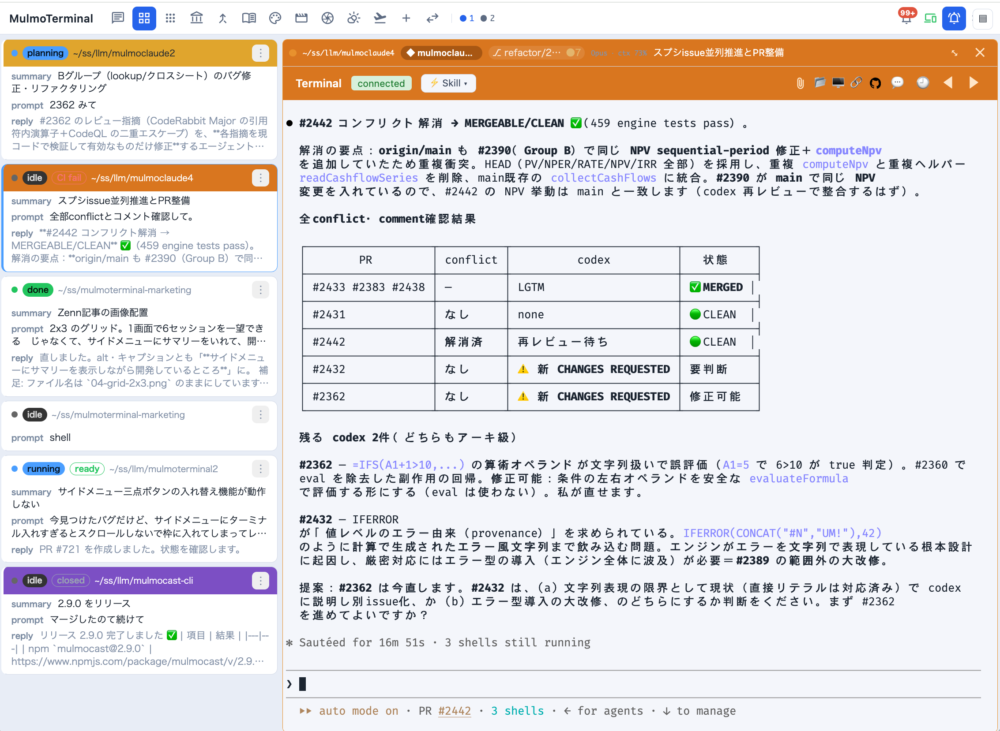
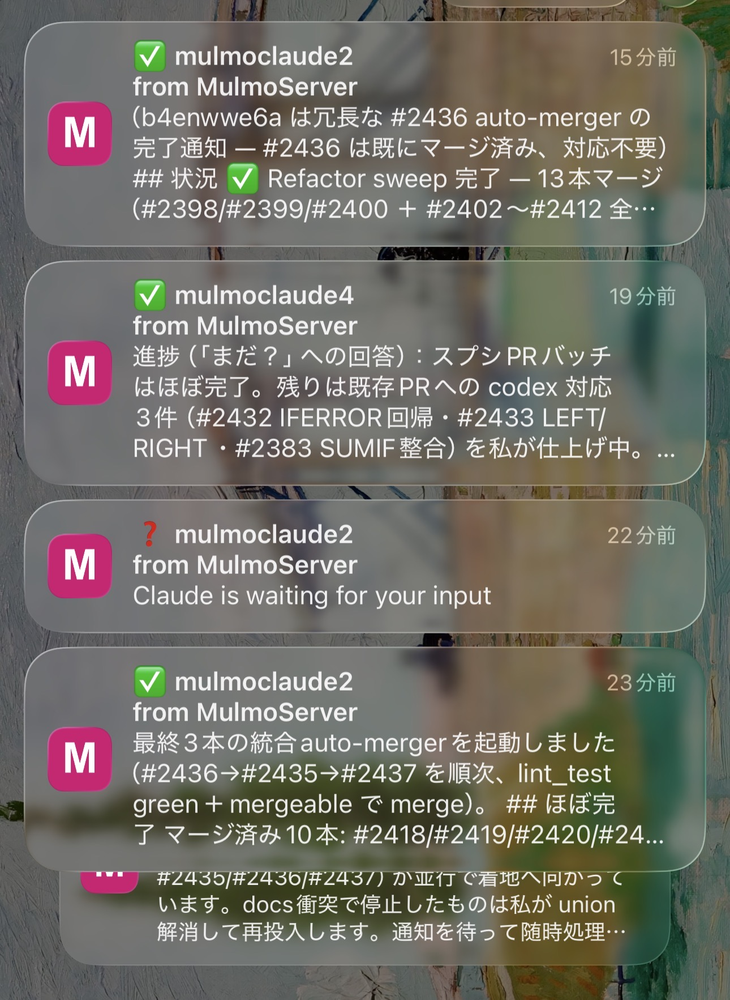

# MulmoTerminal Guide (English)

**Run a whole team of AI coding agents (Claude Code / Codex) in parallel, on one board** —
MulmoTerminal is the cockpit for that. The headline features first.

## ✨ Highlights

### 🎛️ The grid — a cockpit for parallel agents


One independent agent per cell. **Status colors** (working = blue / awaiting input = amber /
done-review = blue ring) and an **attention sound** mean you pick up only the cells that call
you — no babysitting. → [Basics](basics.html)

### 📋 The cockpit roster — everyone's progress, one row each



Stay zoomed into one agent while a text list tracks **every session's AI summary, last
instruction, latest reply, and PR phase** (draft / CI fail / ready / merged …). This is the
main screen for running many agents. → [Basics](basics.html)

### 📱 Phone push & remote control — walk away, get called back



Finished and input-waiting turns send a **Web Push to your phone**; open the live screen there
and answer with one tap (**yes / no / continue**). → [Mobile notifications](notifications.html)

### 🌿 Worktree isolation & one-click PRs

**Git worktrees** let several agents work the same repo without colliding — diff panel, commit,
push, and **⧉ Open PR**, all from the cell. → [Scenarios](scenarios.html)

### 🖼️ The GUI panel — a screen beside the terminal

The agent's tool calls render as **diagrams, forms, images, documents, and video/slides
(MulmoCast)**. Your agent hands you an interface, not just printed text. → [Feature reference](features.html)

### ♻️ tmux persistence — sessions don't die

Sessions survive reloads, reconnects, and server restarts. Leave a long build running and come back.

---

## Vibe-coding with AI agents — sound familiar?

As you run more and more terminals and AI agents (**Claude Code** / **Codex**)…

- 📊 you **lose track of which one is doing what** (their status)
- 📁 you can't tell **which directory** each is in
- 💭 even when you know the dir, **what did I even ask it?** (you forget the instruction)
- 🔔 an agent **finishes and you don't notice** — it waits on you, or you wait on it
- 💥 close the tab or the terminal drops, and **the session is gone**
- 🌿 you want to check git or open a folder, but keep **typing commands for it**
- ⚡ all you really wanted was to **work fast with the terminal as your hub** —

AI agents take minutes per task. Babysit one and your hands sit idle; add more and keeping track gets harder.
The bottleneck isn't the CPU or the terminal — it's **your attention**.

## Every one of these, handled

| The moment | In MulmoTerminal |
|---|---|
| Can't tell the **status** of many terminals | Lay them out in a grid; **status colors** (working = blue / awaiting input = amber / done-review = blue ring) + a sound, at a glance (→ [Basics](basics.html)) |
| Don't know **which directory** | Each cell shows its dir, a **project name badge, and colors**. Color-code to tell them apart (→ [Config](config.html#per-dir)) |
| **Forget the instruction** | The cell header always shows the **latest instruction / what it's doing**; 🕘 shows the **tool-call history** (→ [Feature reference](features.html)) |
| Want to **know it's done** | Input-waiting turns **amber**, a finished turn gets a **blue ring**, both **play a sound** — plus a **Web Push to your phone** (→ [Mobile notifications](notifications.html)) |
| Want the **session to survive** | **tmux persistence** keeps it alive across reload, reconnect, and server restart |
| Open **git / a dir** quickly | A git status chip; open **the OS file manager (Finder/Explorer) / the in-app files / a PR** in one click |
| Work with the **terminal as the hub** | All of the above on top of a terminal, and **extend it to your workflow with a DSL** (→ [Config](config.html#header)) |

## The four pillars behind it

1. **Supervise** — the grid is a **cockpit for parallel agents**. Triage by status color + sound; step in only where you're needed.
2. **See** — each agent's **status, model, context, git, tool-call timeline, and cost**, at a glance. What each one is doing and where, always visible.
3. **Automate & investigate** — run scripts in one click (in a **spare cell** next to a running session); when one fails, **turn a wall of logs into a short AI diagnosis**.
4. **Extend (DSL)** — header buttons/chips, launchers, and per-project config via **a small DSL** — it fits any developer.

## 🚀 Get started

If the [`claude`](https://claude.com/claude-code) CLI (Claude Code) runs on your machine and you have **Node ≥ 22.9**,
one command starts it (`tmux` is ideal for persistent sessions):

```bash
npx mulmoterminal@latest    # opens http://localhost:34567
```

## How to read this guide

1. [Basics — what you can do in the grid](basics.html)
2. [Scenarios — workflows by example](scenarios.html)
3. [Feature reference](features.html) (grouped by the four pillars)
4. [Configuration](config.html) (settings modal · `config.json` · `.mulmoterminal.json` · the **DSL**)
5. [Mobile notifications (Web Push)](notifications.html) (iPhone / Android setup, and driving it from the phone)
6. [Using another model via OpenRouter](providers.html) (run Kimi / DeepSeek / Gemini, with measured data)
7. [Local models with claude-ollama](claude-ollama.html) (fully local, offline, via Ollama)

> The Japanese guide is here: [日本語ガイド](../ja/).
