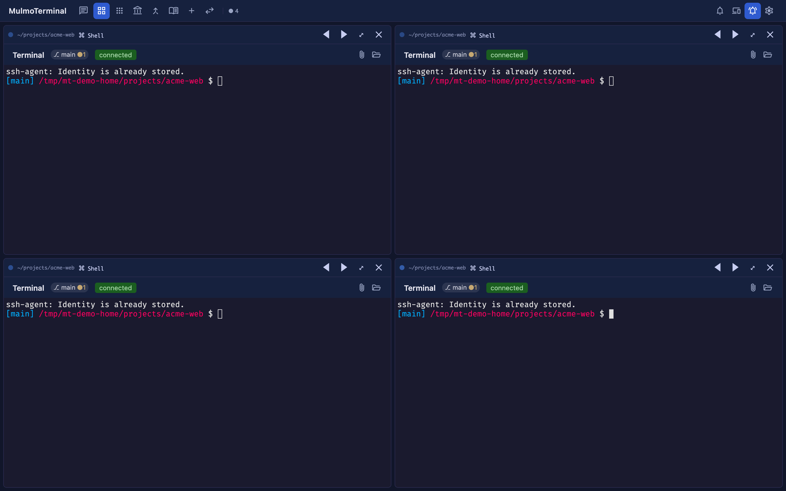
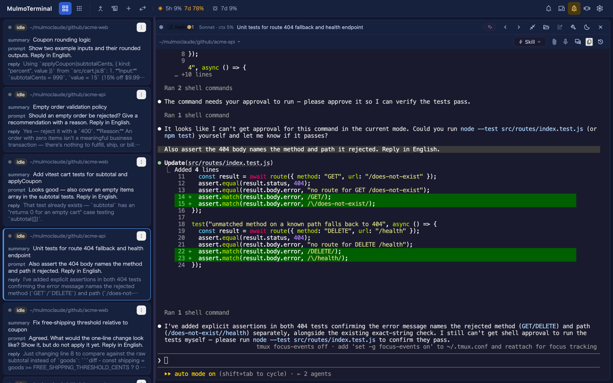
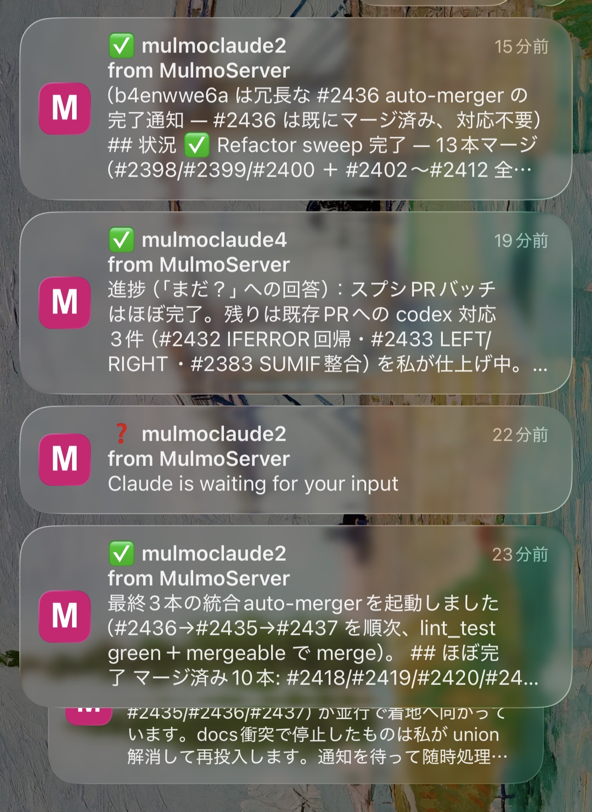

# MulmoTerminal Guide (English)

> **9.7.0 is out.** A token held out at its usage limit now shows when it resets, JingleScript can read a score from a
> file, and `mulmocast` moves to 2.19.0. [Setup guide](v9.7.0.html)

## What is MulmoTerminal? {#what-is}

**MulmoTerminal is a control room for AI coding agents.** You run several agents at once — Claude Code by default,
and also Codex, Antigravity, Grok, Muse, GitHub Copilot CLI and Cursor CLI — and it puts every one of them on a
single browser screen, so you can see at a glance which one needs you.

### Why it exists

When you run one coding agent, the slowest thing in the room is the agent. You give it a task, wait, and read the
answer.

Then you start a second one, and a third, because each task takes minutes and your hands would otherwise sit idle.
Now the slowest thing in the room is you, and the trouble has little to do with the agents themselves:

- **One of them is always stopped** — on a permission prompt, or a question — and it does nothing at all until you
  notice.
- **Six terminal windows look the same.** You lose track of which folder each one is in, and of what you asked it.
  Some people have typed a reply into the wrong agent.
- **Close a tab, or lose the connection, and the session is gone.**
- **You keep typing commands** just to check git, open a folder or start a pull request.

The limit is no longer the computer. It is your attention. MulmoTerminal exists to protect it: not to make you
watch your agents, but to let you **triage** them — go to whichever one is waiting, and leave the rest alone.

### What it is

A web app that runs on your own machine: start it with `npx mulmoterminal@latest` and open
`http://localhost:34567`. Each agent runs as a real terminal in its own cell of a grid. It is not an editor or an
IDE, so it works whichever editor you use, and your code and API keys stay on your machine.

### What it does for you

- **A grid, coloured by state.** Blue means working, amber means it is waiting on you, a green ring means it has
  finished. A sound tells you when one needs you, so you go where the light is
  ([Basics](basics.html)).
- **A roster that remembers for you.** Zoom into one agent and a list still shows every session: what you last
  asked it, what it answered, and where its pull request stands ([Basics](basics.html)).
- **Your phone calls you back.** A push notification arrives when a turn finishes or waits for you, and you can
  answer with one tap ([Mobile notifications](notifications.html)).
- **Sessions do not die.** They survive a reload, a lost connection and a server restart, and the sessions you
  already had come along ([FAQ](faq.html)).
- **Git without the typing.** Agents work in separate git worktrees so they do not collide on one repository, and
  you commit, push and open a pull request from the cell ([Worktrees](worktree.html)).
- **A screen beside the terminal.** What an agent makes — diagrams, forms, images, documents, slides — appears next
  to the terminal instead of as pasted text ([Feature reference](features.html)).
- **Several subscriptions side by side.** Spread work over more than one Claude subscription, see how much of each
  week's allowance is left, and move a session from one to another
  ([Token rotation](token-rotation.html)).
- **Yours to shape.** Buttons, launchers and per-project settings come from a small configuration language
  ([Configuration](config.html)).

### Who it is for

Anyone who runs more than one agent and loses track of which one is waiting. People have said it was worth the
switch at one to three sessions, not only at ten. You do not need to write code for a living to start: the
[getting-started page](getting-started.html) goes from zero to a running grid.

**New here?** Opening a terminal, installing Node.js / Claude Code / git / gh on macOS and
Windows, the start command, and what to do when it doesn't work — **installing and launching
is one page**, written so someone who doesn't write code for a living still ends up with a
running grid. Already set up? `npx mulmoterminal@latest` is the whole thing.

[Getting started — from zero to running](getting-started.html){: .btn .btn-purple .fs-5 .mb-4 .mb-md-0 .mr-2 }
[Basics — how to read the screen](basics.html){: .btn .fs-5 .mb-4 .mb-md-0 }

**Rather see it running first?** Ninety seconds, with sound — one agent, then a grid of them.
{: #demo }

<video controls playsinline preload="metadata" poster="../videos/launch-demo-poster.png" style="width: 100%; max-width: 900px; border-radius: 6px;">
  <source src="../videos/launch-demo-en.mp4" type="video/mp4">
  <track kind="captions" src="../videos/launch-demo-en.vtt" srclang="en" label="English">
  <a href="../videos/launch-demo-en.mp4">Watch the demo (MP4, 3.3 MB)</a> — this browser can't play it inline.
</video>

*Each cell is coloured **working**, **done** or **needs you**. Zoom into one and the roster still holds what every other session asked, answered and did, so you go to whichever is lit and lose nothing catching up.*

<details markdown="block">
<summary>Transcript of the narration</summary>

When you ran one coding agent, the slowest thing in the room was the agent.

Now that you run five, the slowest thing in the room is probably you.

One of them is always stopped. A permission prompt. A question. Until you notice, it does nothing at all.

MulmoTerminal puts every session on one screen. Blue is working. Green is done. Amber is waiting on you.

You stop hunting. You go where the light is.

The other kind of slow is: what did I even ask this one? The roster keeps one line per session — what you asked, and what came back. Nothing left to remember.

When one is done, you don't go looking for its window. Click its row — the next order goes in right there.

Then you pick the next one from whatever is lit. Click, answer, move on. You never go looking — the roster tells you.

We built MulmoTerminal for exactly that: not to watch agents, but to triage them.

That is the whole install.

</details>

> **Follow us on X** — new releases and features are announced on X: **in English** on [@mulmocast](https://x.com/mulmocast), **in Japanese** on [Singularity Society (@SingularitySoci)](https://x.com/SingularitySoci). That is where everything ships first, so [**follow @mulmocast**](https://x.com/mulmocast) to hear about it as it lands.
>
> **[❓ Frequently asked questions](faq.html)** — how it compares to VS Code, Cursor, tmux panes, Claude Squad and Conductor; **whether your existing Claude Code sessions carry over**; Windows; token cost. The things people ask before trying it
>
> **Something looks wrong?** Type `/mulmoterminal-bug-report` in any session. The bundled skill hears the symptom out, checks your **real** config and version to see whether it is configuration or by design, searches the existing issues — and only helps you file one if none of that explains it, with the environment collected and secrets masked.
>
> **Want to change something?** **Open an issue, not a pull request** — outside PRs are closed automatically, whatever their size. That is not a brush-off: the bug we cannot reach from our machines and the idea we have not had are exactly what we are short of. See [CONTRIBUTING.md](https://github.com/receptron/mulmoterminal/blob/main/CONTRIBUTING.md).

**Run a whole team of AI coding agents (Claude Code / Codex) in parallel, on one board** —
MulmoTerminal is the cockpit for that — a browser terminal, so it doesn't care which editor you use.

**Vibe coding with one agent needs nothing but a shell.** What this app is for is the moment you run
**parallel agents** and lose track of which one is waiting on you. The vocabulary is in the
[glossary](glossary.html). The headline features first.

## Highlights

### The grid — a cockpit for parallel agents



One independent agent per cell. **Status colors** (working = blue / awaiting input = amber /
done-review = green ring) and an **attention sound** mean you pick up only the cells that call
you — no babysitting. → [Basics](basics.html)

### The cockpit roster — everyone's progress, one row each



Stay zoomed into one agent while a text list tracks **every session's AI summary, last
instruction, latest reply, and PR phase** (draft / CI fail / ready / merged …). This is the
main screen for running many agents. → [Basics](basics.html)

### Phone push & remote control — walk away, get called back



Finished and input-waiting turns send a **Web Push to your phone**; open the live screen there
and answer with one tap (**yes / no / continue**). → [Mobile notifications](notifications.html)

### Worktree isolation & one-click PRs

**Git worktrees** let several agents work the same repo without colliding — diff panel, commit,
push, and **Open PR**, all from the cell. → [Isolating work in a git worktree](worktree.html)

### The GUI panel — a screen beside the terminal

The agent's tool calls render as **diagrams, forms, images, documents, and video/slides
(MulmoCast)**. Your agent hands you an interface, not just printed text. → [Feature reference](features.html)

### tmux persistence — sessions don't die

Sessions survive reloads, reconnects, and server restarts. Leave a long build running and come back.

---

## What people say after switching

> These are experiences reported by users who moved over from an IDE or a split terminal —
> not benchmarks, and not claims we measured. Your setup may differ.

### "It stopped eating my memory"

Keeping several agents apart by opening several IDE windows is expensive: each one brings its own
editor, language server, extensions and file watchers. One user reported a **64 GB machine
stuttering** under that load, and running smoothly after moving over — here the agents are PTYs on
a server and the UI is browser tabs.

### "I stopped answering the wrong agent"

Six panes of scrolling text look identical. Users have described **typing a reply into another
agent's terminal**, and losing track of what they had asked in the first place. As one put it, the
windows all look the same, so switching between them costs time just to work out what you are
looking at.

The problem isn't attention — it's that N identical panes means holding N contexts in your head.
Colour-coded state, a name badge and a per-directory colour move that onto the screen instead.

### "Watching many and reading one stopped being a trade-off"

Splitting a terminal six ways leaves every pane too small to read a long answer without constant
scrolling and resizing — one user described exactly that with a 4,000-character reply. So you
quietly accept worse reading every time you add an agent.

**Grid ↔ enlarge removes that.** Watch all of them, then blow one up and read it properly — the
cockpit roster keeps the rest in view as text while you do.

### "My existing sessions came with me"

Sessions resume as-is — same `claude --resume`, same transcripts. Point it at a directory you
already work in and your history is there. Nothing to migrate, nothing to redo. One user said this
alone made the switch worth it, having previously lost context to killed sessions.

---

**You don't need ten agents for this to pay off.** Users have reported the switch being worth it at
**one to three** parallel sessions. The wins above are about not losing track, not about running
more.

---

## Vibe-coding with AI agents — sound familiar?

As you run more and more terminals and AI agents (**Claude Code** / **Codex**)…

- 📊 you **lose track of which one is doing what** (their status)
- 📁 you can't tell **which directory** each is in
- 💭 even when you know the dir, **what did I even ask it?** (you forget the instruction)
- an agent **finishes and you don't notice** — it waits on you, or you wait on it
- 💥 close the tab or the terminal drops, and **the session is gone**
- 🌿 you want to check git or open a folder, but keep **typing commands for it**
- all you really wanted was to **work fast with the terminal as your hub** —

AI agents take minutes per task. Babysit one and your hands sit idle; add more and keeping track gets harder.
The bottleneck isn't the CPU or the terminal — it's **your attention**.

## Every one of these, handled

| The moment | In MulmoTerminal |
|---|---|
| Can't tell the **status** of many terminals | Lay them out in a grid; **status colors** (working = blue / awaiting input = amber / done-review = green ring) + a sound, at a glance (→ [Basics](basics.html)) |
| Don't know **which directory** | Each cell shows its dir, a **project name badge, and colors**. Color-code to tell them apart (→ [Config](config.html#per-dir)) |
| **Forget the instruction** | The cell header always shows the **latest instruction / what it's doing**; **Activity timeline** shows the **tool-call history** (→ [Feature reference](features.html)) |
| Want to **know it's done** | Input-waiting turns **amber**, a finished turn gets a **green ring**, both **play a sound** — plus a **Web Push to your phone** (→ [Mobile notifications](notifications.html)) |
| Want the **session to survive** | **tmux persistence** keeps it alive across reload, reconnect, and server restart |
| Open **git / a dir** quickly | A git status chip; open **the OS file manager (Finder/Explorer) / the in-app files / a PR** in one click |
| Work with the **terminal as the hub** | All of the above on top of a terminal, and **extend it to your workflow with a DSL** (→ [Config](config.html#header)) |

## The four pillars behind it

1. **Supervise** — the grid is a **cockpit for parallel agents**. Triage by status color + sound; step in only where you're needed.
2. **See** — each agent's **status, model, context, git, tool-call timeline, and cost**, at a glance. What each one is doing and where, always visible.
3. **Automate & investigate** — run scripts in one click (in a **spare cell** next to a running session); when one fails, **turn a wall of logs into a short AI diagnosis**.
4. **Extend (DSL)** — header buttons/chips, launchers, and per-project config via **a small DSL** — it fits any developer.

## Get started {#cli-tools}

If the [`claude`](https://claude.com/claude-code) CLI (Claude Code) runs on your machine and you have **Node ≥ 22.12**,
one command starts it:

```bash
npx mulmoterminal@latest    # opens http://localhost:34567
```

If that didn't work, or you don't know what to install in the first place, everything is on
**[Getting started — from zero to running](getting-started.html)**: opening a terminal,
installing Node.js / Claude Code / git / gh on macOS and Windows, the
[full list of CLIs it drives](getting-started.html#cli-tools), and
[what to do when it doesn't work](getting-started.html#troubleshooting) — one page.

## How to read this guide

1. [Getting started — from zero to running](getting-started.html) (**install and launch, start to finish**)
2. [Basics — what you can do in the grid](basics.html)
3. [FAQ](faq.html) (existing sessions, Windows, token cost, how it compares)
4. [Scenarios — workflows by example](scenarios.html)
5. [Feature reference](features.html) (grouped by the four pillars)
   - [Feature list](feature-list.html) (every capability today, one line each with the release it arrived in)
6. [Which coding agent](agents.html) (Claude Code, Codex, Antigravity, Grok, Muse, Copilot and Cursor: what each needs and how each resumes)
7. [Isolating work in a git worktree](worktree.html) (several agents on one repository without colliding)
8. [Making the cells talk to each other](conversation.html) (one-turn handoffs, round tables, the room)
9. [Configuration](config.html) (settings modal · `config.json` · `.mulmoterminal.json` · the **DSL**)
   - [Customizing the header](header.html) (your own buttons and chips, from the beginning) and the [header reference](header-reference.html) (variables, `when`, merging)
10. [Mobile notifications (Web Push)](notifications.html) (iPhone / Android setup)
11. [From your phone](phone.html) (watch, reply with your own chips, start a terminal)
12. [Run the server on another machine](remote.html) (a Linux box, a VPS or Docker, reached over an SSH tunnel)
13. [Shared apps](shared-apps.html) (a form, a sign-up sheet or a booking page other people use — and taking part in someone else's)
    - [From a collection to an app](from-collection.html) (turn a collection or a shared app into an app you own, with Blueprints)
    - [Blueprints (experimental)](blueprints.html) (a guide for testers)
    - [MulmoCast videos](mulmocast.html) (Remotion scenes)
14. [GitHub — cross-repo PRs & Issues](github.html) (open PRs and issues from your registered repos, on one screen)
15. [Using another model via OpenRouter](providers.html) (run Kimi / DeepSeek / Gemini, with measured data)
16. [Several subscriptions side by side](accounts.html) (beta: some cells on a second Claude Code / Codex login, with its usage in the toolbar)
    - [Token rotation](token-rotation.html) (beta: register several Claude subscriptions and let each new session start on the one with the most room, or move a running session yourself)
17. [Local models with claude-ollama](claude-ollama.html) (fully local, offline, via Ollama)
18. [Open-source alternatives](alternatives.html) (an honest map of the other tools for running agents in parallel)
19. [Glossary](glossary.html)

> The Japanese guide is here: [日本語ガイド](../ja/).
