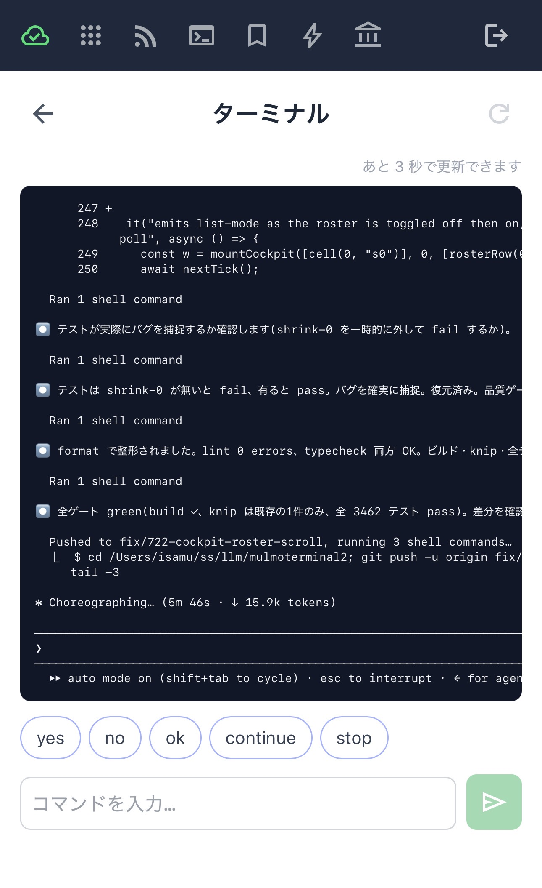

# Mobile notifications (Web Push)
{: .no_toc }

- TOC
{:toc}

**When a task finishes — or stops on a permission prompt or question — your phone gets a push
notification.** Kick off a long task, walk away, and get pulled back when you're needed. Setup is
in two places: the **terminal side** and the **phone side**.

- There are **two kinds** of push: a turn **finishing**, and a turn **blocking on input**
  (permission prompt / question).
- Pushes fire **even for the pane you're viewing** (unlike the attention [sound](features.html),
  which stays quiet for the active pane — a push assumes your phone is elsewhere). Only internal
  background workers are excluded.
- The send happens on the server; device registration/delivery is handled by a separate service
  (`mulmoserver`). Pushes are sent **only while RemoteHost is connected**.

---

## 1. Terminal side (mulmoterminal)

1. Open the **📱 RemoteHost** control in the toolbar (`phonelink` icon) and click
   **Connect (Google sign-in)**. A Google sign-in popup opens — sign in with the
   **same Google account** you'll use on the phone.
2. In **Settings (⚙) → Web Push notifications**, turn on
   **"Notify my devices when a task finishes"** (off by default).

> ⚠️ This is **not** the **Google account** section in Settings (⚙) — that one links a
> Calendar account for tools. Notifications use the **Connect** button in the RemoteHost panel.

That's it — a background task finishing now sends a push to your phone.

> 💡 The login survives a server restart (since 0.9.3): the session is parked in the browser and
> the client silently reconnects — on page load, socket reconnect, tab wake, or network recovery.

## 2. Phone side (mulmoserver PWA)

The entry point is the same on every phone: **[https://mulmoserver.web.app](https://mulmoserver.web.app)**
(or scan the **QR code** shown in the RemoteHost panel with your phone's camera). Sign in with the
**same Google account** as the terminal — but the steps **differ between iPhone and Android**.

### iPhone / iPad (iOS 16.4+)

On iOS, **Web Push only works from a PWA installed on the Home Screen** — you can't enable it
from a regular Safari tab, so **install first**.

1. Open [https://mulmoserver.web.app](https://mulmoserver.web.app) in Safari.
2. Tap **Share → "Add to Home Screen"** to install the PWA.
3. **Launch it from the Home Screen icon** and sign in with the same Google account as the terminal.
4. Tap **"Enable notifications"** and allow the permission prompt (this registers the device
   as a push target).

### Android

Android (Chrome) can enable push straight from the browser tab.

1. Open [https://mulmoserver.web.app](https://mulmoserver.web.app) in Chrome.
2. Sign in with the same Google account as the terminal.
3. Tap **"Enable notifications"** and allow the permission prompt.
4. (Recommended) Use the menu's **"Add to Home Screen"** to install the PWA — launching and
   delivery are more reliable that way.

## Not just notifications: watch and reply from the phone

The mulmoserver PWA is a **remote control**, not just an inbox. From your phone you can browse
the host's sessions, watch a session's **live screen**, and answer on the spot — type a command
or tap a quick reply (**yes / no / ok / continue / stop**). Get pinged, glance at the screen,
send one word, and the agent keeps going — all without a laptop.

---

## When a push is sent

- ✅ RemoteHost is **connected** on the terminal side
- ✅ the **"Notify my devices…" toggle is ON**
- ✅ at least one **device has notifications enabled** on the phone side
- ✅ a regular session's turn **finished** or **blocked on input** (the pane you're viewing
  counts too; internal workers don't)

## If nothing arrives

- Is **RemoteHost disconnected**? → Connect again.
- Notifications not enabled / no device registered on the phone. → enable them in the PWA.
- **Can't enable on iPhone?** → launch from the **Home Screen icon**, not a Safari tab
  (an iOS restriction).
- **Blocked the permission prompt?** → flip it back to "Allow" in the browser's site settings
  (the icon left of the address bar → Notifications).
- **Different Google accounts** on the terminal and the phone? → sign in to both with the
  same account.
- Getting the **same push twice**? Your phone may have a **stale registration** — re-registering
  on the mulmoserver side clears it.

---

← [Configuration](config.html) / [English guide index](index.html)
