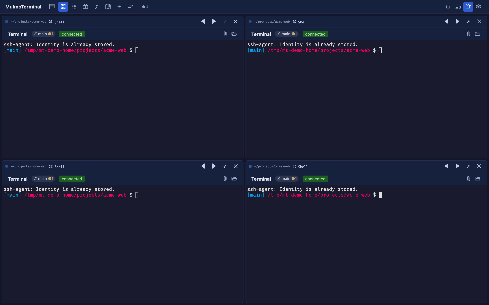
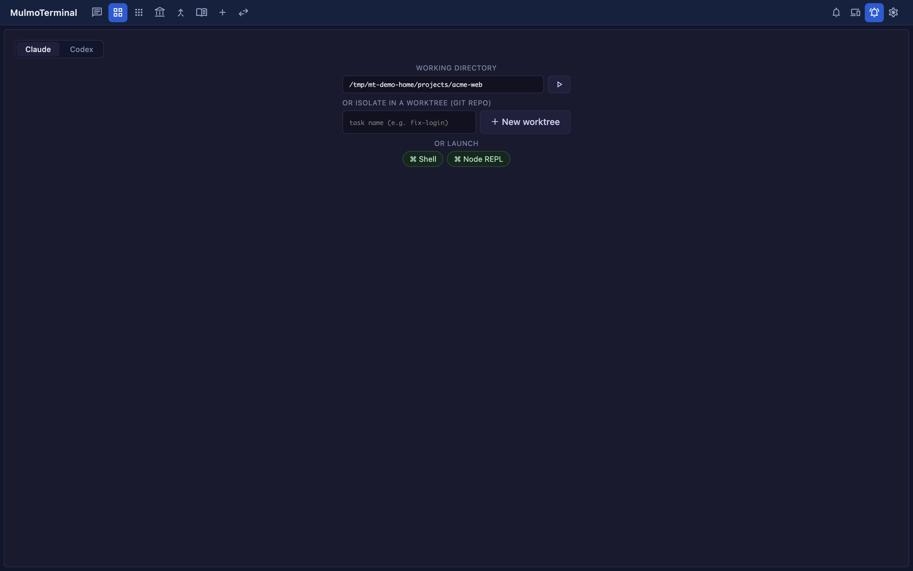
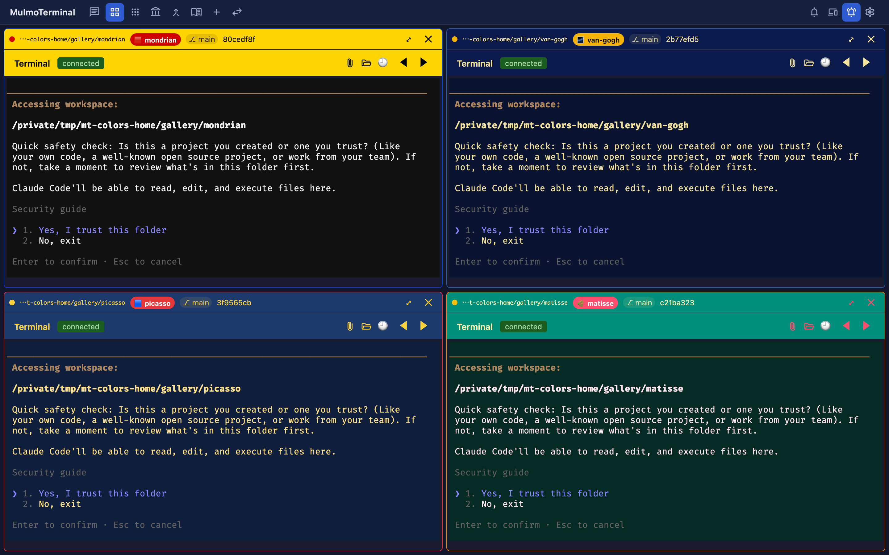

# Scenarios — usage by scenario
{: .no_toc }

- TOC
{:toc}

MulmoTerminal's four pillars — **Supervise / See / Automate & investigate / Extend** — shown as real development workflows.

---

## 1. Run several tasks in parallel (Supervise)

The grid's core and headline use case. This is the center of the **command post**.

1. Add cells with `New terminal ＋` and launch Claude / Codex on a different task in each.
2. While one is thinking, move ahead with review or edits in another cell.
3. Pick up only the cells that call you — **amber (awaiting input)** or the **blue-ringed "done, review it"** ones — you don't have to watch them all.



> Each cell's header shows what that session is doing right now, so you can tell which cell is working on what at a glance.

> 🔔 **You also hear when it's done.** When a session needs you, a notification **sound** plays — so you notice even without
> watching the screen. Point it at **your own audio file** in [Configuration](config.html) — one developer rings a
> **gong ("goooong")** on every completion.

## 2. Isolate work safely with a worktree

When you want to try something *without polluting main*, isolate the work in a **git worktree**.

1. In a cell whose working directory is a git repo, enter a task name (e.g. `fix-login`) under **OR ISOLATE IN A WORKTREE**.
2. Click **＋ New worktree** to create a worktree dedicated to that task and launch the session.
3. As changes pile up, a diff badge appears in the cell header. From there it's one click to **push / create a PR**.



## 3. Work across multiple repositories

You can point each cell at a **different working directory**. Open your frontend repo and your API repo in adjacent
cells and change one to match the other — cross-repo work that completes on a single screen. Register the directories
you use often as *cwd presets* in [Configuration](config.html) so autocomplete kicks in.

## 4. Run a script and let AI summarize the failure

Grid cells aren't just for Claude — they can run your project's **scripts**, say `yarn dev` (dev server), `yarn test`,
`yarn build`, or `yarn lint`.

1. Define scripts in that directory's `script.json`, then pick one from an empty cell's launcher (or the **▶ Run** menu).

   ```json
   { "scripts": [
     { "label": "dev",  "command": "yarn dev" },
     { "label": "test", "command": "yarn test" },
     { "label": "lint", "command": "yarn lint" }
   ] }
   ```

   > **Another way, as of 0.8.0:** a **`run:"shell"` button** in `.mulmoterminal.json` (e.g. `{ "run": "shell", "cmd": "yarn build" }`)
   > runs the same command as a command cell from a one-click header button. See [Configuration → Customizing the header](config.html#header).
2. From an empty cell's launcher the script runs **inside that cell**; from a running session's **▶ Run** menu it
   launches in **a spare cell next door** (so the conversation isn't interrupted). Either way you watch the results
   right next to your Claude session.
3. When a build or test fails and drowns you in logs, press the **✦ button** (Summarize output) on the command cell.
   It passes the output to `claude -p` and returns a short summary of the **errors / warnings / cause / how to fix**.
   Use **⧉ Copy as prompt** to copy "command + directory + summary + follow-up" and paste it into any session to continue.

## 5. Use Claude and Codex together

You can send the same task to both Claude and Codex to compare, or use each for what it does best — all on a per-cell basis.
Just pick one with the toggle at launch; collection actions and mulmoclaude skills work with both.

## 6. Tell projects apart by color

As you add cells, it gets harder to tell which one is which project. Set a **name badge** and header / body / border /
dot / button **colors** in each repo's `.mulmoterminal.json` so you can distinguish them at a glance in the grid (see
[Configuration](config.html#per-dir)).



*Here: Mondrian (yellow + red), Van Gogh (night blue + yellow), Picasso (blue + red + yellow), Matisse (green + pink).
Not just the header and badge — `colors` tints the **terminal itself (background + text)** too, so you can't mix them up.*

```json
{
  "name": "🌌 van-gogh",
  "badgeColor": "#f5b301",
  "headerColor": "#0b1a4a",
  "headerTextColor": "#f2e29b",
  "colors": { "background": "#0a1330", "foreground": "#f2e29b", "cursor": "#f5b301" }
}
```

## 7. Add your frequent actions to the header

Using `buttons` / `chips` in `.mulmoterminal.json`, you can add **your own buttons** (e.g. send `/compact`, open GitHub,
run a build) and **display chips** to the header of a running terminal. For details, see [Configuration → Customizing the header](config.html#header).

---

Next: [Feature reference](features.html)
