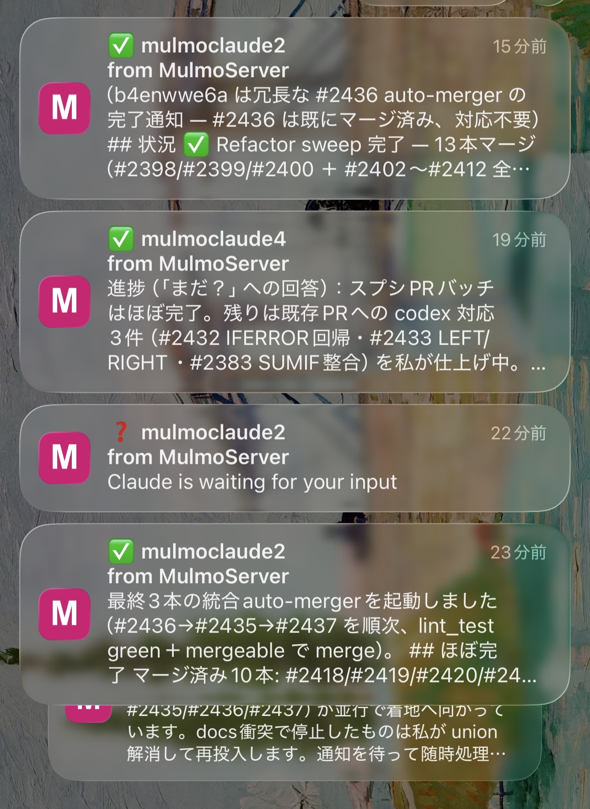
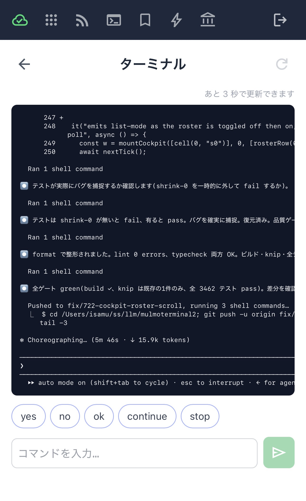

# Using what 2.0.0 added
{: .no_toc }

**As of 2026-07-26.** This page is a snapshot taken at release, written so that someone who wants
a feature *now* can get it working. For anything that changes later, follow the links to the
living guide in each section.

- TOC
{:toc}

---

## Keyboard shortcuts

Drive the grid without the mouse. **Nothing is bound by default** — every key you bind is one the
program inside the terminal (Claude Code, `vim`, `less`) stops receiving, so that trade is yours
to make.

### 1. Open the config file

`~/.mulmoterminal/config.json`. Create it if it isn't there.

### 2. Add a `keymap`

Start with these two:

```json
{
  "keymap": {
    "zoom-toggle": "F8",
    "next-attention": "F9"
  }
}
```

If the file already has settings, add `keymap` **at the top level** and leave the rest alone.

### 3. Apply it

**Restart the server** and **reload the browser tab**. Both: the browser reads the config when the
page loads.

### 4. Check it took

⚙ Settings → **Keyboard shortcuts** lists every action with its binding. Seeing `F8` / `F9` there
means the config was read.

### Try it

With two or more terminals running:

| Key | What it does |
|---|---|
| `F8` | Enlarge the terminal the cursor is in. Press again to collapse |
| `F9` | Move to the next terminal worth looking at — awaiting input, then finished-and-unreviewed, then idle, skipping anything mid-turn |

`F9` **never changes whether you are zoomed**. Zoomed it moves the enlargement; in the grid it
moves the keyboard focus (the focused cell lifts slightly). Only `F8` enlarges and collapses.

### Everything you can bind

| Action | What it does |
|---|---|
| `zoom-toggle` | Enlarge / collapse |
| `zoom-next` / `zoom-prev` | Walk the enlargement along the on-screen order |
| `next-attention` | Move to the next terminal worth looking at |
| `terminal-new` | Add a terminal at the end |
| `terminal-new-adjacent` | Add one next to the current terminal, inheriting its directory |
| `terminal-close` | Close the current terminal |

### ⚠️ On a Mac

**`F1`–`F12` do not reach the browser by default.** macOS treats the top row as media keys, so
pressing `F8` just changes the volume or brightness. Either:

- Hold **`Fn`** while pressing `F8` (the binding stays `"F8"` — `Fn` is not a modifier the browser
  reports), or
- Turn on System Settings → Keyboard → Keyboard Shortcuts → Function Keys → **"Use F1, F2, etc.
  keys as standard function keys"**.

**`Option`+letter does not work.** macOS types an alternate character with `Option` held, so a
binding like `"Alt+n"` never matches. Pair `Option` with arrow keys instead.

A set that works on a Mac without changing any system setting:

```json
{
  "keymap": {
    "zoom-toggle": "Alt+ArrowUp",
    "next-attention": "Alt+ArrowDown",
    "zoom-next": "Alt+ArrowRight",
    "zoom-prev": "Alt+ArrowLeft"
  }
}
```

### ⚠️ Keys you cannot bind

`Cmd`/`Ctrl`+`W`, `Cmd`/`Ctrl`+`T` and `Cmd`/`Ctrl`+`N` are **reserved by the browser** — binding one simply does nothing. So
a close shortcut cannot be `Cmd+W`; use something like `Cmd+Shift+W`.

### If you mistype a binding

**The server refuses to start**, naming the line:

```
[config] /Users/you/.mulmoterminal/config.json: invalid keymap — refusing to start
  keymap.zoom-next: "Hyper+PageDown" — unparseable key binding
```

That is deliberate: a silently ignored typo is indistinguishable from a shortcut that just doesn't
work. Fix or remove the line and it starts.

→ **Full syntax, five ready-made keymaps, and the combinations that can never be bound:
[Configuration → Keyboard shortcuts](config.html#keymap)**

---

## Web Push, per kind

Push fired for both finished turns and permission prompts, with one global on/off as the only
control — so **"tell me when it's done" also meant a notification on every permission request.**
Now you choose.

### How to set it

⚙ Settings → **WEB PUSH NOTIFICATIONS**, and tick the moments you want. No file editing.

**Nothing changes for you if you already use Push:** an unset value means both kinds, so upgrading
loses no notifications.

→ **A table of which setting fires when: [Mobile notifications](notifications.html)**



---

## What the phone can do now

### Launch a terminal in the session's directory

From the phone's remote view you can start a new terminal **in the working directory of the
session you are looking at**. You pick from the host's configured launchers, so no arbitrary
command is ever run.

### Quick-reply chips you define

Register the phrases you type often and tap to drop them into the input box. They live in the
host's config, so every device sees the same chips.

### A link to GitHub

When the session's directory is a GitHub repository, the screen links out to it.

→ **Everything the phone can do: [Using MulmoTerminal from your phone](phone.html)**



---

## Clicking a file path opens it as what it is (1.11.0)

Click a file path an agent printed in the terminal and it now opens **according to its extension**.
Nothing to configure.

| Kind | Opens as |
|---|---|
| `.md` | Rendered |
| `.json` | Indented |
| `.csv` / `.tsv` | A table with a sticky header |
| Source, `.txt` | The in-app **Files** view — editable, highlighted |
| Images / PDF / video | As-is |

Files within the session's working directory.

---

## Also in this release

- **A terminal that went white after a resize recovers in place**, instead of asking for a page
  reload (xterm 6.0.0 buffer corruption).
- **Clickable elements inside a TUI** (Claude's "Jump to bottom" and friends) respond again.
- **`npx mulmoterminal@latest` reads the `.env` in the directory you ran it from** — if you keep an API
  key there, it now reaches the server (1.10.0).
- **Windows got a lot better** (1.9.2 / 1.10.0 / 1.11.1): sessions start on an `npm i -g` Claude
  Code, and the `--settings` JSON arrives intact.

---

Details of earlier releases are in the
[changelog](https://github.com/receptron/mulmoterminal/blob/main/docs/ChangeLog.md).
