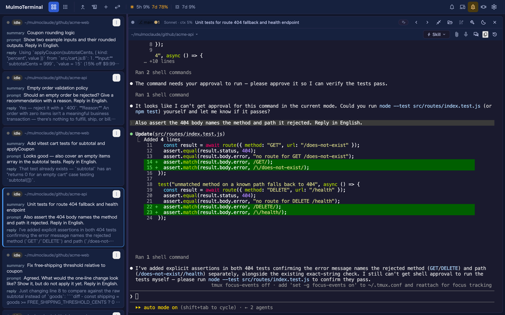

# Using what 2.1.0 added
{: .no_toc }

**As of 2026-07-27.** This page is a snapshot taken at release, written so that someone who wants
a feature *now* can get it working. For anything that changes later, follow the links to the
living guide in each section.

- TOC
{:toc}

---

## The app now opens on the grid

**Nothing to configure — this one just happens.** Open `http://localhost:34567` and you land on
the **grid** instead of the single view. The URL settles on `/terminals`.

The single view did not go away; it has its own address now:

| Screen | URL |
|---|---|
| Grid (the default) | `/` → `/terminals` |
| Single view | **`/chat`** |

**If you would rather start on the single view, bookmark `http://localhost:34567/chat`.** That is
the whole workaround, and it is a stable URL — the chat / grid icons in the toolbar keep working
as before.

Two smaller consequences worth knowing:

- A **mistyped URL** now lands on the grid rather than the single view.
- Opening the app **no longer attaches the single view's terminal**. That session lives in tmux
  on the server, so nothing is lost — it comes back the moment you open `/chat`.

→ Reference: [Basics](basics.html)


---

## Terminal font size

The terminal's font size is adjustable — globally from Settings, and per project.

**Globally:** open **Settings (⚙) → Terminal font size** and use the stepper. It applies
immediately and is remembered **per browser** (so a phone and a desktop pointed at the same
server each keep their own size, which one shared value could not express).

**Per project**, in that directory's `.mulmoterminal.json`:

```json
{
  "fontSize": 16
}
```

A per-directory value **wins** over the global one for that terminal. The range is **8–32**
(default 14); a number outside it is clamped, and a non-number is ignored.

Why a setting rather than browser zoom: zoom scales the page but leaves xterm's grid and the
shell disagreeing about how many columns exist, so the cursor and the wrap points drift. This
path re-fits the terminal and tells the shell the new size.

→ Reference: [Terminal font size](config.html#font-size)


---

## Cockpit roster: how many lines each row shows

The **cockpit roster** — the list beside an enlarged terminal — truncates each session's summary,
last prompt, and latest reply. How many lines each of those gets is now yours to set, in
`~/.mulmoterminal/config.json`:

```json
{
  "cockpitLines": { "summary": 6, "prompt": 2, "response": 3 }
}
```

**Defaults are 2 / 2 / 3, and omitting `cockpitLines` keeps exactly the old behaviour.** Raise
`summary` when you want to read what an agent is doing without zooming into it; raise `response`
when the answers you care about are longer than three lines.

Restart the server (or save from Settings) for a hand-edited config to take effect.

→ Reference: [Cockpit roster line counts](config.html#cockpit-lines)



---

## PRs say which clone they came from

If you keep several checkouts of one repo side by side — `myrepo`, `myrepo2`, `myrepo3` — a PR on
GitHub used to say nothing about which one produced it. A PR created with **⧉ Open PR** now ends
its body with:

```
work in myrepo3
```

That is the name of the **main checkout**, not of the worktree. It is added only to PRs
MulmoTerminal creates; pressing the button again on a branch that already has a PR just opens it.

**On by default.** To turn it off, in `~/.mulmoterminal/config.json`:

```json
{
  "prWorkdirFooter": false
}
```

This one takes effect on the **next PR — no restart needed**, because it has no Settings control
and is read from the file each time.

→ Reference: [Which clone made this PR](config.html#pr-workdir-footer)

---

## The interface uses icons instead of emoji

Every emoji in the UI is now a **Material Symbols** glyph — the grid cell toolbars, the overlays,
the menus, the settings modal. Buttons kept their tooltips and labels, so nothing you knew how to
click moved.

**Nothing to configure.** One thing to know if you have customised header buttons: a button in
`.mulmoterminal.json` should now use **`icon`** with a Material Symbols name rather than `emoji`:

```json
{
  "buttons": [{ "id": "build", "icon": "build", "label": "Build", "run": "shell", "cmd": "yarn build" }]
}
```

`emoji` still works and still wins when both are set, so **your existing config keeps rendering
exactly as it does today** — there is nothing to migrate.

→ Reference: [Customizing the header](config.html#header)


---

## Outside pull requests are now closed automatically

Repository policy, not a feature you turn on: a pull request from someone outside the development
team gets a comment pointing at
[CONTRIBUTING.md](https://github.com/receptron/mulmoterminal/blob/main/CONTRIBUTING.md) and is
closed. **Issues — bug reports and feature requests — are as welcome as ever**, and they are the
way to get a change in: open one, agree on a plan, and a maintainer writes the PR.
