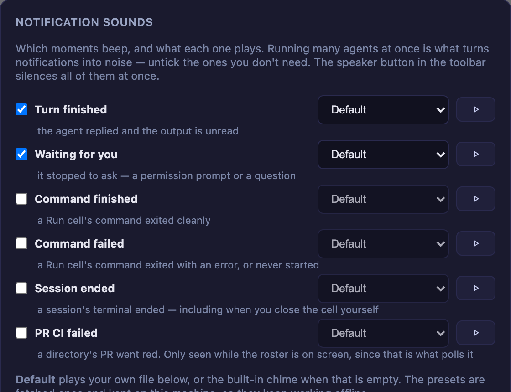

# What changed in 2.2.0
{: .no_toc }

**As of 2026-07-27.** This page is a snapshot taken at release. For anything that changes
later, follow the links to the living guide.

- TOC
{:toc}

---

## Editing files beside a terminal

The in-app file explorer used to be **full-screen**: to read a file you covered the terminal
you were reading it for. Now it can sit next to one.

**Try it in four steps.**

1. In the grid, enlarge a cell with **⤢**.
2. Its header gains a **folder** icon. Click it — the enlarged area splits, terminal on the
   left, explorer + editor on the right, rooted at that cell's directory.
3. Drag the divider to resize. Or click it and use **←/→**, **Home**, **End**.
4. Walk the enlargement to another terminal (your zoom keys, or a filmstrip thumbnail). The
   pane follows, and remembers what you had open in the cell you left.

Whether it is open and how wide it is are remembered per browser. It works in **both** zoomed
layouts — the cockpit roster and the thumbnail filmstrip. In roster mode you get three columns,
which is tight on a laptop; the toolbar's view toggle switches to the filmstrip if you'd rather
have the width.

The full-screen view has not gone anywhere: a **Files** header button, or clicking a file path
an agent printed, still opens it.

### If there is no folder icon

The **Files** header button and the pane's toggle are separate things, but both need the cell's
header. If you have set `buttons` in `~/.mulmoterminal/config.json`, that **replaces** the
default set — a config written before this release simply has no Files button in it. Add:

```json
{ "id": "files", "icon": "folder_open", "label": "Browse files in the app", "run": "open", "open": { "files": "${dir}" } }
```

Restart the server afterwards: `buttons` is read into memory at startup and refreshed only when
the Settings modal saves. See the [config guide](config.html) for the full button syntax.


## Editing is now safe against the agent

This is the part with no UI to turn on. The editor works in a directory where **an agent is
writing the same files**, so three things changed underneath it.

**A save can no longer overwrite what the agent wrote.** Opening a file records a version;
saving sends it back. If the file changed meanwhile the save is refused and a banner offers to
reload the disk's copy or to overwrite deliberately. Before this, "open a file, let Claude
rewrite it, press ⌘S" silently threw away what Claude wrote.

**Leaving an open file saves it.** Switching files, moving the enlargement, closing the pane,
navigating away, closing the tab. No dialog interrupts you, because —

**Three generations of every file the editor touches are kept** under
`~/.mulmoterminal/backups/`, taken when a file is opened and before one is replaced. Outside
your project, so no `.bak` ever reaches `git status` or the agent's view of its own repo.

```
~/.mulmoterminal/backups/<hash>/
  source.txt                     # which file this is
  <timestamp>-<n>-<name>.bak     # newest three
```

Worth knowing: three generations reach back three *saves*, not three days. Re-opening and
editing the same file a few times rotates the oldest out. For a file under version control,
`git` is still the better undo.

**And you hear about a change before you save.** A file that moves on disk while you have it
open is picked up immediately when Claude writes it, and within 30 seconds otherwise (which is
what covers Codex, `git`, builds and other editors). If you are not editing, the pane just
takes the new content — it reads as a live view of what the agent is doing. If you are, the
banner appears instead of choosing for you.

## The mouse no longer zooms the page

`Ctrl`+wheel and a trackpad pinch used to rescale the whole page, dragging the layout and the
terminal's fit along with it. Both are ignored now. Keyboard zoom (`Cmd`/`Ctrl` `+` / `-`)
still works when you mean it, and a phone's finger pinch is untouched.

To make terminal text bigger, use the font size in Settings, or `fontSize` in a directory's
`.mulmoterminal.json` — that re-fits the PTY, which browser zoom never did.

## Copy and paste from the keyboard

Two new [`keymap`](config.html#keymap) actions, `copy` and `paste`. **Nothing
is bound by default** — any key you bind is taken away from the terminal underneath. In
`~/.mulmoterminal/config.json`:

```json
{
  "keymap": {
    "copy": "Ctrl+Shift+C",
    "paste": "Ctrl+Shift+V"
  }
}
```

## Notification sounds per kind

The bell can now sound differently for **finished** and **waiting**, and each can be turned off
on its own. Presets ship with the app, so you no longer need a file of your own. See
[notifications](notifications.html).

A fix comes with it: a **subagent** finishing no longer raises the "it wants you" notification
while the main agent is still working. That was the source of notification storms on long runs.



## Ordering the grid yourself

`orderPriority` in a directory's `.mulmoterminal.json` decides where its cells sit in the grid —
lower first. Directories without one keep the existing behaviour.

```json
{ "orderPriority": 10 }
```


## Smaller things

- **Shell and Command cells** now show the directory name badge and follow that directory's
  theme and font, like terminal cells always did.
- **`addDirs`** in `.mulmoterminal.json` passes extra `--add-dir` arguments to the agent.
- **The terminal font is configurable** (`fontFamily`), and the default stack now carries CJK
  faces — Japanese in the terminal no longer misaligns box-drawing frames.
- **Collections push to Google Calendar.**
- A **git chip** squeezed into a narrow cell no longer collapses into what looked like an empty
  badge, and a failed request now shows the reason the server gave rather than a generic error.

---

The living reference is the [guide](index.html); this page is only what changed on
2026-07-27. For **what** changed and **why**, see the
[changelog](https://github.com/receptron/mulmoterminal/blob/main/docs/ChangeLog.md).
