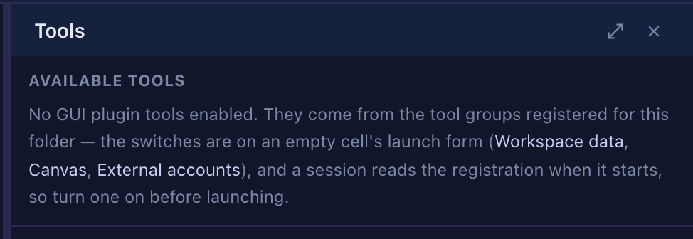

# 4.16.0 — Decks in an ordinary repository

**A snapshot as of 4.16.0 (released 2026-09-03).** It will go stale as the app moves on — that is
expected, and the living reference is the guide each section links to.

```bash
npx mulmoterminal@latest
```

**Nothing here needs configuring.** The one thing it asks of you is a restart, and this page says
why.

## Your other repositories can show their decks now

4.15.0 gave you two ways to open a mulmoScript deck — right-clicking a row in the file tree, and the
**⊞ Mulmo** header menu. Both only worked **under the workspace MulmoTerminal was started in**. A
deck in any other repository was found and then correctly refused: the app could see it and could
not serve it.

Now every directory your launcher has saved is a place decks can be served from, registered
alongside the workspace when the app starts.

**There is nothing to turn on.** A directory qualifies by being one you already launch cells in —
the launcher records those the first time you use them.

### It takes a restart, and that is deliberate

The list is read **once, at startup**. A repository you open for the very first time will not show
its decks until you restart MulmoTerminal.

That is a real cost and it was chosen over the alternative. Registering a directory later means
rebuilding the plugin's server ops, and that one object also holds the **in-flight movie and PDF
generation state** — so a cell opened while a video was rendering would have thrown that away.
Restarting is the cheaper price.

**How to tell you have it:** open a cell in a repository outside your workspace that has a deck —
either in `artifacts/stories/` under your workspace, or one you named with `decks` in that
project's `.mulmoterminal.json` — and look for **⊞ Mulmo** beside **⚡ Skill** in the cell header.
On 4.15.0 that button was simply absent there.

The reference is [the `decks` key](config.html#decks).

## The Tools pane tells you what to do about an empty list

Opening **Tools** in a cell with no GUI tools used to say `No GUI plugin tools enabled.` and stop —
the one fact you could already see.



It now names where they come from: the tool groups registered for that folder, whose switches are on
an **empty cell's launch form** — so they are not on screen while a session runs, and a session
reads the registration when it **starts**. Both halves matter; either alone sends you looking for a
control that is not there.

**And it no longer claims things it does not know.** An empty list from a failed request, from a
response it could not read, or from a request still in flight is no longer reported as a confirmed
empty configuration — so the pane will not send you off to reconfigure a folder that is fine.

**Switching cells no longer shows the previous cell's tools**, or its "this agent reports no hooks"
note, while the new one is still being asked.

## For anyone writing a shared app with the skill

The **`mulmoterminal-shared-app`** skill used to stop when a cell had no collection tools and point
you at the launcher's tool-group switch — which is hard to find if you have never seen it. It now
gives the agent the command that switch runs, so the agent registers the group itself and the only
thing left for you is closing and reopening the cell.

## Fixes worth knowing you have

- A collection's **custom view could 404 in the Canvas** when the collection was authored through
  staging. Two halves: this server's own workspace was not recognised as a staged one, and
  staged-ness is now decided per collection rather than per directory — so a stale staged view can
  no longer win over a committed one in a collection you imported.

## Where the reference lives

This page is a snapshot; the guide is the part that stays current.
[The `decks` key](config.html#decks) ·
[Every key in the config file](config.html#all-keys) ·
[What MulmoTerminal does](features.html) ·
[Header buttons](header.html)
