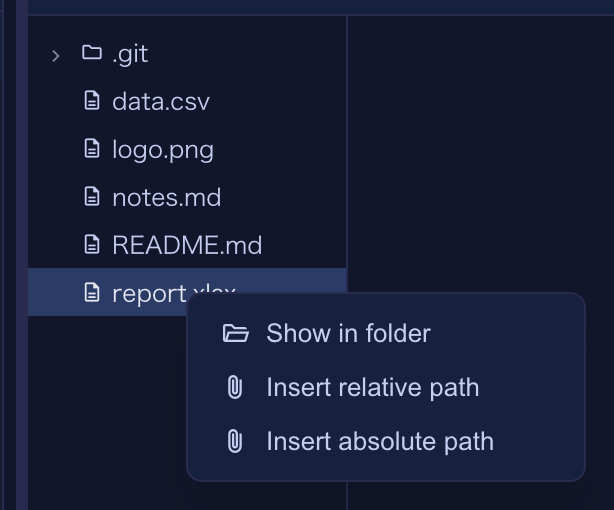
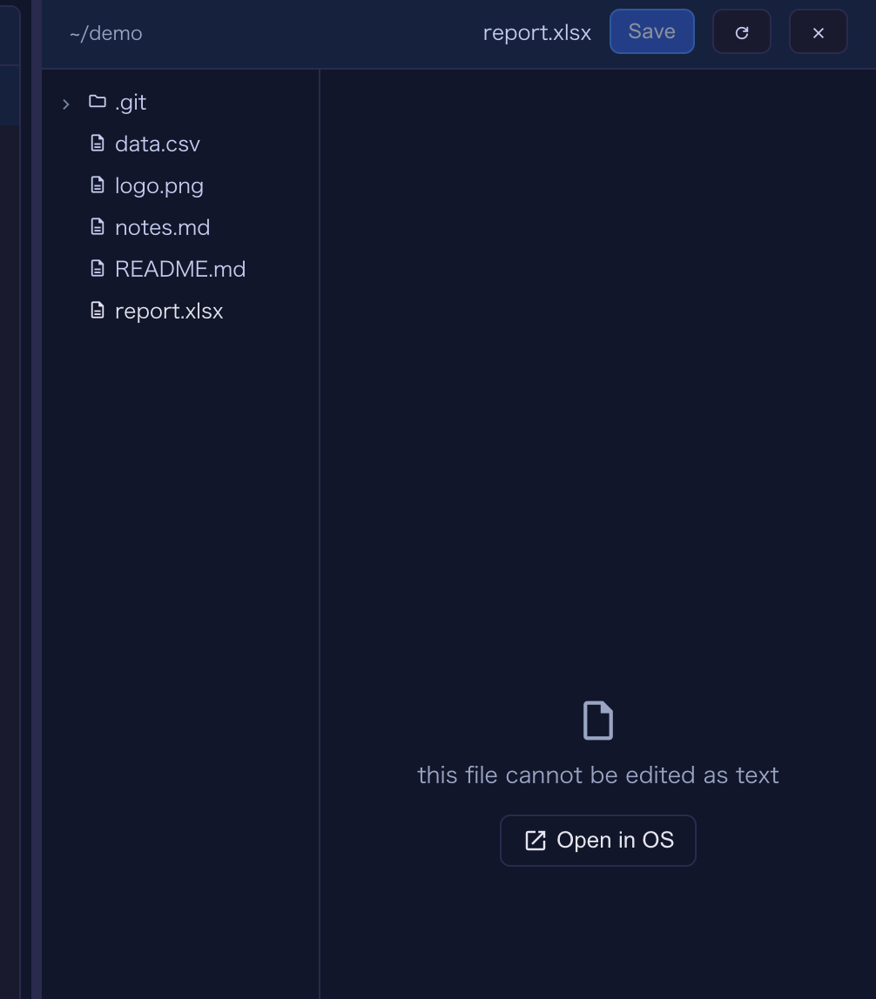
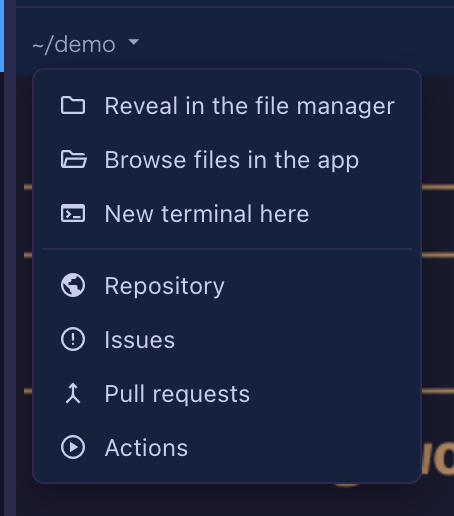

# 4.21.0 — Your OS opens the files this app cannot, and a spreadsheet no longer breaks when you click it

**A snapshot as of 4.21.0 (released 2026-09-12).** It will go stale as the app moves on — that is
expected, and the living reference is the guide each section links to.

```bash
npx mulmoterminal@latest
```

**Two things here need your hands**, and the first one is about damage that may already have
happened. Everything else is new and optional, or a fix that just works once you are on this
version.

## First: did the Files pane break one of your files?

Until this release, clicking a non-text file in the Files pane — a `.xlsx`, a `.png`, a `.zip`, a
PDF — loaded it into the text editor as UTF-8. Every byte that is not valid UTF-8 became the
replacement character `U+FFFD` on the way in, so **the editor held a broken copy before you typed
anything**, and pressing Save wrote that copy over your file.

The damage happened on **read**. That is why it was silent: nothing looked wrong until the file
would not open in Excel any more.

### How to tell

The file usually gets **much smaller**. A real case: a 4.9 MB `.xlsx` came out at 336 bytes and no
longer opened as a zip archive.

- **In a git repository**, `git status` shows it modified and `git diff --stat` shows the size
  collapse. `git checkout -- <file>` restores it.
- **Outside git**, compare it against wherever it came from — a download, a share, a colleague.
  Your OS backup (Time Machine, File History) has the old copy if the change is recent.

### What will NOT restore it

MulmoTerminal's own editor backups **cannot help here**, and it is worth knowing why: the backup
was also taken as UTF-8 text, from the same damaged string. The safety net stored the damaged
version too. From this release the backup is skipped entirely for such a file, so the store can no
longer fill up with broken copies — but a backup taken before the upgrade is not a copy of your
spreadsheet.

### What happens now instead

The pane says **this file cannot be edited as text** and offers a button — **Open in OS** — which
hands the file to whatever application your system opens it with. Save is refused for such a file
from every direction, including Ctrl/Cmd+S and the server's own write route.

Reference: [Editing files beside a terminal](features.html).

## Second: `.shape` files with two statements on one line

ShapeScript continues to move toward the [upstream app](https://shapescript.info/mac/). This
release makes **two statements on one line a parse error**, because the upstream app reads a
property's arguments to the end of the line:

```
sphere { position 0 1 0 size 2 }     # was accepted, now a parse error
```

```
sphere {
  position 0 1 0
  size 2
}
```

The error names the rule, so you will not have to guess. Also gone: `tau` — write `2 * pi`.

If you converted models for 4.20.0, this is the same job, much smaller: it only touches scripts
written on one line. A model that already reads one statement per line needs nothing.

In exchange, `text "Hello"` now draws real glyph outlines — `fill` and `extrude` turn them into
letters with their counters, and a text is a value with `.bounds`. A USDZ export of coloured
polygon meshes no longer comes out white or misplaced.

## New: hand a file to your OS from the tree

Right-click any row in the Files pane. A file offers **Show in folder**; a directory offers **Open
this folder**.



What you get is your own file manager, with the file **selected** rather than the folder merely
opened:

| Your system | What runs |
| --- | --- |
| macOS | `open -R` — Finder opens the folder with the file highlighted |
| Windows | `explorer /select,` — Explorer, file highlighted |
| Linux / WSL | the parent directory through `xdg-open` and friends — none of them have a reveal verb |

The last row is not a bug and not a fallback we forgot to finish: no `xdg-open`-family opener can
select a file. Opening the folder is the whole of what that platform offers.

Reference: [Editing files beside a terminal](features.html).

## New: a file the browser cannot show opens in its own application

Clicking a `.docx` in the tree, or a file path in the terminal, used to download it. Now it opens
in the application your system uses for it — and the same rule decides for the terminal link, the
tree and the raw URL, so the three cannot disagree about one file.



Text, Markdown, images, PDFs and the other things a browser can render still open **in the app**,
as before. Nothing you were reading in a tab moves to a desktop application.

## New: Actions in the path menu

The path menu's GitHub section gained **Actions**, next to Repository, Issues and Pull requests:



It appears only when the cell's directory has a GitHub remote — on GitLab, or a GitHub Enterprise
host we cannot name, the whole section stays away rather than offering a link that 404s.

The seventh row also made the menu taller than a tiled cell can show. A cell between 217 and 243
pixels high — which a 3x3 grid in an 800px window is — hid the bottom row. The menu is now sized
against the cell **and** the window, and scrolls when neither is tall enough.

Reference: [The path menu](header.html#path-menu).

## Fixed: a file you save keeps its own name

Saving a file served by the app used to produce `raw.pdf`, `raw.png`, `raw.csv` — the browser named
the download after the last thing it saw in the URL, because the server never said what the file
was called. It does now, and a PDF still previews in a tab rather than downloading.

## Fixed: a failed deck save is on screen, not only in the console

A deck edit that the server refused used to leave no trace anyone would see: the editor keeps
showing your edit either way — deliberately, so a transient failure does not eat keystrokes — which
made a silent refusal look exactly like a success until the next reload put the old value back.
The server's own message now appears as a red banner under the tab row.

The same update makes the Canvas send the stories **root** its card names, so a deck card written
by an earlier version, carrying a root that is not the workspace, now saves to the right file.

Reference: [The Mulmo menu and the Canvas](features.html#3-automate--investigate).

## Fixed: a deck from the `[Mulmo]` menu could hide behind "Canvas is not enabled"

In a cell whose directory has no render MCP, picking a deck from the `[Mulmo]` menu opened the
Canvas onto "Canvas is not enabled for this session" — the deck was already stored, and collapsing
the cell and enlarging it again was the only way to see it. It shows straight away now.

## See also

- [Changelog](https://github.com/receptron/mulmoterminal/blob/main/docs/ChangeLog.md) — what changed and why
- [Editing files beside a terminal](features.html) — the Files pane, in the living guide
- [The path menu](header.html#path-menu) — the header's directory menu
