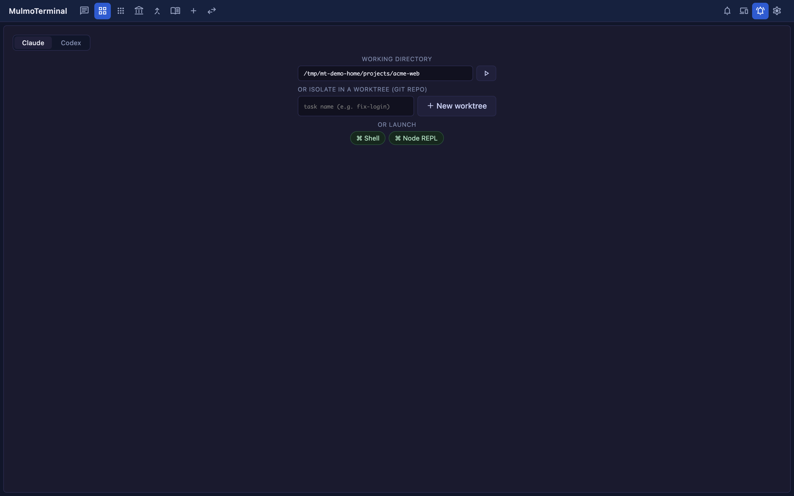

# Isolating work in a git worktree
{: .no_toc }

- TOC
{:toc}

Run **two agents in one repository** and they will tread on each other's files — one rewrites
`src/index.ts` while the other reads it and reaches a different conclusion. So MulmoTerminal can cut
a **git worktree** per task and start the session there instead.

What a worktree *is* belongs in the [glossary](glossary.html#git-worktree). This page is the whole
run: **create it → work in it → clean it up**.

---

## Creating a worktree {#create}

A cell whose working directory is a git repository shows **OR ISOLATE IN A WORKTREE** in its launcher.

1. Type a task name (e.g. `fix-login`).
2. Click **New worktree**. A worktree dedicated to that task is created and the session starts in it.



Worktrees that already exist are listed underneath, so you pick up where you left off from there.

### The branch name, and what it forks from {#branch}

| How you made it | Branch | Forked from |
|---|---|---|
| A task name in the launcher | `agent/<task>` | your **local** base branch |
| The ▶ on [an issue row](github.html) | `issue/<number>-<slug>` | **`origin/<base>`, after a fetch** |

Only the issue route forks from the remote, and for a reason: if you keep several clones of one repo
side by side, only the one you happen to be working in gets pulled — so forking from the local branch
would quietly start the work on week-old code. With no remote reachable it falls back to the local
branch and the worktree is still created.

### Where it lands {#location}

Not inside the repository you are working in — under MulmoTerminal's own directory.

```
~/.mulmoterminal/worktrees/<repo-name>-<hash>/<branch minus its prefix>/
```

The folder name is the branch with its **first segment dropped** (`agent/fix-login` → `fix-login`,
`issue/1026-fix-login` → `1026-fix-login`), so it stays one level deep — otherwise `worktree add`
would happily dig another folder below the root.

Setting the `MULMOTERMINAL_HOME` environment variable moves **this worktree root only**
(→ [Configuration → environment variables](config.html#env)); the other things kept under
`~/.mulmoterminal` (the rate-limit cache, backups) stay where they are.

Nothing is scattered inside the repo, so a worktree never dirties its `git status`.

---

## One session per worktree {#one-session}

A worktree is tied to a branch, so it is **never started twice**. Hand the same branch to two agents
and they end up fighting over the same files anyway.

Each row in the list means something different depending on its state:

| The row shows | Clicking it |
|---|---|
| nothing | starts the first session in that worktree |
| `resume` | resumes the session that worktree already has |
| `in use` | **does nothing** — that session is open in another terminal (close it there first) |

The limit is on the **directory**, not the row. Pasting the same worktree path into **WORKING
DIRECTORY**, or opening it from a recent-directory chip, will not start one either. The server is
what refuses, so no client and no way of spelling the path gets around it.

**The limit applies to agents** (Claude / Codex / Antigravity). An **OR LAUNCH** command is refused
too when what it runs is an agent. **Shell**, and launchers that run anything else (`yarn dev`,
`lazygit`), are exempt — the worktree an agent is working in is exactly where you want to run those.

And two of those `yarn dev`s no longer fight over port 3000 — if the project asks for it. Each
variable a project declares in [`worktreeEnv`](config.html#worktree-env) (a port, a database name,
or several of either) is given **a value of its own per worktree**, exported into that worktree's
terminals and shown on the cell header — a port as a clickable `:3010`.

---

## Working in the worktree {#work}

### The diff badge {#diff-badge}

As changes pile up, a badge like `+2 ●5` appears in the cell header: `+` is commits ahead of the base
branch, `●` is uncommitted entries (the line count of `git status --porcelain`, so staged, unstaged
and untracked all count). Click it to open the diff panel.

The badge shows **only on a worktree cell that has changes** — never on an ordinary project cell.

### Commit, push, PR {#pr}

Along the bottom of the diff panel are three buttons:

| Button | What it does | Disabled when |
|---|---|---|
| **Commit** | asks Claude to commit the changes (no writing the message yourself) | nothing is uncommitted, or the session is busy |
| **Push** | `git push -u origin` | no commits are ahead |
| **Open PR** | pushes, then opens the pull request | same |

A worktree started from an issue carries the number in its branch, so **Open PR** writes
`Fixes #<number>` into the PR body. From then on the header's
[work chip](header-reference.html#builtin-chips), the work comments on the issue, and the auto-close on merge
all read that same number.

---

## Cleaning up as you close {#close}

Closing a worktree cell asks first whether to **keep or remove** it. **Remove worktree** deletes the
worktree **and its branch**, so you aren't left running `git branch -D` afterwards.


**When uncommitted or unpushed work is left, the dialog names the counts** and the button becomes
**Discard & remove** — what you're about to lose is written on the button itself. The diff is
re-read the moment the dialog opens (the button reads `Checking…` until it lands), so a change made
seconds ago can't be discarded unseen.


Only worktrees **this app created** can be removed; the server refuses a delete aimed outside the
directory it manages.

---

## Project settings are inherited {#inherit}

A new worktree gets its **own copy**, made from the project's `.mulmoterminal.json` — colours, name,
model and all — so a worktree cell never turns up plain beside the project it came from.

The rules in detail (why the colour is nudged rather than copied, which keys are not carried over,
the two cases where nothing is written) are in
[Configuration → a worktree inherits this file](config.html#worktree-inherit).

> **Put `.mulmoterminal.json` in your `.gitignore`.** Without it the file shows up as an untracked
> change in the worktree's `git status` — which is not just untidy: MulmoTerminal **refuses to remove
> a worktree that has uncommitted changes**, so it becomes one you cannot clean up.

---

## See also {#related}

- [Starting from a GitHub issue](github.html) — the ▶ on an issue row reads it, makes the worktree and launches, in one click
- [Configuration → a worktree inherits this file](config.html#worktree-inherit)
- [Glossary → git worktree](glossary.html#git-worktree)
