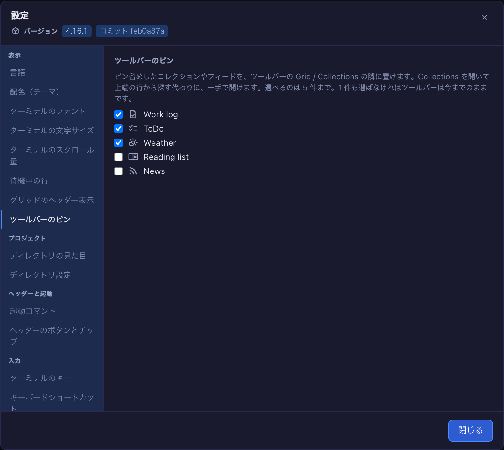

## やりたいことから探す

| こうしたい / こうなって困っている | どこを見るか |
|---|---|
| 設定を書いたのに**効かない** | [設定が効かないとき](#dir-settings-preview) |
| セルが増えて**どれがどのプロジェクトか分からない** | [色・名前バッジ](#per-dir) |
| **Shift+Enter で改行したいのに送信される** | [Enter — 送信と改行](#terminal-submit) |
| 通知音が**うるさい** | [通知音](#sounds) |
| ターミナルの**日本語が崩れる** / 文字が小さい | [フォント](#font-family) ・ [フォントサイズ](#font-size) |
| 選択したら**キーを押さずにコピー**したい | [マウスで選ぶだけでコピー](#copy-on-select) |
| キーボードで**拡大するターミナルを切り替えたい** | [キーボードショートカット](#keymap) |
| ロスターの1行が**長すぎる / 短すぎる** | [ロスターの行数](#cockpit-lines) |
| **毎日開くコレクション**に 2 手かかる | [ツールバーに出すお気に入り](#toolbar-pins) |
| セッションに**別のフォルダも見せたい** | [複数フォルダ](#add-dirs) |
| 2つの `yarn dev` が **ポート 3000 を取り合う** | [worktree ごとのポート](#worktree-env) |
| **worktree だけ別プロジェクトに見える** | [worktree はこのファイルを引き継ぐ](#worktree-inherit) |
| 拡大しても **Canvas が出ない** / GUI ツールが使えない | [どのディレクトリで起動するか](basics.html#launch-dir) |
| **Antigravity / Grok** だけ GUI ツールが無い（ワークスペースでも） | [Antigravity と Grok はどこでも登録が要る](basics.html#antigravity-gui-tools) |
| **Claude 以外のモデル**で動かしたい | [プロバイダ](#providers) |
| **自分のコマンド**で Claude Code を起動したい（`ollama launch claude …`） | [カスタムエージェント](#custom-agents) |
| ヘッダーに**自分のボタン**を足したい | [ヘッダーのカスタマイズ](#header) |
| **自分の配色**でアプリ全体を染めたい | [自分の配色を作る](#custom-themes) |
| issue に**着手を知らせたい** | [issueWorkComments](#issue-work-comments) |
| **決めたことを何度も聞かれる**のをやめさせたい | [このプロジェクトで既に決めたこと](#decision-digest) |
| **別のマシンのブラウザ**から開きたい | [`MULMOTERMINAL_HOST`](#bind-host) |

---

# 設定方法
{: .no_toc }

- TOC
{:toc}

設定は 3 か所にあります。**設定モーダル（Settings）**・**グローバル設定 `~/.mulmoterminal/config.json`**・
**プロジェクトごとの `<project>/.mulmoterminal.json`**。ボタン/チップは両ファイルがマージされます。

{: .highlight }
> **手書きする必要はありません。** MulmoTerminal のセッションで **`/mulmoterminal-config`** と打てば、
> 何を変えたいかを聞いて、その領域を担当するスキルに引き継ぎます。「今どう設定されている？」にも答えます
> ——**検証で落とされたキー**も含めて。設定したのに効いていないものは、外から見るとこれです。
>
> 領域が分かっているなら直接どうぞ:
>
> | スキル | 範囲 |
> |---|---|
> | **`/mulmoterminal-dirs`** | プロジェクトの色・グリッドとランチャでの位置・名前バッジ・ターミナルの文字サイズ。実際に開いているディレクトリを母集団にし、既にある設定を読んでその規則を、まだ無いディレクトリにも適用します。（Settings → **Configure appearance…** はこれを起動します） |
> | **`/mulmoterminal-theme`** | 自分の[配色](#custom-themes)を作る。Settings のテーマ選択に並びます（Settings → **Create a theme…**） |
> | **`/mulmoterminal-header`** | [ヘッダーのボタンとチップ](#header)。global でもプロジェクト単位でも |
> | **`/mulmoterminal-keys`** | [`keymap`](#keymap)・[`copyOnSelect`](#copy-on-select)・[`terminalSubmit`](#terminal-submit)（「Shift+Enter で改行ではなく送信されてしまう」の対処）・[`questionPaneEnabled`](#question-pane)（Settings → **Set up shortcuts…**） |
> | **`/mulmoterminal-model`** | [`providers`](#providers)、プロジェクトごとのモデル、[`customAgents`](#custom-agents) |
> | **`/mulmoterminal-notify`** | [どの瞬間に鳴らす・通知するか](#sounds)、それぞれ何を鳴らすか（Settings → **Configure notifications…**） |
>
> **UI が一切ない設定**に手が届く唯一の対話的な経路でもあります。手編集でも構いません（このページに全フィールドの
> 説明があります）が、スキルは書きながら検証します。これは特に `keymap` で効いてきます——記法を間違えると
> サーバが起動しなくなるためです。
>
> 名前を覚える必要もありません。上記のスキルに対応する Settings のセクションには、それを新しいセッションで
> 起動するボタンが末尾に付いています。Settings に対応セクションが無い `-header` と `-model` だけ、
> 名前で呼んでください。

---

## 設定モーダル（Settings）— どこで何を変えられるか {#settings-modal}

ツールバーの **Settings**（歯車）から開きます。

タイトルのすぐ下に **Version** の行があり、**いま動いているビルド**が出ます。npm で入れたなら `4.7.0`、
git チェックアウトならその横に `commit a1b2c3d` のチップが並びます（チェックアウトの場合、バージョン番号は
最後のリリース時点のものなので、ビルドを特定するのはコミットのほうです）。新しいものがあるときは、ヘッダーの
バッジと同じ更新通知（実行するコマンド込み）が次の行に続きます。バグ報告に貼るのはこの行です。


**左のサイドバー**がセクションをグループ分けし、一度に 1 つだけ表示します（`sm` 未満、つまりスマホでは
セクションの上のセレクタになります）。9 グループ・28 セクション（**Voice input** は文字起こしできる
マシンでのみ出るので、多くの環境では 27）。

セクションをスキルに引き渡すボタン（「Create a theme…」「Configure notifications…」など）は、押すと
**確認を出します**。新しいグリッドセルでエージェントのセッションが始まるので、何が起きるか・やめ方
（そのセルを閉じる）をダイアログが説明します。**キャンセル**なら何も起きず、設定は開いたままです。


設定画面は**英語と日本語**で表示できます。既定ではブラウザの言語に従い、**Language（言語）**で明示的に
選ぶこともできます。Language をサイドバーの先頭に置いてあるのは、画面の他が読めない人が最初に探すのが
この設定だからです。いまのところ訳されているのはこのモーダルだけで、他の画面は英語のままです。

- **Appearance** — Language, Theme, Terminal font, Terminal font size, Terminal scroll speed, Waiting rows, Grid header read-outs, Toolbar pins
- **Projects** — Directory appearance, Directory settings
- **Header & launch** — Launch commands, Header buttons and chips
- **Input** — Terminal keys, Keyboard shortcuts, Voice input
- **Models & servers** — Models and backends, MCP servers
- **Notifications** — Notification sounds, Web Push notifications, Phone quick commands
- **Integrations** — GitHub and GitLab, Pull request repos, Google account
- **Sessions** — Sessions and background tasks, Sessions that survived a restart, Cost (estimated)
- **Help** — Help & user guide


| 項目 | 内容 |
|---|---|
| **Language** | 設定画面自身の表示言語（ブラウザの言語＝既定 / English / 日本語）。配色と同じくブラウザごとで、設定ファイルではなく `localStorage` に保存されます |
| **Theme** | Midnight / Nord / Daylight / Solarized Light、および[自分で定義した配色](#custom-themes)。選ぶのは既にあるものだけで、新しく作るのは「Create a theme…」（`mulmoterminal-theme` スキルを起動） |
| **Terminal font** | 全ターミナルの font-family スタック（`fontFamily`）。サイズと違い**グローバル** — どのフォントが入っているかはマシンの性質だからです。空欄なら内蔵スタック（→ [ターミナルのフォント](#font-family)） |
| **Terminal font size** | ターミナル（xterm）のフォントサイズ（px, 8〜32）。**このブラウザ**の全ターミナルに適用され、スマホと PC でそれぞれ別の値を保持します。ディレクトリ側の `fontSize`（[後述](#per-dir)）が優先されます |
| **Terminal scroll speed** | ホイール1ノッチ／トラックパッドの1スワイプでターミナルがどれだけ動くか（1× が xterm 既定）。フォントサイズと同じくブラウザ単位 — ポインティングデバイスの性質なので |
| **Waiting rows** | 拡大したセルの横（下）に出る一覧で、**入力を待っている**行に琥珀色のリングが付いて点滅し、**終わっただけ**の行は緑で静止します。チェックを外すと止まるのは**動きだけ**で色は残ります。OS が「視差効果を減らす」設定のときは点滅しません。下の 3 つのステッパーは各行を何行で打ち切るか（`cockpitLines` → [ロスターの行](#cockpit-lines)） |
| **Toolbar pins** | ピン留めしたコレクション / フィードのうち、ツールバー自体にボタンを出すものを最大 5 件選びます。1 件もチェックしなければツールバーは今までのまま（`toolbarPins` → [ツールバーに出すお気に入り](#toolbar-pins)） |
| **Directory appearance** | 「Configure appearance…」— ディレクトリの名前バッジ・色・ターミナルのパレット・グリッド上の位置を、`mulmoterminal-dirs` スキルで対話的に設定 |
| **Directory settings** | 各ディレクトリの `.mulmoterminal.json` が**実際に何をしているか**。行を開くと、効いている値（色は見本付き）・**どのファイル由来か**・**検証で落ちたキー**・**このアプリが読まないキー**が出ます。読み取り専用 — 「Explain my settings…」で `mulmoterminal-config` スキルが同じものを読み、理由を説明して直します（→ [設定が効かないとき](#dir-settings-preview)） |
| **Launch commands** | グリッドセルでエージェント以外に起動できるコマンド（`{ label, command }`）。素のシェルは登録不要 — ランチャの **Shell** トグルが無設定で `$SHELL` を開く |
| **Header buttons and chips** | グローバル設定で宣言しているボタンとチップの数（読み取り専用）。未設定なら「built-in」。「Set up header buttons…」で `mulmoterminal-header` スキルを起動（→ [ヘッダーのカスタマイズ](#header)） |
| **Terminal keys** | [選ぶだけでコピー](#copy-on-select)（`copyOnSelect`、既定 OFF）、[質問ペイン](#question-pane)（`questionPaneEnabled`）、あなたの Claude が**送信**として読むバイト（[Enter — 送信と改行](#terminal-submit)、`terminalSubmit`） |
| **Keyboard shortcuts** | 全アクションと `send` の行を、割り当ての有無にかかわらず並べる一覧（読み取り専用）。**既定は全部 Not set** — 「Set up shortcuts…」で `mulmoterminal-keys` スキルが `keymap` に書きます（→ [キーボードショートカット](#keymap)） |
| **Voice input** | 音声入力で**話す言語**（ブラウザの言語 / 発話ごとの自動検出 / 固定）。文字起こしできるマシンでだけ表示されます |
| **Models and backends** | セッションを動かせるバックエンドと、**今それぞれ到達できるか**（読み取り専用）。「Add a backend…」で `mulmoterminal-model` スキルを起動（→ [別のモデルで動かす](providers.html)） |
| **MCP servers** | 自分の HTTP MCP サーバ（`userMcpServers`）。GUI ツールを全部持つ **Claude の**セッション — 作業ディレクトリが**ワークスペース**のセル、およびサーバ自身が起こしたセッション（スマホ・スケジュールタスク。ただし issue の seed セッションはグリッドのセルと同じ形で起こされるため除きます）— にマージされます。プロジェクトディレクトリのセルと Codex には合流しません（`.mcp.json` など**自分で書いた Claude の MCP 設定は、どちらのディレクトリでも読まれます**。→ [どのディレクトリで起動するか](basics.html#launch-dir)） |
| **Notification sounds** | どの瞬間に鳴らすか＋それぞれ何を鳴らすか。種類ごとに1行、プリセット選択と試聴ボタン付き。「Configure notifications…」で `mulmoterminal-notify` スキルを起動すると、プロジェクトごとの音やスマホに通知する瞬間まで設定できます（→ [通知音](#sounds)） |
| **Web Push notifications** | 「Notify my devices when a task finishes」トグル（既定 OFF → [スマホ通知](notifications.html)） |
| **Phone quick commands** | **スマホ**のターミナル表示にチップとして並ぶ定型文。タップで入力欄に入るだけで、送信は送信ボタンを押したとき（`quickCommands`） |
| **GitHub and GitLab** | このアプリが**あなたの名前で** forge に書き込むもの。セルが [issue に着手を知らせるか](#issue-work-comments)（`issueWorkComments`、既定 OFF）と、作った PR の末尾に[クローン名を書くか](#pr-workdir-footer)（`prWorkdirFooter`、既定 ON）。その下は `glab` で読む[セルフホスト GitLab のホスト](github.html#自前ホスティングの-gitlab)（`gitlabHosts` — 反映は次回起動時） |
| **Pull request repos** | 横断 PR/Issue ビューが集約するリポ（`owner/repo`） |
| **Google account** | Calendar 連携用の Google サインイン（RemoteHost の Connect とは別物） |
| **Sessions and background tasks** | 返信を[まとめで終わらせるか](#append-system-prompt)（`appendSystemPrompt`、既定 ON — ディレクトリ側の設定が優先）、[決めたことの記録を残すか](#decision-digest)（`decisionDigest`、既定 OFF）、[定期の開発ログ](#all-keys)とその間隔（`worklogEnabled`、既定 OFF — 実行のたびにトークンを消費します） |
| **Sessions that survived a restart** | 以前のサーバから動き続けているターミナルを、**全ディレクトリ横断**で一覧。もう開かないプロジェクトのセッションや、素のシェルを見て終了できる唯一の場所です。各行に「どこで動いているか・何なのか（キーに紐づく会話が無ければ `shell or unknown`）・どれだけ放置されているか・終了して失うものがあるか」が出ます。**stop** はそのセッションだけを終了し、transcript のある会話はあとで再開できます。ターミナルが掴んでいる行は代わりに `● open` と出て、そちらで閉じます。この節では `sessionIdleReapDays`（何日放置したらサーバが自動で終了するか）も変更でき、その対象になる行には **ends at next start** と出ます |
| **Cost (estimated)** | Session / Today / Month の推定コスト表示 |
| **Help & user guide** | このガイドへのリンク集 |

## 設定が効かないとき — まずここを見る {#dir-settings-preview}
書いたはずの設定が反映されないとき、**Settings → Directory settings** を開いてください。ディレクトリごとに、
その `.mulmoterminal.json` が**実際に何をしているか**が出ます。

- **効いている値** — 色は見本付き。表示されている値が、いま本当に使われているものです
- **どのファイル由来か** — グローバル (`~/.mulmoterminal/config.json`) とプロジェクト
  (`<project>/.mulmoterminal.json`) のどちらから来たか
- **`Dropped as invalid:`** — 書式が不正で**捨てられたキー**
- **`Not settings this app reads (a typo?):`** — このアプリが**読まないキー**。`badgeColor` を
  `badgeColour` と書いた、グローバル専用の設定をプロジェクト側に書いた、など


*上の例では `badgeColour`（`badgeColor` の綴り違い）と `fontSize2` が「読まないキー」として
警告色で出ています。書いたのに何も起きなかった設定は、ここに出ます。*

**効かなかった設定と、そもそも書いていない設定は、この画面が無いと見分けがつきません。**
書いたキーがそのままファイルに残る理由は [このバージョンが知らないキーは消えない](#unknown-keys) に。

## プロジェクトごとの設定 — 色・名前・並び順（`.mulmoterminal.json`） {#per-dir}

プロジェクト直下に置くと、**そのディレクトリで開いた端末（グリッドセル）**の見た目・音・ヘッダーを変えられます。

### 使うモデル

```json
{
  "provider": "openrouter",
  "model": "moonshotai/kimi-k2.7-code"
}
```

そのディレクトリのセッションが既定で使うバックエンドとモデル。`provider` を省いて `model` だけ書くと
Anthropic のまま別のモデルを指定できます。→ [OpenRouter で別のモデルを使う](providers.html)

### 名前バッジと色

```json
{
  "name": "acme-web",
  "badgeColor": "#2563eb",
  "headerColor": "#0b2545",
  "headerTextColor": "#e6f0ff",
  "cellColor": "#0e1117",
  "cellBorderColor": "#1f6f4f",
  "dotColor": "#22c55e",
  "buttonColor": "#a7f3d0"
}
```

すべて `#rrggbb`。作業中/要対応の状態色は、これらの背景色より優先されます（アイドル時に反映）。

`headerTextColor` を省くと、ヘッダーの文字（パス・タイトル・モデル/コンテキストやトークンのチップ）は
`headerColor` から読みやすい色が導出されます。

`headerColor` と `headerTextColor` は **アイドル時**の組み合わせで、効くのは「その色が実際に出ているとき」
だけです。作業中・完了・要対応のセルはヘッダー背景をテーマの状態色に置き換えるので、その間の文字は
テーマの色に戻ります。あなたのヘッダー色に合わせて選んだ文字色は、テーマが混ぜた状態色の上では読めないためです。

状態ごとに色を変えたいときは、その状態を名指しします。

```json
{
  "headerColor": "#0b2545",
  "headerStatusColors": {
    "working": "#6d28d9",
    "done": { "background": "#166534" },
    "blocked": { "background": "#7c2d12", "text": "#ffe8a3" }
  }
}
```

指定できるのは `working` / `done` / `blocked` だけです（`idle` はありません。`headerColor` がアイドルそのものです）。
名指ししなかった状態はテーマの状態色のままです。**`text` を省けば背景から読める色が導出される**ので、
背景だけ指定して読めなくなることはありません。

自分の色をそのまま保ちたいときは `"headerStatusTint": "none"`。**作業中**と**完了**の間も `headerColor` が
残り、状態はセルの枠線・ステータスドット・ピルが伝えます。**要対応（blocked）には意図的に効きません** —
答えるまで何も進まない唯一の状態なので、`headerStatusColors.blocked` で別の色を指定しない限り
テーマの amber を保ちます。

どちらのキーも `~/.mulmoterminal/config.json` に書けます。そこでは全ディレクトリの既定値になり、
`.mulmoterminal.json` がどちらかを書いていれば、そのディレクトリではそちらが優先されます。

### `repo.json` を持つリポジトリ {#repo-json}

[`repo.json`](../../repo-json.html) は**オープンなリポジトリメタデータの規格**です。リポジトリの
ルートに置く小さな1ファイルで、どのツールからも読めます。MulmoTerminal もこれを読むので、
このアプリの存在を知らないプロジェクトでも、名前・色・アイコンの付いたセルになります。

```json
{
  "name": "diffusion-lab",
  "description": "Training and evaluation for latent diffusion models",
  "icon": "docs/logo.png",
  "color": "#7c3aed"
}
```

- **`name`** → バッジ
- **`icon`** → セルのアイコン。文字列でも、サイズ付きの配列でも可。使える中で最良のものが選ばれます
- **`color`** → **7色すべて**。ヘッダーはその色そのもの、バッジ・枠・ステータスドット・ボタン・
  セル本体はその色相から導出、ヘッダーの文字色はコントラストから導出（宣言しません）。
  `color.background` はセル本体を直接指定します
- **`extensions.mulmoterminal`** → オープン規格に無い、このアプリ固有のもの。`theme` /
  `orderPriority` / `sound` など、このページの他のキー

3つのファイルは一般 → 具体の順に重なります。

```
repo.json  →  .mulmoterminal.json  →  .mulmoterminal.local.json
プロジェクト     このアプリの設定        この checkout
```

下の層が設定したキーを、上の層が置き換えます。`repo.json` だけで完結してもよく、逆に
`.mulmoterminal.json` の色は `repo.json` の色に勝ちます — ブランド色を一日中見ていたくない
プロジェクトで、自分の配色を保つのはこの方法です。

### 同じリポジトリを何本も clone しているとき（`.mulmoterminal.local.json`） {#local-config}

1つのリポジトリを `acme` / `acme2` / `acme3` と並行して開いているとき、プロジェクトとしては
同じものなので、**違うべきなのはグリッドで見分けるための色だけ**です。共有ファイルの隣に
`.mulmoterminal.local.json` を置きます。

```jsonc
// .mulmoterminal.json — プロジェクトの設定。色も含めて単体で完結しているので、
// clone を1本しか持たない人はこれだけでよい。コミットして構わない
{
  "name": "acme-web",
  "theme": "nord",
  "badgeColor": "#1b3479",
  "headerColor": "#2d4ea9",
  "headerTextColor": "#ffffff",
  "orderPriority": 30
}

// .mulmoterminal.local.json — この clone だけ。.gitignore に入れる
{
  "badgeColor": "#27b4a8",
  "headerColor": "#4ed0c5",
  "orderPriority": 65
}
```

- **local が勝つ（キー単位）。** local に書いていないキーは共有ファイルの値のままです
- **キーごと丸ごと置き換え。深いマージはしません。** local の `colors` は共有側の `colors` を
  丸ごと置き換えます。1キー = 1つの意図であり、2つのファイルから組み立てないと分からない
  パレットより、1か所で読み切れる方が予測しやすいからです
- **検証は同じように効きます。** local は規則を迂回する手段ではありません。`#rrggbb` でない色は
  共有ファイルに書いたときと同じように落とされます
- **相対パスの意味も同じ**（`icon` / `sound` / `addDirs`）。ファイルではなくディレクトリ基準で
  解決されます
- **どちらか片方だけでも動きます。** local だけの clone もあり得ますし、片方が壊れていても
  もう片方は生きたままです
- **どちらを書き換えてもライブリロードします。** 自分の clone の色を変えれば即座に反映されます

設定 → [設定が効かないときは](#dir-settings-preview) が両方のパスと、local が持っていったキーの
一覧を出します。「変えたのにセルが違う」ときの答えはたいていこれです

### プロジェクトのアイコン（`icon`） {#dir-icon}

`icon` は名前バッジの隣に**画像**を出します。プロジェクトのロゴを置いておけば、文字を読む前に
どのセルか分かります。

```jsonc
{
  "icon": "docs/logo.png",                  // このディレクトリ内のファイル
  // "icon": "https://example.com/logo.svg" // URL でも
  // "icon": "data:image/png;base64,iVBO…"  // 画像を直接埋め込んでも
}
```

出る場所は、**セルのヘッダー**、拡大時の **cockpit ロスター**と**フィルムストリップのサムネイル**、
**ランチャのディレクトリチップ**、そして[スマホ](phone.md)の**ターミナル一覧とターミナル画面**。
起動前も起動後も、PC でもスマホでも、同じ絵で見分けられます。

- **パスはこのディレクトリからの相対**です。絶対パスや `../` で外に出るものは拒否されます
  （`sound` と同じ扱い。開いたプロジェクトがマシン上の別の場所を指せないようにするためです）
- **形式**: PNG / JPEG / **GIF（アニメーションはそのまま動きます）** / WebP / AVIF / SVG / ICO / BMP。
  これ以外の拡張子は無視されます
- **画像はリポジトリにコミットしておく**のがおすすめです。clone した直後から、また
  [worktree](#worktree-inherit) を切った直後からアイコンが付きます（`icon` は書いたままの文字列で
  引き継がれるので、同じ相対パスが worktree 側でも解決します）
- 解決できなくなったアイコン（ファイル名変更、URL 先がダウン）は、単に表示されません。実際に何が
  適用されたかは 設定 → [設定が効かないときは](#dir-settings-preview) で確認できます
- ヘッダー**ボタン**の `icon` とは別物です。あちらは
  [Material Symbols](https://fonts.google.com/icons) のアイコン名で、画像ではありません

### favicon は勝手に拾われます {#auto-dir-icon}

たいていの場合 `icon` を書く必要はありません。**未設定**のディレクトリは、そのリポジトリが
既に持っているアイコンを表示します。

1. `public/favicon.svg` → `favicon.svg`
2. `public/apple-touch-icon.png` → `apple-touch-icon.png`
3. `public/favicon.png` → `favicon.png`
4. `public/favicon.ico` → `favicon.ico`
5. web manifest（`public/site.webmanifest` / `public/manifest.json` / ルートの同名）の
   `maskable` でない最大のアイコン

最初に見つかったものが勝ちます。並び順は「よくある順」ではなく「14px で描いたときに崩れない順」です。
`docs/logo.png` や `assets/logo.*` は**あえて探しません** — 「ロゴ」は README 用の横長バナーであることも
多く、それを 14px 四方に押し込むとただの染みになるからです。

切り方は2つあり、意味が違います。

- **`"icon": false`**（プロジェクトのファイル）— *そのプロジェクト*のセルにアイコンを出さない。
  worktree にも引き継がれます
- **`autoDirIcon: false`**（`~/.mulmoterminal/config.json`）または
  設定 → *Directory appearance* のチェックボックス — 全体で off。挙動そのものが不要ならこちらです。
  全リポジトリに `"icon": false` を書いて回るのは違います

**書き間違えたキーは favicon にフォールバックしません。** `"icon": "logo.png"` の指す先が無い場合、
セルにはアイコンが出ません（意図的です — 壊れた設定は壊れて見えるべきなので）。
設定 → [設定が効かないときは](#dir-settings-preview) に、落ちたキーとして出ます。

### このディレクトリの通知音

```jsonc
{
  "sound": "./.mulmoterminal/alert.mp3", // 全種類共通（下で上書きしない限り）
  "sounds": { "command-failed": "preset:gong" } // 特定の種類だけ
}
```

ここで開いたターミナルでは、どちらもグローバル設定より優先されます。プロジェクトごとに音を
変えれば、耳だけで区別できます。ファイルパスは**このディレクトリからの相対**で、絶対パスや
`../` で外に出るものは拒否されます。`preset:<id>` は **`sounds`**（種類ごと）で使えるので、プロジェクト側に音声
ファイルを置く必要はありません。→ [通知音](#sounds)

### ターミナル自体の色（xterm パレット）

`headerColor` などが「**枠**（ヘッダー・セル）」の色なのに対し、**`colors`（と `theme`）は端末の中身（xterm）**を染めます。
`colors` は xterm の ITheme——`background` / `foreground` / `cursor` や `red` `green` … の ANSI 16 色——を上書きできます。

```json
{
  "name": "🌌 van-gogh",
  "headerColor": "#0b1a4a",
  "headerTextColor": "#f2e29b",
  "colors": { "background": "#0a1330", "foreground": "#f2e29b", "cursor": "#f5b301" }
}
```

`theme` に `midnight` / `nord` / `daylight` / `solarized` を指定するとプリセットのパレットになり、`colors` はその上へ部分上書き。
[応用編 6](scenarios.html) の色分けスクショは、ヘッダー色と `colors` を組み合わせて**ヘッダーから端末の中身まで**プロジェクトごとに染めた例です。

### ターミナルのフォントサイズ（`fontSize`） {#font-size}

`fontSize` はこのディレクトリのターミナルのフォントサイズ（px）で、設定モーダルの値を上書きします。

```json
{ "fontSize": 16 }
```

有効範囲は **8〜32**。範囲外の値は近い端に丸められます（`99` は無視されず 32 になります）。数値でない値は無視され、
設定モーダルの値が使われます。

ブラウザのズーム（Ctrl +/−）ではなくこちらを使ってください。ズームはターミナルに知らせずページを拡大するため、
xterm の文字グリッドとシェルが認識しているウィンドウサイズがずれ、カーソル位置や折り返し位置が崩れます。
`fontSize` はターミナルを再フィットして新しい桁数・行数をプロセスに送るので、ずれが起きません。

### ターミナルのフォント（`fontFamily`） {#per-dir-font}

`fontFamily` はこのディレクトリのターミナルのフォントスタックで、グローバルの
[`fontFamily`](#font-family) を上書きします。

```json
{ "fontFamily": "'Cica', 'ＭＳ ゴシック', monospace" }
```

ルールはグローバル側と同じです。選び方・不正な値の扱い・CJK フォントで字幅が 2 倍である必要がある理由は
[ターミナルのフォント](#font-family)を参照してください。ふだんは ASCII 中心だが、このリポジトリのログだけ
日本語が多い、といった場合に便利です。

グローバル側と違い、こちらは**サーバ再起動が不要**です。ただしファイル監視をしているわけでもありません。
MulmoTerminal が `.mulmoterminal.json` を読み直すのは、**Claude の Write/Edit ツールが「書いた」と
報告したとき**です（`/mulmoterminal-dirs` を実行するとセルの色がその場で変わるのはこのため）。
エディタなど**外部から手で書き換えた**場合、すでに開いているターミナルはブラウザのタブを再読み込み
するまで古いフォントのままです。
### グリッドでの並び位置（`orderPriority`） {#order-priority}

`orderPriority` は、グリッドの **priority** 並び順における順位です。ツールバーの並び順ボタンの3つ目のモードで、
auto（注目度順）と manual（移動ボタンで手動）と並びます。

```json
{ "orderPriority": 10 }
```

- **小さい順**。負数も使えるので、`0` の全プロジェクトより前に出すこともできます
- **未設定のディレクトリは末尾**にまとまり、既存の順序を保ちます — 1つのプロジェクトに追加しても他が動きません
- 同順位は現在の順を維持。同じディレクトリのセルが複数ある場合も同様です（順位は**ディレクトリ**の属性で、セルの属性ではありません）

**グリッド**で読むのは priority モードだけです。ボタンを auto や manual にしている限り、プロジェクト側が
何を宣言していてもグリッドの表示は変わりません。

**ランチャのディレクトリチップは、グリッドのモードに関わらず常にこの順**で並びます。同じプロジェクトが
どちらの画面でも同じ位置に来るということです。チップは本来「最後に起動した順」で、起動のたびに並びが
変わってしまうので、順位を宣言するのが固定する方法になります。宣言していないディレクトリは、順位を持つ
ものの後ろに、その起動順のまま残ります。

### worktree はこのファイルを引き継ぐ {#worktree-inherit}

> worktree の作り方・制約・片付けは [worktree で作業を隔離する](worktree.html)へ。ここはその
> **設定ファイルの引き継ぎ規則**です。

プロジェクトから切った [worktree](glossary.html#git-worktree) には何も入っていませんでした。色も名前も
モデルも順位も無く、グリッドの末尾に灰色のセルが1つ増えるだけ — 無関係なプロジェクトに見えていました。

いまは新しい worktree に、プロジェクトの設定から作った専用のコピーが置かれます。書き込み先は
**`.mulmoterminal.local.json`**（[前述](#local-config)）で、リポジトリがコミットした共有設定の上に重なり、
worktree の `git status` を汚しません。

- **同一性はそのままコピー** — `name` / `icon` / `theme` / `colors` / `fontSize` / `fontFamily` /
  `provider` / `model`。同じプロジェクト、同じターミナル、同じモデルです。`icon` は解決後のファイルでは
  なく**書いたままのパス**で渡るので、リポジトリにコミットされたロゴなら worktree 側でも見つかります
  （gitignore されている画像なら、worktree には出ないだけです）
- **セルの色は色相を少しずつ回す** — `badgeColor` / `headerColor` / `headerTextColor` /
  `cellColor` / `cellBorderColor` / `dotColor` / `buttonColor`。1本ごとに 12 度ずつ進むので、
  並べるとグラデーションになります。「このプロジェクトだ」と分かり、かつ「どの worktree か」も分かる状態です。
  彩度と明度は触らないので、`headerTextColor` の `#ffffff` は白のままです（無彩色には回す色相がありません）
- **`orderPriority` はプロジェクトの順位 +1**。末尾に落ちるのではなく、切り出し元のすぐ後ろに並びます。
  プロジェクトが順位を宣言しているときだけで、未設定なら worktree も未設定のままです
- **`sound` / `sounds` / `addDirs` は引き継ぎません**。これらはプロジェクトのディレクトリ内のパスを指しており、
  worktree にその実体はありません。`addDirs` にいたっては worktree 基準で解決され、黙って別のフォルダを許可してしまいます
- **[`worktreeEnv`](#worktree-env) はそのまま引き継ぎます**。これは値ではなく「宣言」だからで、
  worktree は宣言をもとに自分専用のポートと DB 名を予約します。引き継がないと、その worktree だけが
  相変わらず 3000 を取り合うことになります。

書き込まないケースが2つあります。どちらも意図的です。

- **そのリポジトリでどちらのファイルも gitignore されていない場合。** 書いたファイルが worktree の
  `git status` に未追跡ファイルとして出てしまいます。これは単に汚いだけではありません。MulmoTerminal は
  未コミットの変更がある worktree の削除を拒否するので、掃除できない worktree になります。リポジトリの
  `.gitignore` に `.mulmoterminal.local.json` を足せば、次の worktree から色が付きます。
  このファイルが無かった頃の設定（`.mulmoterminal.json` を ignore している）もそのまま動きます —
  そちらはフォールバックとして使われます
- **worktree に既に local ファイルがある場合**（自分で書いた、または前回の作成で書かれた）。そのファイルが答えなので、
  MulmoTerminal が上書きすることはありません。**共有**設定がコミットされていても止まりません — それは local が
  上に重なる相手だからです

コピーは作成時に1度だけ取られ、以後は worktree のものです。あとからプロジェクト側の色を変えても、
既存の worktree は与えられた色のままです。変えたいときは worktree 側のファイルを編集するか削除してください。

### ヘッダーのカスタマイズ（ボタン / チップ） {#header}

MulmoTerminal の「**拡張**」の柱がここ。稼働中ターミナルのヘッダーを、**小さな DSL** で自分のワークフローに合わせて成形できます。
どんな開発者でも、よく使う操作をワンクリックにし、見たい情報だけを出せる——それがこの仕組みの狙いです。

> **はじめての 1 個は [ヘッダーをカスタマイズする](header.html) へ。** スクリーンショット付きで、
> ヘッダーの読み方から順に説明しています。ここは**全フィールドのリファレンス**、
> `${変数}` の意味・`when` の全記法・貼れるレシピは [ヘッダーのリファレンス](header-reference.html) です。

**ボタン**（`buttons`）— 稼働中セッションに効く操作ボタン。**描かれるのは `icon`（Material Symbol 名）だけ**で、
`label` は**ホバーで出るツールチップ**（と読み上げ名）になります。画面に文字は出ないので、`label` は
そのボタンが何をするか分かる文にしてください。`icon` も `emoji` も無いときは `bolt` が出ます。`order` で並び順を指定できます。
未設定なら**組み込みの既定セット**が表示されます: **Insert a file path**・**Open this branch's PR**（git リポかつ PR がある時のみ）。`buttons` をどこかで書くと既定セットは**丸ごと置き換え**られます（マージ**されません**）。つまり自分のリストを書けば——**短い**リストでも——並べ替え・削減・差し替えができます。

*Reveal in the file manager*・*Browse files in the app*・*New terminal here*・*Open on GitHub* も以前は既定ボタンでした。今は**パスメニューの項目**です（ターミナルのヘッダー行にあるディレクトリのパスをクリック）。どれも「このディレクトリに対して何かする」で、それはパス自身が表していることなので、常設アイコン4つ分の場所に見合いませんでした。設定としては何も変わっていません。自分で書けば従来どおりボタンとして動きます——メニューは固定なので、その場合は両方に出ます。

ただし 1 つだけ、メニューの項目とボタンで動きが違います。*Browse files in the app* は**メニューから**なら拡大セルの隣のファイルペインを開き（タイル表示なら先に拡大します）、**ボタンとして**（`open.files`）なら従来どおり**全画面**の Files ビューを開きます。これは意図的です。ボタンは任意のパスを渡せるのに対し、ペインは拡大セルのディレクトリにしか root できません。

```json
{
  "buttons": [
    { "id": "compact", "icon": "compress", "label": "Compact", "run": "input", "text": "/compact", "when": "agent == claude" },
    { "id": "gh",      "icon": "public",   "label": "Open on GitHub", "run": "open", "open": { "url": "https://github.com/${repo}" }, "when": "repo != " },
    { "id": "reveal",  "icon": "folder",   "label": "Reveal folder", "run": "open", "open": { "reveal": "${dir}" } },
    { "id": "build",   "icon": "build",    "label": "Build", "run": "shell", "cmd": "yarn build" }
  ]
}
```

- `run: "input"` … 稼働中の Claude/Codex に `text` を送信（例 `/compact`）。
- `run: "open"` … 1 ボタンに 1 つだけ書きます。複数書いた場合は**次の順で最初の 1 つだけ**が効きます: `pr`（現在ブランチの PR。サーバ側で `url` に解決されるため、`url` を併記しても PR が勝つ）/ `url`（ブラウザ, http/https のみ）/ `reveal`（OSのファイルマネージャ: Finder/Explorer/xdg-open）/ `files`（アプリ内エクスプローラ）/ `view`（`prs`/`wiki`/`collections`/`accounting`。`diff` も受け付けるが専用画面が無く、現状はファイルビューにフォールバックする）/ `terminal`（そのディレクトリで新しい端末セルを開く）/ `pickFile`（OSのファイル選択でパス挿入）。
- `run: "shell"` … `cmd` をコマンドセルで実行（サーバ側で id 解決 + `${変数}` はシェルエスケープ、コマンドはブラウザに渡らない）。
- `run: "action"` … セル自身に効く操作。現在の `action` は `"restart"` の 1 つだけ —— エージェントを終了して、**同じセル・同じ会話のまま**起動し直します。MCP の登録変更・設定ファイルの編集・plugin の更新が効くようになるのはこれです。**resume の代償**があり（会話を transcript から読み直すぶんのトークンがかかります）、作業中でも**確認なし**で実行されます。組み込みの Restart ボタンはありません。このボタンと `terminal-restart` ショートカットが、再起動する手段のすべてです。
- `${変数}` … `dir` `dirName` `branch` `repo` `remoteUrl` `ahead` `behind` `dirty` `agent` `model` `task` `session`。何が入るか・いつ空になるかは[変数の表](header-reference.html#vars)。**知らない変数名は空にならず、`${そのまま}` 残ります**（打ち間違いが見えるように）。
- `when` … `isGitRepo` / `!isGitRepo` / `変数 == 値` / `変数 != 値` / `変数 !=`（**右辺を空にすると「値があるとき」**）。`&&` / `||` で繋げられ（`&&` が優先）、**括弧は使えません** → [`when` の全記法](header-reference.html#when)。

**チップ**（`chips`）— グリッドセルヘッダーの情報チップを並べ替え/非表示 + カスタム。`null`（既定）は従来どおり。

```json
{ "chips": ["ctx", "git", { "label": "env", "text": "⎇ ${branch}", "when": "isGitRepo" }] }
```

- **並べ替え・非表示にできるのは `git` / `work` / `diff` / `ctx` / `usage` / [`env`](#worktree-env) の 6 つだけ**です。書いた順に並び、書かなければ出ません。
- `dir`（プロジェクトバッジ）/ `status`（状態ドット）/ `tools`（2 段目のツール履歴）は**セルの構造**なので、
  書いても効かず、書かなくても消えません。スキーマは受け付けるためエラーにはならず、黙って無視されます。
- カスタム `{ label, text, when }` … 読み取り専用テキスト。**出るのは `text`**（`${変数}` 展開あり）で、
  `label` はボタンと同じく**ツールチップ**です。

#### `work` — そのセルが今どの PR / issue をやっているか {#work-chip}

`#977 → #966` のように、ブランチの PR と、その PR が閉じる issue を出します。セルが画面いっぱいに
あるとき「頼んだのはどれだったか」に答えられるのはここだけで、別の依頼でセルを使い回した結果 PR が
中途半端に放置される、というのがこれで防げます。

- issue は PR 本文の `Fixes #966` から取ります。PR がまだ無ければブランチ名（`fix/966-…`）から。
  ただし**その issue が実在することを確認してから**なので、`release/2026-07-28-hotfix` のような
  ブランチが issue #2026 を名乗ることはありません。
- **PR がマージされた（または閉じられた）時点で消えます。** 作業は終わっており、残ったバッジは
  無いより悪いためです。
- PR がまだ無いときは issue だけ出ます。どちらも無いセルには何も出ません。
- `gh` のインストールとログイン、GitHub リモートが要ります（ヘッダーの PR ボタンと同じ条件）。

既定の並びに入っているので、`chips` を設定していないヘッダーには最初から出ます。**自分で `chips` を
書いている場合は `"work"` を足してください** —— 書いたリストがそのまま全部になります。

### Skill メニューの絞り込み（`skills`）

ヘッダーの **Skill**（雷のアイコン） はそのディレクトリで使えるスキル（`<project>/.claude/skills` と `~/.claude/skills`）を一覧します。working dir（プロジェクト）のスキルが先頭、その後にユーザースコープ。選ぶと**今のセッション**でそのスキルを実行します（Claude は `/<slug>`、他のエージェントは `Use the "<slug>" skill.`）。

`skills` を書くと**その slug だけを、その並び順で**表示する許可リストになります。**書かなければ全部**表示。

```json
{ "skills": ["review-diff", "commit-msg"] }
```

- スキル名（slug）は英数字始まりで `a-z 0-9 - _` のみ。存在しない slug は無視されます。

### Mulmo メニューのデッキ（`decks`） {#decks}

ヘッダーの **Mulmo**（Skill の隣）は mulmoScript の**デッキ**をセルの隣の Canvas に出します。エージェントには聞かないビューアなので、トークンを使いません。

出どころは 2 つで、**ディスクの探索はしません**:

1. **ワークスペース直下の `artifacts/stories/`** —— エージェントが作ったデッキが置かれる場所。設定不要で常に出ます
2. **`decks`** —— リポジトリの中に置いたデッキの、このファイルからの相対パス

```json
{ "decks": ["decks/launch.json", "docs/talks/retro.json"] }
```

- パスは**宣言したディレクトリの中**に収まる必要があります。`../other-project/deck.json` や絶対パスは捨てられます —— 設定ファイルは clone について回るので、宣言は *このリポジトリの* デッキを指すものだからです。
- mulmoScript でないパス（`$mulmocast` が無い）や、存在しないパスは黙って捨てられます。メニューが開いてもサーバが拒否するだけなので。
- 名前はデッキ自身の `title`、無ければファイル名。最大 50 件。
- メニューが出るのは**エージェントのセル**だけです。対象は MulmoTerminal がデッキを配信するディレクトリ —— 起動したワークスペースに加えて、ランチャーに保存したディレクトリ（合計 64 件まで。存在しないものは飛ばします）。これらは**起動時に一度だけ**読むので、初めて開くリポジトリは再起動が要ります。それ以外のデッキは、ファイルツリーの右クリック（**Open in the Canvas**）から開けます。

### このディレクトリの返信まとめ（`appendSystemPrompt`）

```json
{ "appendSystemPrompt": false }
```

このプロジェクトのセッションに、返信の最後のまとめを書かせるかどうか。書かなければグローバル設定
（既定 ON）に従います。→ [返信の最後のまとめを切る](#append-system-prompt)

## 自分の配色を作る（`themes`） {#custom-themes}

組み込みの 4 つ（Midnight / Nord / Daylight / Solarized Light）以外の配色を、`~/.mulmoterminal/config.json`
の `themes` に定義すると **Settings のテーマ選択に並びます**。選ぶとアプリ全体（グリッド背景・ヘッダー・
パネル・ターミナルの中身）がその配色になります。

```json
{
  "themes": [
    {
      "id": "my-dark",
      "label": "My Dark",
      "extends": "midnight",
      "colors": { "--bg-base": "#101820", "--bg-panel": "#16202c", "--accent": "#ff8c00" }
    }
  ]
}
```

- **`extends`** — 組み込みのどれかを土台にして、**変えたい色だけ**書きます。省略もできますが、その場合は
  下の変数を**すべて**書く必要があります（欠けたままだと、直前のテーマの色が残った混ざりものになるため、
  適用されません）
- **`id`** — 小文字・数字・ハイフン。**組み込みと同じ id は使えません**（`midnight` などを名乗る定義は
  読まれず、[設定が効かないとき](#dir-settings-preview)に「読まないキー」として出ます）
- **`colors`** の値は `#rrggbb` 形式のみ。CSS にそのまま入る値なので、ここは厳しく検証しています
- **明るい配色は自動で判別されます**。`--bg-base` の明るさから判断し、ステータス表示（完了・待機・
  エラーの色）を明るい背景向けに切り替えます。何も書く必要はありません
- **ターミナルの中身の色は自動で決まります**。背景は `--bg-base`、文字は `--term-fg`、選択は
  `--term-selection`。ANSI 16 色は `extends` 先から受け継ぎます

**書き換えたら `mulmoterminal` を再起動してください。** グローバル設定はサーバ起動時に一度だけ
読まれるので、`themes` を足しても・色を変えても、ページのリロードだけでは反映されません
（[全キー一覧](#all-keys)の他の設定と同じ扱いです）。
配色を詰めているときはここでつまずきやすいので、先に書いておきます。

指定できる変数は次の 20 個です。

| 変数 | 何の色か |
|---|---|
| `--bg-base` | 画面の地の色（テーマの明暗判定もこれ） |
| `--bg-deep` / `--bg-panel` / `--bg-subtle` / `--bg-elevated` / `--bg-input` | 一段深い背景・パネル・淡い面・浮いた面・入力欄 |
| `--bg-hover` / `--bg-selected` / `--bg-selected-hover` | ホバー・選択中・選択中のホバー |
| `--border` | 枠線 |
| `--accent` / `--accent-bg` / `--accent-bg-hover` / `--on-accent` | アクセント色と、その上に載る文字 |
| `--text` / `--text-secondary` / `--text-muted` / `--text-dim` | 文字の 4 段階 |
| `--term-fg` / `--term-selection` | ターミナルの文字色・選択範囲 |

### 作る手順

いきなり 20 色を決める必要はありません。**3 色から始めて、気になったところだけ足す**のが早いです。

1. **土台を選ぶ** — 暗い配色にしたいなら `"extends": "midnight"`、明るいなら `"daylight"`。
   書かなかった色はここから来ます
2. **地とアクセントを変える** — `--bg-base`（画面全体の地）と `--accent`（リンク・選択枠・強調）。
   この 2 つだけで、もう別のテーマに見えます
3. **面の重なりを整える** — `--bg-panel`（モーダルやカード）と `--bg-deep`（一段奥）。地との差が
   小さすぎると、パネルが浮いて見えなくなります
4. **文字を決める** — `--text` と `--term-fg`。**真っ黒・真っ白にしないほうが馴染みます**
5. **触った感触を足す** — `--bg-hover` / `--bg-selected` / `--border`

各段階で、サーバを再起動してブラウザをリロードすれば確認できます。

{: .highlight }
> **アクセントは地の補色から選ぶと失敗しにくい。** 黄色い地に黄色いアクセントを置くと、リンクも
> 選択枠も沈みます。下の Van Gogh が地を黄にしてアクセントをオレンジ、選択を青にしているのは
> そのためです。

### サンプル

そのまま `themes` に貼れます。4 つとも実際にこのアプリで使って確かめたものです。


#### Van Gogh — アルル時代

麦畑の黄を地にして、ひまわりの中心のオレンジをアクセントに。**黄一色にすると平板になって文字も沈む**ので、
選択とホバーにアルルの空の青を差しています。文字を黒ではなく焦茶にしているのは、彼の輪郭線の色です。

```jsonc
{
  "themes": [
    {
      "id": "van-gogh",
      "label": "Van Gogh (Arles)",
      "extends": "daylight",
      "colors": {
        "--bg-base": "#fbf1d3",  // 麦畑の淡い黄。明暗判定もこの色から
        "--bg-deep": "#f0dfa8",
        "--bg-panel": "#fffcf0",
        "--bg-subtle": "#f8ecc4",
        "--bg-elevated": "#fffcf0",
        "--bg-input": "#fffdf7",
        "--bg-hover": "#f6e2a2",
        "--bg-selected": "#cfe0f7",  // アルルの空の青 — 黄の補色を差す
        "--bg-selected-hover": "#b6d1f2",
        "--border": "#c08a1e",  // ひまわりの輪郭のオークル
        "--accent": "#c05f00",  // ひまわりの中心
        "--accent-bg": "#c05f00",
        "--accent-bg-hover": "#a44f00",
        "--on-accent": "#fffcf0",
        "--text": "#3a2c10",  // 黒ではなく焦茶（ゴッホの輪郭線）
        "--text-secondary": "#57451a",
        "--text-muted": "#7b6835",
        "--text-dim": "#9c8a5c",
        "--term-fg": "#3a2c10",  // 端末の文字も同じ焦茶に
        "--term-selection": "#f5d98a"
      }
    }
  ]
}
```

#### Mondrian

生成りの白に**黒い枠線**、赤のアクセント、選択は原色の黄。`--border` を思い切って黒に振ると、
コンポジションの黒い罫のように画面が分割されて見えます。

<details markdown="1">
<summary>JSON を見る</summary>

```json
{
  "id": "mondrian",
  "label": "Mondrian",
  "extends": "daylight",
  "colors": {
    "--bg-base": "#f4f1ea",
    "--bg-deep": "#e7e3d9",
    "--bg-panel": "#ffffff",
    "--bg-subtle": "#f7f5f0",
    "--bg-elevated": "#ffffff",
    "--bg-input": "#ffffff",
    "--bg-hover": "#ffe8a3",
    "--bg-selected": "#ffd60a",
    "--bg-selected-hover": "#f5c400",
    "--border": "#14110f",
    "--accent": "#d10a11",
    "--accent-bg": "#d10a11",
    "--accent-bg-hover": "#a90810",
    "--on-accent": "#ffffff",
    "--text": "#14110f",
    "--text-secondary": "#2b2722",
    "--text-muted": "#5d564c",
    "--text-dim": "#8a8175",
    "--term-fg": "#14110f",
    "--term-selection": "#ffe066"
  }
}
```

</details>

#### Picasso — 青の時代

深い青で統一し、アクセントだけ黄土色に。暗いテーマですが、`--text` を青みがかった白（`#dbe7ef`）に
することで、Midnight とは違う冷たさが出ます。

<details markdown="1">
<summary>JSON を見る</summary>

```json
{
  "id": "picasso-blue",
  "label": "Picasso Blue",
  "extends": "midnight",
  "colors": {
    "--bg-base": "#0d2438",
    "--bg-deep": "#081a2a",
    "--bg-panel": "#12344e",
    "--bg-subtle": "#173f5c",
    "--bg-elevated": "#143a47",
    "--bg-input": "#071624",
    "--bg-hover": "#1c4d70",
    "--bg-selected": "#215a82",
    "--bg-selected-hover": "#2a6d9c",
    "--border": "#1e4c6b",
    "--accent": "#e0a33e",
    "--accent-bg": "#b8802a",
    "--accent-bg-hover": "#cf9333",
    "--on-accent": "#0d2438",
    "--text": "#dbe7ef",
    "--text-secondary": "#b9cfdd",
    "--text-muted": "#89a4b6",
    "--text-dim": "#65808f",
    "--term-fg": "#dbe7ef",
    "--term-selection": "#1c4d70"
  }
}
```

</details>

#### Matisse

生成りの地にショッキングピンク。**枠線と選択を緑**にして、切り絵の補色の組み合わせを作っています。
アクセントが強い分、`--text` は緑寄りの黒にして落ち着かせています。

<details markdown="1">
<summary>JSON を見る</summary>

```json
{
  "id": "matisse",
  "label": "Matisse",
  "extends": "daylight",
  "colors": {
    "--bg-base": "#fdf6ec",
    "--bg-deep": "#f2e7d8",
    "--bg-panel": "#ffffff",
    "--bg-subtle": "#fbf0e2",
    "--bg-elevated": "#ffffff",
    "--bg-input": "#ffffff",
    "--bg-hover": "#ffd9e4",
    "--bg-selected": "#bfe3c9",
    "--bg-selected-hover": "#a5d8b4",
    "--border": "#1f6f4a",
    "--accent": "#e5397f",
    "--accent-bg": "#c92c6c",
    "--accent-bg-hover": "#e5397f",
    "--on-accent": "#ffffff",
    "--text": "#16281f",
    "--text-secondary": "#284437",
    "--text-muted": "#4f6b5c",
    "--text-dim": "#7d9487",
    "--term-fg": "#16281f",
    "--term-selection": "#bfe3c9"
  }
}
```

</details>

### うまくいかないとき

| 症状 | 原因 |
|---|---|
| **ピッカーに出てこない** | `id` が組み込みと同じ / `colors` に不正な値 / `extends` 無しで色が足りない。いずれも読まれません |
| **書き換えたのに変わらない** | サーバを再起動していない。グローバル設定は起動時に一度だけ読まれます |
| **選択したのに既定の色になる** | 定義が見つかっていません。Settings のテーマ選択に理由が出ます |
| **ステータスの色が読みにくい** | `--bg-base` の明るさで自動判定しています。地を中間色にすると判定が意図とずれることがあるので、明るくするか暗くするか寄せてください |
| **パネルが見えない** | `--bg-panel` と `--bg-base` の差が小さすぎます |

プロジェクトごとの `.mulmoterminal.json` の [`theme`](#per-dir) にも、ここで定義した id を書けます。
ただし**そのディレクトリのセルは、ターミナルの中身の配色だけ**が変わります（ヘッダーなどのクロームは
Settings で選んだテーマのまま）。

**選んだテーマが見つからないとき** — 別のマシンで開いた、定義を消した、など — 見た目は既定に戻り、
Settings に理由が出ます。選択そのものは保持されるので、定義が戻れば自動で元の配色に戻ります。

## Enter — 送信と改行（`terminalSubmit`） {#terminal-submit}

**Enter で送信するか、それとも改行を入れるか**を最終的に決めているのは MulmoTerminal ではなく
**Claude Code（の TUI）**で、判定は端末が送る*バイト列*に基づきます。関係するバイト列は 2 つです。

- **CR**（`\r`）— 素の **Enter** が送るバイト。
- **ESC + CR**（`\x1b\r`）— **Option/Alt+Enter**、および MulmoTerminal の **Shift+Enter** が送るバイト。

Claude Code の**標準**の割り当ては **CR＝送信 / ESC+CR＝改行**です。これが MulmoTerminal の既定なので、
**割り当てを変更していない限りこの設定は不要**です。人によっては Claude Code を逆
（**CR＝改行 / ESC+CR＝送信**）に設定していることがあり、その環境では Shift+Enter が*送信*になり、
スマホの「送信」もテキストが*入力されるだけで送信されません*。`terminalSubmit` は、キーボードと
スマホの両方をあなたの割り当てに合わせます。

```jsonc
{ "terminalSubmit": "cr" }      // 既定: Enter=送信 / Shift+Enter=改行
{ "terminalSubmit": "esc-cr" }  // 逆向き: Enter は ESC+CR で送信 / Shift+Enter=改行
```

| モード | Enter | Shift+Enter・Option/Alt+Enter | スマホの「送信」（リモートビュー） |
|---|---|---|---|
| `cr`（既定） | 送信（`\r`） | 改行（`\x1b\r`） | `\r` で送信 |
| `esc-cr` | 送信（`\x1b\r`） | 改行（`\r`） | `\x1b\r` で送信 |

**どちらのモードでも意味は同じ**（Enter＝送信 / Shift・Option+Enter＝改行）で、あなたの Claude の
割り当てに合わせて*バイトだけ*が入れ替わります。

### どちらを選べばいい？

ほとんどの人は既定（`cr`）のままで大丈夫です（設定不要）。`esc-cr` を選ぶのは、**MulmoTerminal で
Shift+Enter が改行ではなく*送信*になってしまう場合だけ**です（言い換えると、素の Enter が送信されず
改行になってしまう場合）。これは Claude Code が逆向きの割り当てになっているサインです。判断が付かない
ときは `cr` のままにして、Shift+Enter がおかしいときにだけ `esc-cr` に切り替えてください。

### 設定方法

手っ取り早いのは **Settings → Terminal keys** で、両モードが挙動の言葉で並んでいます。このタブには
すぐ反映されますが、スマホのリモートビューは次回のサーバ起動で拾います（下の手順 3）。

手で書く場合:

1. `~/.mulmoterminal/config.json` を開き（無ければ作成）、トップレベルにキーを追加します。逆向きの
   割り当てなら次の通り:
   ```json
   { "terminalSubmit": "esc-cr" }
   ```
2. **ブラウザのタブを再読み込み**します — キーボードはページ読み込み時に値を読みます。
3. **`mulmoterminal` を再起動**します — スマホのリモートビュー「送信」は起動時にファイルから値を
   読むため、手編集を反映するには再起動が必要です。
4. 確認: 素の **Enter** で送信され、**Shift+Enter** で改行が入ることを確かめます。

値が不正（タイプミスや `"cr"` / `"esc-cr"` 以外）の場合は無視されて `"cr"` にフォールバックするので、
書き間違えても Enter が壊れることはありません。

### 補足

- **Claude セッションのみ** — `terminalSubmit` は *Claude Code* の割り当てを表すため、効くのは Claude
  セルだけです。**シェル**・**codex**・コマンドセルは `esc-cr` でも常に素の Enter（`\r`）で送信します
  — 逆向き設定がシェルの Enter を書き換えることはありません。
- **MulmoTerminal が代わりに送るプロンプト** — 最初のプロンプト入りで起動したセッション
  （**Skill** の起動ボタン、コレクション／カスタムビューから開いたチャット）は、そのプロンプトが
  入力欄に打ち込まれて代わりに送信されます。この送信もこのマッピングに従います。
- **スマホ** — ソフトキーボードは素の **Enter** しか送れません（Shift+Enter は無く、Android では
  Return キーが通常の Enter ですらないことが多い）。そのためスマホでは Enter は上の表の通りに動き、
  画面上のキーボードから改行は入れられません。複数行はリモートビューの入力欄から送ってください。
- **日本語などの IME 入力** — 変換中の **Enter は変換確定**として扱われ、どちらのモードでも送信/改行
  にはなりません。日本語入力に影響はありません。

## 通知音（`soundKinds` / `sounds`） {#sounds}

鳴る瞬間は6種類あり、それぞれ別の音・別の ON/OFF を持ちます。並列数を上げたときに通知が
うるさくなるのが本題なので、**既定で ON なのは最初の2つだけ**。残りは
**Settings → Notification sounds** か設定ファイルから opt-in します。

| 種類 | いつ | 既定 |
| --- | --- | --- |
| `finished` | ターンが終わって出力が未読 | **ON** |
| `waiting` | 許可プロンプトや質問で停止した | **ON** |
| `command-done` | Run セルのコマンドが正常終了（exit 0） | OFF |
| `command-failed` | Run セルのコマンドが異常終了、または起動に失敗 | OFF |
| `session-exited` | セッションの端末が終了。**自分でセルを閉じた場合も含む** | OFF |
| `pr-ci-failed` | そのディレクトリの PR が赤くなった。フェーズを取りに行くのはロスターなので、**ロスターが画面に出ている間だけ**拾えます | OFF |

```jsonc
{
  "soundKinds": ["waiting", "command-failed"], // 呼ばれた時とビルドが壊れた時だけ鳴らす
  "sounds": {
    "waiting": "preset:coin",
    "command-failed": "preset:gong"
  }
}
```

ここでいう **Run セル**は、`script.json` のエントリやヘッダーの `run:"shell"` ボタンが開く
**1コマンド専用の使い捨てセル**です。shell ランチャセルは対話シェルが生き続けるため、その中の
コマンドがいつ終わったかを誰も知りません（この2種類は鳴りません）。

8本並列で通知に疲れたときにまず触るのは `"soundKinds": ["waiting"]` です。呼ばれたことは
分かるまま、それ以外で作業が中断されなくなります。

### 何を鳴らすか

- **プリセット** — `preset:<id>`。`chime` `coin` `cheep` `door` `gong` `magic` `meow` の7種。
  初回だけ `~/.mulmoterminal/sounds/` に取得し、以降はそこから読むのでオフラインでも鳴ります。
  選ぶまで何もダウンロードしません。
- **自分のファイル** — 絶対パス。種類ごとに `sounds`、全種類共通なら `soundFile`。
- **未設定** — ブラウザで合成する内蔵チャイム。種類ごとに2音の形が違います（呼ばれている時は
  上昇、終わった時は下降）。

`sounds` に無い種類は `soundFile` にフォールバックし、プロジェクトの `.mulmoterminal.json`
はその両方より優先されます（→ [プロジェクト単位](#per-dir)）。

## ターミナルのフォント — 日本語が崩れるとき（`fontFamily`） {#font-family}

全ターミナルが描画に使うフォントです。**Settings → Terminal font** で設定できます。あるいは
`~/.mulmoterminal/config.json` に CSS の font-family スタックを書きます。

```json
{ "fontFamily": "'Cica', 'ＭＳ ゴシック', monospace" }
```

設定モーダルから変えた場合は開いているターミナルにすぐ反映されます。**手で書いた**場合は
**`mulmoterminal` を再起動**し、ブラウザのタブを再読み込みしてください。グローバル設定は
サーバ起動時に一度だけ読まれるため、手編集は再起動するまでブラウザに届きません——[`keymap`](#keymap) や
[`terminalSubmit`](#terminal-submit) と同じ注意点で、「設定したのに効かない」の典型的な原因です。
**ディレクトリごと**の指定（[後述](#per-dir)）はサーバ再起動こそ不要ですが、ファイル監視で拾われる
わけでもありません。再読み込みの条件は[後述](#per-dir-font)を参照してください。

フォント名は **OS のフォント一覧に表示されているとおり**に、使いたい順で並べてください。インストール
済みのものが先頭から採用されます。未設定（通常はこちら）なら組み込みのスタック——**JetBrains Mono →
Fira Code → Menlo → Consolas**、続いて日本語・韓国語・中国語の CJK フォント、最後に `monospace`——が
使われます。

**ディレクトリごと**に `.mulmoterminal.json` の `fontFamily`（[後述](#per-dir)）で上書きでき、そちらが
優先されます。フォント**サイズ**が表示上の好みとして設定モーダルで**ブラウザごと**に保持されるのに対し、
こちらはホストに 1 つの値です。指定するのは*フォント*であり、どのフォントが存在するかは、見ている
スマホや PC ではなくマシン側の性質だからです。

### 日本語フォントの選び方

**全角の字幅が半角のちょうど 2 倍**のフォントを選んでください。ターミナルは全角文字にきっかり 2 桁分を
確保するため、そうなっていないフォントでは罫線が崩れます——エージェントの TUI はほぼ罫線でできているので、
影響は大きいです。この条件を満たすものとしては **Cica**・**HackGen**・**Sarasa Mono J**・
**Noto Sans Mono CJK JP**・**ＭＳ ゴシック**・**BIZ UDゴシック** などがあります。

### 反映されないとき

- **どのフォントを指定しても何も変わらない。** サーバを再起動していない可能性が高いです。グローバル
  設定は起動時にしか読まれません（上記参照）。ディレクトリごとの `fontFamily` は再起動こそ不要ですが、
  手編集の場合はブラウザの再読み込みが必要です（→[ターミナルのフォント](#per-dir-font)）。
- **特定のフォントだけ効かない。** その名前のフォントが入っていないため、ブラウザがスキップして次の
  候補にフォールバックしています。フォント一覧の表記と綴りを見比べてください。
- **指定が丸ごと無視された。** スタックは 1 つの意図として検証されます。1 つでも不正な項目があると
  中途半端に効かせず全体を破棄し、組み込みスタックに戻ります。CSS の構文文字（`;` `{` `}` `(` `)` `<`
  `>` `\` `/` `@` `!`）は拒否され、引用符は名前全体を囲む対でなければなりません。
- **全体がプロポーショナルになった。** それはブラウザの既定フォント、つまりスタック内のどれ 1 つも
  一致しなかった状態です。総称ファミリを書かなかった場合は `monospace` が自動で補われるので、これが
  起きるのは末尾に自分でプロポーショナルなものを指定したときだけのはずです。

## マウスで選ぶだけでコピー（`copyOnSelect`） {#copy-on-select}

ターミナルの出力をドラッグして離した瞬間に、クリップボードへ入ります。キーは押しません。
PuTTY や iTerm2 が昔からそうなっている挙動で、Windows Terminal では `copyOnSelect` と呼ばれます。

**書かない限り OFF** です。読んでいて何気なくなぞっただけのつもりでも、クリップボードの中身が
入れ替わるためです。

```json
{ "copyOnSelect": true }
```

**Settings → Terminal keys** にチェックボックスがあり、こちらは即座に反映されます。ファイルを手で
書いた場合は**サーバを再起動してから、タブを再読み込み**してください（このファイルはサーバ起動時に
一度だけ読まれ、ブラウザはその値をページ読み込み時にサーバから受け取ります）。

[`copy` のキーバインド](#keymap)とは併用できます。キーボードで選択したものをコピーしたい場合など、
キーからも使いたければ `copy` の割り当ては残したままで構いません。

以下の 2 つは**意図的にコピーしません**。どちらも、いま入っているクリップボードを守るためです。

- **空白だけの選択** — ターミナルの空いている場所をドラッグすると、黙ってクリップボードが空白の
  並びに置き換わってしまうため。インデントを本当にコピーしたい場合は `copy` のキーバインドを使ってください
- **直前と同じ文字列** — OS のクリップボード履歴に同じものが増えるだけのため

{: .note }
> **`http://` で開いている場合、ブラウザはページにクリップボードを一切触らせません** — この API は
> `https://` と `localhost` に限定されています。MulmoTerminal はキーボードショートカットと同じ経路
> （xterm 自身にコピーさせる）へフォールバックし、そちらは動きますが、**ターミナルがキーボード
> フォーカスを持っている必要**があります。`http://<IP>:PORT` で開いていてドラッグしてもコピーされない
> 場合は、まずここを疑ってください。`http://localhost:PORT` ならこの制限はかかりません。

## サイドペインから答える（`questionPaneEnabled`） {#question-pane}

Claude のセッションが何かを尋ねて止まったとき —— 普段は矢印キーで答える `AskUserQuestion` の
ダイアログ —— **同じ選択肢が、拡大したターミナルの横のペインにボタンとして**出ます。

**頼まない限り OFF** です。ペインから答えると、**そのダイアログに対して矢印キーと Enter を
代わりに押す**ためで、キーボードを操作するペインが既定で現れるべきではないからです。

```json
{ "questionPaneEnabled": true }
```

**設定 → Terminal keys** にチェックボックスがあります。[選択したらコピー](#copy-on-select) と違い、
ファイルを手で書き換えた場合も**再起動もリロードも要りません** —— サーバはこの設定を**質問ごとに
ディスクから読む**ので、次にセッションが尋ねた時点で新しい設定が効きます。

- **ターミナルのダイアログは消えないし、置き換わりもしません。** ペインは同じダイアログに答える
  もう 1 つの経路なので、先に使ったほうが勝ちます。キーボード派の人はペインの存在に気づきません
- **ペインが自動で開くのは「拡大しているセル」**です。そのセッションが尋ねた時点で開き、質問が
  答えられた時点でボタンが消えます —— ターミナルで答えても、ペインで答えても、Esc でも
- **タイル表示中に来た質問は失われません。** 規則は「質問が来たら開く」ではなく、**「拡大している
  セルは、そのセッションが止まっている質問を出す」**です。だから後からそのセルを拡大しても開くし、
  リロードや接続断からの復帰でも開きます —— ページを再読み込みしても質問を失わないのはこのため
  です。専用のボタンはありません（押すものがありません）
- **ペインが消え方は 2 通りあり、記憶されるのは片方だけです。** 質問そのものが終わったとき
  （ターミナルで答えた・ペインで答えた・ターミナルで Esc を押して取り消した）は、答えるものが
  無くなったので消えます。もう 1 つは**ペインの × ボタンで閉じた**場合で、これは「ターミナルで
  答える」という意思表示として扱われ、そのダイアログについて記憶されるので、セルに戻っても
  開き直しません。どちらの場合も、そのセルの次の質問は通常どおり開きます
- **Claude のセッションだけ**です。選択肢は Claude Code 自身のツールフックから届くので、
  codex やシェルのセルには publish するものが無く、ペインは開きません
- **これはペインの話で、スマホの話ではありません。** スマホの MulmoTerminal は、この設定に
  関係なく同じ質問に答えられます。この設定があるのは、ペインが**あなたが座っているターミナル**に
  入力するからで、スマホではそのキーボードの前に誰も居ません

この設定が止めるのは**質問の提示**です。OFF のときは質問がブラウザに送られないので、ペインは
隠れているのではなく**出すものが無い**状態になります（ボタンで開くこともできません）。

**「閉じた」の通知は、OFF でも送られます。**これは意図的です。質問の途中でスイッチを切ると、
既にボタンを出しているペインが「ダイアログはもう終わった」と知る手段を失い、押した瞬間に下の
プロンプトへ Down と Enter が入ってしまうためです。提示されなかった質問についての「閉じた」は
何もしませんし、質問文も含まないので、OFF のままの人には何のコストもありません。

## キーボードショートカット（`keymap`） {#keymap}

キーボードショートカットは **opt-in** です。既定値はありません。`config.json` に `keymap` が無ければ何も
割り当てられず、キーを横取りすることもありません。これは意図的な設計です——**割り当てたキーは、その分
ターミナル内のプログラムに届かなくなります**。そのトレードオフが自分のワークフローに見合うかを判断できるのは
ユーザ自身だけだからです。

```json
{
  "keymap": {
    "zoom-next": "PageDown",
    "zoom-prev": "Shift+PageUp"
  }
}
```

### アクション

| アクション | 動作 | 拡大が必要 |
|---|---|---|
| `zoom-toggle` | **拡大 / 解除** — 拡大状態を変えるのはこのアクションだけ。カーソルのあるターミナルを拡大し、解除してもカーソルはそこに残る | 不要 |
| `zoom-next` | 画面上の並び順で**次**のターミナルへ拡大対象を移す | 必要 |
| `zoom-prev` | 同じく**前**へ | 必要 |
| `next-attention` | **見に行くべき次のターミナルへ移る** — 入力待ち → 完了・未レビュー → idle の順。作業中のセルは飛ばす。巡回する。**拡大も解除もしない**：拡大中は拡大対象が移り、非拡大時はそのターミナルにキーボードフォーカスを移す（フォーカス中のセルが浮き上がる）。必要ならページも切り替わる | 不要 |
| `terminal-new` | 既定のワークスペースで**起動パネル**を開く（ツールバーの **＋** と同じ） | 不要 |
| `terminal-new-here` | 今のターミナルの作業ディレクトリで**起動パネル**を開く（各ターミナルのヘッダーにある **＋** と同じ）。対象のターミナルが無いときは何もしないのではなく、ワークスペースで開く | 不要 |
| `terminal-new-adjacent` | 今のターミナルの作業ディレクトリで**シェルを即座に起動**する。フォームは出ない。「このターミナルを分割する」に最も近い | 必要 |
| `terminal-close` | 今のターミナルを**閉じる**（セルの閉じるボタンと同じ） | 必要 |
| `terminal-restart` | 今のターミナルの**エージェントを再起動**する —— 同じセル・同じディレクトリ・同じ会話のまま。resume の代償があり、作業中でも中断します | 必要 |
| `copy` | ターミナルの選択範囲を**コピー**。**選択がある時だけ**動き、選択が無ければキーはそのままシェルへ届く — これにより `Ctrl+C` を割り当てても**中断（^C）を失いません** | 不要 |
| `paste` | ターミナルへ**ペースト** | 不要 |

多くのアクションは操作**対象**のターミナルを必要とし、グリッドが名指しできるのは拡大中のセルだけです。
拡大していないグリッドには「今のターミナル」が存在しないので、推測せず何もしません。**`zoom-toggle` か
`next-attention` のどちらかは必ず割り当ててください**——入口が無いと、「拡大が必要」なアクションは
マウスで **Expand** を押すまで一切使えません。拡大の移動は
**端で止まります**（巻き戻りません）。→ [基本編 → 拡大するターミナルの切り替え](basics.html#keyboard-zoom-switch)

{: .warning }
> **`terminal-close` は確認なしで即座に閉じます**——セルの閉じるボタンと同じで、そのセッションは終了します。
> 誤爆しないキーに割り当ててください。

{: .warning }
> **`terminal-restart` も確認なしで即座に実行されます。** 作業中でもエージェントを終了し、会話は
> transcript から読み直しになります——無料の再読み込みではなく、実際にトークンを消費します。
> MCP サーバ・設定ファイル・plugin を変更して、動いているエージェントに反映させたいときのためのものです。

### すぐ使えるキーマップ例

既定では何も割り当てられていないので、**自分の指が既に覚えている操作系**に近いものを選んで、そこから
編集するのが早いです。以下のキーはいずれも[割り当てできない組み合わせ](#macos-keys)を避けてあります。

**最小構成 — 拡大に入って戻るだけ**

いちばん重要な2つです。どちらかが無いと、「拡大が必要」なアクションは **Expand** をクリックするまで一切
使えません。

```json
{ "keymap": { "zoom-toggle": "F8", "next-attention": "F9" } }
```

**tmux 風** — `Ctrl`+`B` が指に染みついている場合、それをここに割り当てると **tmux 自身から奪う**点に
注意してください。以下は tmux が使わない `Alt` を使っています。

```json
{
  "keymap": {
    "zoom-toggle": "Alt+z",
    "zoom-next": "Alt+n",
    "zoom-prev": "Alt+p",
    "next-attention": "Alt+a",
    "terminal-new": "Alt+c",
    "terminal-close": "Alt+x"
  }
}
```

{: .warning }
> **macOS では `Alt`+英字は動きません**。`Option` が別の文字を入力するため、英字として届きません
> （[上の節](#macos-keys)参照）。Mac の方は下の矢印キー版の、**上下のペアだけ**をどうぞ（理由はそこに）。

**iTerm2 風** — `Cmd`+`D` のペイン分割に最も近い形です。`terminal-new-adjacent` は今のターミナルの
作業ディレクトリでシェルを即座に起動する（フォームを挟まない）ので、グリッドにおける「分割」に相当します。
先にエージェントを選びたい場合は `terminal-new-here` を割り当ててください。

```json
{
  "keymap": {
    "zoom-toggle": "Cmd+Enter",
    "zoom-next": "Cmd+]",
    "zoom-prev": "Cmd+[",
    "next-attention": "Cmd+Shift+A",
    "terminal-new-adjacent": "Cmd+d"
  }
}
```

{: .note }
> `Cmd`+`W` を**あえて入れていません**。ブラウザの予約キーなので、閉じる操作には使えないためです。
> `Cmd`+`Shift`+`W` なら使えます。

**矢印キー — 最も安全なクロスプラットフォーム構成。** 矢印キーは macOS の `Option` 問題の影響を受けず、
ブラウザ予約でもありません。

```json
{
  "keymap": {
    "zoom-toggle": "Alt+ArrowUp",
    "zoom-next": "Alt+ArrowRight",
    "zoom-prev": "Alt+ArrowLeft",
    "next-attention": "Alt+ArrowDown",
    "terminal-new-adjacent": "Alt+Shift+ArrowRight"
  }
}
```

{: .warning }
> **macOS では上下のペアだけにしてください。** Mac のターミナルでは `Option`+`←` / `Option`+`→` が
> 単語単位の移動として効いていることが多く、割り当てたアクションは capture フェーズで**ターミナルより
> 先に**キーを奪います。つまり `zoom-next` / `zoom-prev` をそこに割り当てると、単語移動が消えます。
> `Alt+ArrowUp` と `Alt+ArrowDown` だけで足ります —— 何かを拡大していなくても使えるのは
> `zoom-toggle` と `next-attention` の 2 つだからです。
>
> ```json
> { "keymap": { "zoom-toggle": "Alt+ArrowUp", "next-attention": "Alt+ArrowDown" } }
> ```

**多数のエージェントを見張る用途** — 1つのキーを連打して、呼んでいるものを順に巡る構成です。入力待ち →
完了・未レビュー → idle の順に辿り、作業中のものは飛ばします。

```json
{ "keymap": { "next-attention": "F9", "zoom-toggle": "F8" } }
```

### ターミナルへキーを送る（`send`） {#keymap-send}

上のアクションは MulmoTerminal を操作します。`send` は逆で、**ターミナルへバイト列をそのまま流し込みます**。
シェルやエージェントが既に理解しているキーを、手元のキーボードにあるキーから叩けるようにするものです。
きっかけの要望は Mac の `Cmd`+`→` で**行末へ**でした。

```json
{
  "keymap": {
    "send": [
      { "key": "Cmd+ArrowRight", "bytes": "\u0005" },
      { "key": "Cmd+ArrowLeft",  "bytes": "\u0001" }
    ]
  }
}
```

`\u0005` は `Ctrl`+`E`（行末）、`\u0001` は `Ctrl`+`A`（行頭）で、`readline` も Claude Code の入力欄も
codex も解釈します。制御文字は JSON の書き方（`\uXXXX`）で書いてください。値は再解釈されず、
書いたとおりにプログラムへ届きます。

このページの他の設定と違って**配列**なのは、エントリごとに送る中身が違うためです。`send` を 1 つの
フィールドにすると、キーを 1 つしか指定できません。

| やりたいこと | `bytes` | 相当するキー |
|---|---|---|
| 行頭 / 行末 | `\u0001` / `\u0005` | `Ctrl`+`A` / `Ctrl`+`E` |
| 単語単位で戻る / 進む | `\u001bb` / `\u001bf` | `Alt`+`B` / `Alt`+`F` |
| 行末まで削除 | `\u000b` | `Ctrl`+`K` |
| Esc（TUI のモードを抜ける） | `\u001b` | `Esc` |

送り先は**そのキーを押したターミナル**です（「拡大中のセル」ではなく、カーソルのあるセル）。

{: .warning }
> **同じキーにアクションと `send` を割り当てると、原則アクションが勝ちます —— 例外が 1 つ。**
> 決まる場所が違い、多くのアクションはターミナルがキーを見る前に奪い、`paste` はターミナルの中で
> `send` より先に処理されるので、`send` は黙って発火しません。**例外は `copy`** —— 選択がある
> ときだけ動くので、選択が無ければキーは素通りし、`send` の方が発火します。
> 起動時に両方の名前を挙げて**警告**しますが、その文言は常にアクションを勝者として書きます。
> 「この 2 つは衝突している」と読んでください。`"bytes"` が空のものは受け付けません — キーを
> ターミナルから奪っておいて何も送らないことになるためです。

割り当てた内容は **設定 → キーボードショートカット** にアクションと並んで表示されます。表記は
ターミナル流のキャレット記法（`^E`）なので、`\uXXXX` を読み解かなくても何が送られるか分かります。
これは**表示**だけの話で、`bytes` に書くのは常にエスケープ（`"\u0005"`）です。キャレットの文字列を
書くのではありません。
1 件も割り当てていなくても「**ターミナルにキー列を送る — 未設定**」の行が 1 つ出るので、使う前から
この仕組みの存在が分かります。


### 記法

`修飾キー+修飾キー+キー`。キーはブラウザの `KeyboardEvent.key` の値と照合されます。

- **修飾キー**：`Shift` / `Ctrl`（`Control`）/ `Alt`（`Option`）/ `Cmd`（`Command`・`Meta`）。大文字小文字は問いません。
- **キー**：ブラウザが返すそのままの値——`PageDown`・`Home`・`F5`・`ArrowUp`・`a` など。印字可能な文字は
  **大文字小文字を区別**します（`A` は Shift 併用を意味します）。
- **修飾キーは完全一致**です。`PageDown` を割り当てても `Shift+PageDown` では発火せず、そのキーストロークは
  ターミナルに残ります。xterm のスクロールバック用に `Shift`+`Page Up`/`Page Down` を残せるのはこの仕組みです。
- 不正な記法（未知の修飾キー、`Shift` 単独、末尾の `+` など）があると、MulmoTerminal は**起動を拒否**し、
  該当行を表示します。黙って無視すると「ショートカットが効かない」と見分けがつかず、たった1文字の設定ミスを
  アプリ側で探し回ることになるためです。
- **同じキーストロークに2つのアクションを割り当てた場合**、先に来た方しか発火しないため、起動時に両方を挙げて
  **警告**します。判定はパース後のキーストロークで行うので、`Shift+PageUp` と `shift+PageUp` は同一と見なされます。
- IME 変換中は常に素通しするため、日本語入力の候補選択が横取りされることはありません。
- **Mac ではファンクションキーと `Option`+英字に注意** — 選ぶ前に[下の節](#macos-keys)を参照してください。

### そもそも割り当てできない組み合わせ

MulmoTerminal はブラウザのタブ上で動くため、**抑止可能な形では web ページに届かないキー**があります。

| 組み合わせ | 理由 |
|---|---|
| `Cmd`/`Ctrl`+`W`・`Cmd`/`Ctrl`+`T`・`Cmd`/`Ctrl`+`N`・`Cmd`/`Ctrl`+`Shift`+`T` | **ブラウザの予約キー**（タブを閉じる／新規タブ／新規ウィンドウ）。ページ側から横取りできず、割り当てても**何も起きません** |
| macOS の `Ctrl`+`Cmd`+`D` など | **OS が先に消費**する場合があります（これは「辞書で調べる」）。ブラウザまで届かないことがあり、システム設定に依存します |
| `Ctrl`+`C` / `Ctrl`+`D` / `Ctrl`+`B` など | **割り当て自体は可能**ですが、shell・`readline`・`tmux` が使うキーです。割り当てるとターミナルから奪われます——許可はしますが、通常は避けたい選択です |

### Mac ではファンクションキーに注意 {#macos-keys}

**既定では `F1`〜`F12` はブラウザに届きません。** Apple は[「キーボードのファンクションキーは、初期設定では
システム機能を操作するように設定されています」](https://support.apple.com/guide/mac-help/use-keyboard-function-keys-mchlp2596/mac)
と明記しています（明るさ・音量など）。この状態では `F2` を押してもページに keydown が配送されないため、
割り当てても**完全に無反応**に見え、MulmoTerminal 側からは検知すらできません。対処は2つ、どちらも Apple の
ガイドに沿ったものです。

- **`Fn`**（または **Globe** キー）を押しながら押す。`"F2"` の割り当てにマッチします。`Fn` はブラウザが報告する
  修飾キーではないので、割り当て文字列に書く必要はありません。*（macOS で実機確認済み: `Fn`+`F2` で `"F2"` の
  割り当てが発火します。）*
- または既定を切り替える: **システム設定 → キーボード → キーボードショートカット → ファンクションキー →
  「F1、F2 などのキーを標準のファンクションキーとして使用」**。素のキーで効くようになり、`Fn` 併用が逆に
  システム機能になります。（旧 macOS では「システム環境設定 → キーボード」にあります。手順は Apple の
  [解説記事](https://support.apple.com/ja-jp/102439)を参照。）

どのキーがどのシステム機能に対応するかはキーボードと macOS のバージョンによって異なり、**Apple は固定の
対応表を公開していません**。設定を変えても特定のキーだけ無反応なら、まだシステム側が握っていると考えて別の
キーを選んでください。下のコンソール確認でどちらの状況かが分かります。

**`Option`+英字は macOS では選択として不向きです。** 割り当ては `KeyboardEvent.key` と照合されますが、
[MDN](https://developer.mozilla.org/en-US/docs/Web/API/KeyboardEvent/key) によれば `key` は修飾キーと
キーボードレイアウトを適用した後に**実際に入力される文字**を返し、デッドキーの場合は文字列 `"Dead"` になります。
macOS は `Option` を代替文字やアクセントの入力に使うため、`Option`+英字はその文字として届き、英字にはなりません。
したがって `"Alt+n"` のような割り当ては一致しません。Option を使うなら**印字されないキー**
（`Alt+ArrowDown`・`Alt+PageUp` など）と組み合わせてください。決める前に下のスニペットで自分のレイアウトを
確認するのが確実です。

{: .note }
> そのキーが実際に何を送っているか分からないときは、ブラウザの devtools コンソールに次を貼って押してみて
> ください。**何も出力されなければ、ページに届く前に OS かキーボードが奪っています**——この場合どんな割り当ても
> 効きません。`keymap` に書いたものと違う値が出るなら、実際に出た値のほうを割り当ててください。
>
> ```js
> addEventListener("keydown", e => console.log(e.key, e.code, {shift: e.shiftKey, alt: e.altKey, ctrl: e.ctrlKey, meta: e.metaKey}), true);
> ```
{: .note }
> **未知のアクション名は警告のみ**で、起動は続行します——新しいバージョン向けに書かれた設定はこう見えるので、
> ダウングレードでアプリが使えなくなってはいけないためです。並べ替え・ページ切替・ナビゲーション等の追加
> アクションは [issue #829](https://github.com/receptron/mulmoterminal/issues/829) で追跡しています。

## ロスターの行が長すぎる / 短すぎる（`cockpitLines`） {#cockpit-lines}

ターミナルを拡大すると、残りは横に**ロスター**として並びます。1 セッションにつき 3 行——
**summary**（そのセッションが今なにをしているか）、**prompt**、**reply**——で、長いロスターでも
画面に収まるようそれぞれ途中で打ち切られます。

この打ち切りは不具合ではなく**トレードオフ**です。行数を増やせば 1 件あたりは読めますが、
同時に見えるセッション数は減ります。文章として書かれた summary が途中で切れて一番困るので、
上げる価値があるのはたいてい summary です。

```json
{ "cockpitLines": { "summary": 6, "prompt": 2, "response": 3 } }
```

**Settings → Waiting rows** の 3 つのステッパーからも変えられます。

| 項目 | 打ち切る対象 | 既定 |
|---|---|---|
| `summary` | そのセッションが今なにをしているか | `2` |
| `prompt` | 送ったプロンプト | `2` |
| `response` | エージェントの返答 | `3` |

- 各項目は **1〜20** の整数。範囲外の数値はこの範囲に**丸め込まれ**、小数は**四捨五入**されます
  ——指定した方向がそのまま効くので、黙って既定に戻されることはありません。
- 非数値は**その項目だけ**既定に戻ります——1 つの書き間違いが他の 2 つを巻き添えにしません。
- `cockpitLines` を書かなければ、ロスターは従来とまったく同じ見た目です。
- 打ち切られていても**ホバーすれば全文が読めます**。行数を上げるのはホバーの手間を省く話であって、
  長い summary を読む唯一の手段ではありません。
- **タブのリロード**で反映されます。

{: .note }
> これは**全体設定**で、ディレクトリごとの設定ではありません。ロスターは複数ディレクトリの
> セッションを混ぜて並べるため、ディレクトリ単位にすると隣り合う行で高さの根拠が食い違います。

## 毎日開くお気に入りをツールバーに出す（`toolbarPins`） {#toolbar-pins}

コレクションやフィードをピン留めすると（**Collections** の星）、Collections オーバーレイの上端の行に
並びます。この行は**オーバーレイを開かないと見えない**ので、ピン留めしたものを開くのに
「Collections を押す → アイコンを押す」の 2 手かかります。

そのうちの数件を昇格させると、**ツールバー自体**の **Grid** / **Collections** の隣にボタンが出ます。
どの画面からでも 1 手です。


```json
{ "toolbarPins": ["collection:works", "collection:todos", "feed:news"] }
```

**Settings → Toolbar pins** でチェックしても同じです（ピン留め済みのものが一覧されます）。



| | |
|---|---|
| 書き方 | `"<種類>:<slug>"` — 種類は `collection` か `feed`、slug はアドレスに出るもの（`/collections/works`） |
| 並び順 | 配列の順（左から右） |
| 件数 | ボタンは **5 件**。ファイル自体はそれ以上持てます（下の最後の項目） |
| 既定 | **空**（ツールバーは今までのまま） |

- **昇格させるだけで、ピン留めはしません。** 対象は先にピン留めされている必要があります。ボタンの名前と
  アイコンは**ピン側から読む**ので、コレクションの名前を変えればボタンの名前も変わり、古い名前が残ることは
  ありません。ピンが外れたキーは何も描かれず、ピンし直せばボタンも戻ります。
- **MulmoClaude 側でピンを外しても、ボタンはすぐには消えません。** このアプリが共有のピン一覧を読むのは
  ページを開いたときと、**Settings → Toolbar pins** を開いたときだけです。それまではボタンは残ります
  （押せば開きます — ピンを外してもコレクション自体は消えないので）。
- そういうキーは **5 件の枠を消費せず、消されもしません**。昇格させたものをピン留めから外すとボタンは消え、
  もう一度ピン留めすれば**元の位置にそのまま戻ります**（Settings で選び直す必要はありません）。ただし
  **反映のタイミングは上の項目と同じ**で、消えるのも戻るのも、このアプリが共有の一覧を読み直したとき
  （ページを開いたとき、または Settings → Toolbar pins を開いたとき）です。ファイルには
  行が残りますが、それがトレードオフです — 片付けようとすると「このピンはもう無い」を古いかもしれない一覧から
  判断することになり、一度でも間違えると、まだ欲しいボタンを黙って消してしまいます。
- Collections オーバーレイ上端のピンの行はこれまで通りで、**全件**並びます。これはその上に重ねる
  「もっと短い一覧」です。
- 上限が 5 件なのは、ツールバーがすでにビュー切り替え・グリッドの操作・状態タリー・2 つのゲージを
  載せているからです。数件を超えると横スクロールに押し込まれ、この機能が無くそうとしている 2 手に戻ります。
- ピン本体は `<workspace>/config/shortcuts.json` にあり、**MulmoClaude と共有**しています。
  `toolbarPins` は MulmoTerminal 固有で、そのうちどれを昇格させるかだけを持ちます。

## 1 つのセッションで複数フォルダを見る（`addDirs`） {#add-dirs}

リポジトリと、その隣にある共有ライブラリのように、**複数のディレクトリを横断して**エージェントに作業させたい場合、これまでは複数フォルダを開けるエディタが必要でした。Claude Code は `--add-dir` を受け取るので、ディレクトリ側の設定として書けます。

```json
{
  "addDirs": ["../shared-lib", "/Users/me/notes"]
}
```

- 相対パスは**この設定ファイルがあるディレクトリ**を基準に解決します。`"../shared-lib"` は「プロジェクトの隣」であって、セッションが実際に動いている場所の隣ではありません（git worktree のセッションは `~/.mulmoterminal/worktrees/` から動きます）。
- 存在しないパスは**設定を読んだ時点で捨てます**。渡してしまうと「フラグは付いているのにエージェントには何も見えない」状態になるためです。最大 16 件。
- プロジェクト自身を書いても何も起きません（既にセッションの作業ディレクトリです）。
- **Claude 専用**です。codex には同じフラグが無いので、このキーは無視されます。

そのディレクトリで次に開くセッションから反映されます。

## worktree ごとのポートと DB 名（`worktreeEnv`） {#worktree-env}

worktree が隔離するのは **ファイル** です。**ポート**は隔離されません。worktree A で `yarn dev`、
worktree B でも `yarn dev` をやると、2つめは 3000 を取れずに落ちます。ローカル DB も同じで、
5つの worktree が同じ DB を見ていれば、migration を走らせた1つが残りの4つを壊します。

「各ワーキングツリーが自分専用に持つべきもの」を宣言すると、MulmoTerminal がツリーごとに
重複しない値を予約し、そのツリーのターミナルに環境変数として渡します。

```json
{
  "worktreeEnv": {
    "PORT": { "kind": "port", "base": 3000 },
    "API_PORT": { "kind": "port", "base": 4000 },
    "DB_NAME": { "kind": "slug", "prefix": "myapp_" }
  }
}
```

プロジェクト本体の checkout が先に予約したとき（普通はそうなります — worktree を切る前に開いて
いるので）、その checkout が `base` そのものを取り、worktree はその上の番号を取ります。

| ディレクトリ | `PORT` | `DB_NAME` |
|---|---|---|
| `~/src/myapp`（checkout 本体） | `3000` | `myapp_myapp` |
| `…/worktrees/myapp-a1b2c3d4/fix-login` | `3010` | `myapp_fix_login` |
| `…/worktrees/myapp-a1b2c3d4/add-search` | `3020` | `myapp_add_search` |

`base` そのものは **最初に予約したディレクトリ**が取ります。同じリポジトリの **2つ目の clone**
は同じ `base` を宣言するので、その次の空き（3010）になります — これが狙いどおりで、
その 2 つの checkout も worktree 同士と同じように 3000 を取り合っていました。

- **`kind: "port"`** — 空いている TCP ポート。`base` + **10** の倍数です。刻みが 1 でなく 10 なのは、
  多くの dev サーバが「そのポートが埋まっていたら次のポートへ」勝手にずれるから（vite の既定動作）。
  1 刻みだと、そのずれた先が隣の worktree の枠に着地してしまいます。
- **`kind: "slug"`** — worktree の task 名（worktree でなければフォルダ名）から作った名前に、
  指定した `prefix` を付けたもの。小文字 `[a-z0-9_]`、63文字で切ります。Postgres のデータベース名 /
  スキーマ名、SQLite のファイル名、コンテナ名などにそのまま使えます。
- **MulmoTerminal は DB を作りません。** 他とぶつからない名前を渡すところまでです。
  その名前をどう使うかは各プロジェクトの `migrate` スクリプト側の仕事です。
- 変数名は自由です。`PORT` / `VITE_PORT` / `NEXT_PUBLIC_PORT` など、シェルが export できる名前なら
  何でも。1ディレクトリにつき 16 個まで。

### 番号は動きません {#worktree-env-stable}

値は **一度予約したら固定** で、`~/.mulmoterminal/worktree-env.jsonl` に記録されます。
セルを開き直しても、サーバを再起動しても、マシンを再起動しても、同じツリーには同じ番号が返ります
（その予約をしたときの宣言が変わっていない限り）。

これは親切心ではありません。もし起動のたびにポートを測り直すと、**そのツリー自身の dev サーバ**が
掴んでいるせいで「使用中」と判定され、番号がずれます。自分自身から逃げることになります。
さらに tmux セッションに再アタッチするセルは環境変数を読み直さないので、動いた値は
実際に走っているプロセスと食い違ったままになります。

**測るのは、最初に配るときの1回だけ**です。マシン上の他のものが既に掴んでいるポートは、
そこで飛ばされます。

MulmoTerminal のサーバを 2 つ並べて動かしていると、「予約を読む」と「予約を書く」の一瞬の間に
両方が同じ値を選ぶことはあり得ます。これは lock で防ぐのではなく、**書いた直後に検出**します。
追記のみのファイルを両方が同じように読むので、**先に載っているほうが勝ち**という判定が一致し、
負けたほうが解放して次の値を取ります。衝突は起きえますが、**残りません**。

予約は worktree を **削除したとき**（Close → 削除）に解放されます。ディレクトリが単に無くなった
予約も、その時点で値を押さえなくなります。**宣言を書き換えても解放されます** — `base` を変えれば
次のセッションで割り当て直し、変数をリネーム / 削除すれば、その値は他のツリーに回ります。

### そのツリーが何をもらったか見る {#worktree-env-chip}

セルのヘッダに `env` チップとして出ます（`:3010`）。**ポートはクリックすると dev サーバが開きます**
（新しいタブ）。変数名はホバーで出ます。

そのディレクトリの **すべてのセル** に出ます — エージェントのセル、Shell、launch コマンド、
Run コマンド。とくに効くのは launcher のセルで、`yarn dev` を走らせているのはそこだからです。

既定のチップに入っていますが、`worktreeEnv` を宣言していないプロジェクトでは**何も描画しません**。
なので有効化する操作は不要で、使わない人には何も見えません。位置を自分で決めたい場合は
[`chips`](#header) に並べてください（例: `"chips": ["git", "env", "ctx"]`）。

### 補足

- 値はそのディレクトリの **すべてのターミナル** に届きます。Claude セル、Codex セル、Shell、
  launch コマンド、Run メニューのコマンド — `yarn dev` を走らせたものがポートを受け取ります。
- 継承した環境変数の **上に** 乗ります。MulmoTerminal 自身が使う変数は、同名の宣言より優先されます。
- 宣言しなければ何も変わりません。`worktreeEnv` が無ければ予約も変数設定も起きません。
  例外は **以前は宣言していた** ディレクトリだけで、古い予約の解放が 1 行追記されます
  （その値が他のツリーに回るように）。
- そのディレクトリの **次のセッション** から効きます。

## 別のモデルで動かす（プロバイダ） {#providers}

Claude Code は Anthropic 互換のバックエンドなら何にでも接続できます。接続先は `config.json` の
`providers`、**鍵はサーバの環境変数**（設定ファイルには書きません）、既定のモデルはプロジェクトの
`.mulmoterminal.json`。そのうえで**起動時にセッション単位で選べます**。

```json
{
  "providers": [
    { "id": "openrouter", "label": "OpenRouter", "baseUrl": "https://openrouter.ai/api", "tokenEnv": "OPENROUTER_API_KEY", "maxOutputTokens": 16000 }
  ]
}
```

`baseUrl` の末尾に `/v1` を付けないこと、`tokenEnv` は鍵ではなく**変数の名前**であることに注意。

→ **手順・検証済みモデル一覧・モデルの追加方法・トラブルシューティングは
[OpenRouter で別のモデルを使う](providers.html) にまとめてあります。**

## 自分のコマンドで Claude Code を起動する（`customAgents`） {#custom-agents}

*プロバイダは HTTP で繋ぐバックエンドでした。こちらはもう一方のケース、**コマンドを実行して**
モデルに繋ぐ場合です。*

`ollama launch claude --model nemotron-3-ultra:cloud --` はローカルのモデルで Claude Code を
起動するコマンドです。これをランチャチップに登録することもできますが、それでは
ただの「ターミナルで動くコマンド」で、再開できる履歴もコスト表示もコンテキスト残量も
「入力待ち」状態も GUI ツールもありません。**カスタムエージェント**は同じコマンドラインを
実行し、そこに **Claude Code 自身の引数を付け足す**ので、セルは本物のセッションになります。

空きセル上部の **Agent Picker**（Claude / Codex / Antigravity / Grok / Shell のトグル）に並びます。

```json
{
  "customAgents": [
    {
      "id": "nemotron",
      "label": "Nemotron",
      "agent": "claude",
      "command": "ollama launch claude --model nemotron-3-ultra:cloud --"
    }
  ]
}
```

| キー | 中身 | 制限 |
|---|---|---|
| `id` | 内部の識別子。後から変えると**別のエージェント**になるので、改名したいときは label のほうを変えてください | `^[a-z0-9][a-z0-9_-]{0,31}$` — 小文字の英数字・`-`・`_`、最大 32 文字、先頭は `-`/`_` 不可。`claude` / `codex` / `antigravity` / `grok` / `shell` は使えません |
| `label` | ボタンの表示名 | 24 文字 |
| `agent` | **何として**起動するか（＝誰の引数を付け足すか） | `"claude"` のみ。**必須** |
| `command` | 実行するコマンドライン。この後ろに Claude Code の引数が付きます | 500 文字 |

制限の効き方は 2 種類あり、どちらも画面には何も出ません。

- `id` や `agent` が不正、`label` や `command` が空、`id` の重複 → **その項目ごと捨てられます**
  （ボタンが出ません）。
- `label` や `command` が長すぎる場合 → 捨てられずに**上限で切り詰められます**。
  切り詰められたコマンドは、そのまま「別のコマンド」として実行されるので厄介です。

最大 8 件。9 件目以降は無視されます。`config.json` のみで Settings に UI はないため、サーバ起動中に編集したら
**再起動**＋タブのリロードが必要です。

ピッカーが決めるのは**新しく始める**セッションの起動方法です。*OR RESUME HERE* から会話を
再開した場合は、ピッカーの表示に関係なく**そのセッションが最初に起動したときのエージェント**が
そのまま使われます（プロバイダ／モデルの選択と同じ規則）。どのセッションがどのエージェントで
始まったかはディスクに記録されるので、セルを閉じても、セッションを終了しても、サーバを
再起動しても残ります。

### 自分のコマンドと Claude Code の引数の境目

実際に起動されるのは、あなたのコマンドの後ろに Claude Code の argv がまるごと付いたものです。

```
ollama launch claude --model nemotron-3-ultra:cloud -- \
  --session-id <uuid> --settings <hooks> --permission-mode … --mcp-config … --allowedTools …
```

つまり、あなたのコマンドは **Claude Code の引数が始まる位置で引数の解釈をやめる**必要が
あります。上の末尾の `--` がその役目で、`ollama` は `--model nemotron-3-ultra:cloud` までを
自分のものとして受け取り、`--` 以降はそのまま素通しします。

ここから 2 つ言えます。

- **`--model` が 2 つあっても衝突しません。** 書いたほうは `--` の前なので `ollama` のもの、
  起動フォームの MODEL 選択は `--` の後ろなので Claude Code のものです。
- **後ろの引数を飲み込んでしまうコマンドは、静かにセッションを壊します。**
  `--session-id` が届かなければ再開できず、`--settings` が届かなければセルが
  working / waiting を表示せず、`--mcp-config` が届かなければ GUI ツールが使えません。
  カスタムエージェントのセルが起動はするのに灰色のままなら、原因はこれです。

コマンドは**シェルを通さず、書かれたまま**実行されます。引用符は解釈しますが、`$HOME`・`~`・
パイプ・`&&` は展開されません。シェルの記法を使いたいならランチャコマンド（チップ）の出番です。

### ボタンが出てこないとき

読み込み時に弾かれた項目は、単に「無い」状態になります。ファイルを保存し忘れたのと
見分けがつきません。可能性の高い順に:

1. **`agent: "claude"` が無い。** 必須です。コマンドラインのどこにも「`--` の向こう側が
   どの CLI か」は書かれていないので、MulmoTerminal は推測しません。
2. **`id` が名前として無効**（大文字・空白が入っている、組み込みの 4 つと同じ、など）。
3. **サーバを再起動していない**／タブをリロードしていない。

何が受け付けられたかは、ファイルとアプリが解釈した結果を比べれば分かります。

```sh
curl -s "http://localhost:34567/api/config" | jq .customAgents
```

ファイルにあってこの出力に無い項目が、弾かれたものです。

### ランチャコマンドとの違い

|  | カスタムエージェント（Agent Picker） | ランチャコマンド（チップ） |
|---|---|---|
| 実行するもの | あなたのコマンド **+ Claude Code の引数** | あなたのコマンドを書かれたまま |
| セルの中身 | 本物のエージェントセッション（再開・コスト・コンテキスト・入力待ち） | ただのターミナル |
| GUI ツール | 通常の Claude セルと同じく使える | 自分のコマンドで指定した場合のみ |
| シェル記法（`$VAR`・パイプ） | 使えない | 使える |

→ `/mulmoterminal-model` が上の落とし穴込みで書いてくれます。

## この PR はどのクローンの作業か（`prWorkdirFooter`） {#pr-workdir-footer}

同じリポジトリのクローンを `myrepo`, `myrepo2`, `myrepo3` … と並べて使っていると、GitHub 上の
PR を見ても**どのクローンで作業したのか分かりません**。セルから PR へは辿れるのに、逆は勘に
なります。

そこで **Open PR** で作成した PR は、本文の末尾に作業したクローンの名前が入ります。

```
work in myrepo3
```

ここに入るのは **main のチェックアウト**のディレクトリ名で、worktree の名前ではありません。
MulmoTerminal は各タスクを `~/.mulmoterminal/worktrees/` 以下の worktree で動かしますが、その
名前は branch そのもので、branch は PR がすでに表示しているからです。

**既定は ON** です。切るときは `~/.mulmoterminal/config.json` に:

```json
{
  "prWorkdirFooter": false
}
```

**Settings → GitHub and GitLab** のチェックボックスでも切り替えられます。どちらの場合も次に作成する
PR から反映され、**再起動は不要**です（PR 作成のたびにファイルから読み直しているので、隣で動いている
別の MulmoTerminal からも変更が見えます）。

補足:

- この行が入るのは**このアプリが作成した PR だけ**です。既に PR がある branch で Open PR を
  押しても、その PR が開くだけで、行が二重に付くことはありません。
- 後から GitHub 上で本文を編集して構いません。あとから書き換えられることはありません。
- 行の追記に失敗した場合（`gh` が無い、通信エラーなど）でも、**PR の作成自体は成功**して開き
  ます。行が付かないだけです。

## 返信の最後のまとめを切る（`appendSystemPrompt`） {#append-system-prompt}

MulmoTerminal は起動する Claude セッション全部に、**返信の最後に短いまとめを書く**よう指示を
足しています（`--append-system-prompt`）。内容は「**何を頼まれたか / 何ができたか / 何ができて
いないか**」の 3 点で、`---` の区切り線の下に出ます。

グリッドの話です。セルをしばらく放っておいて戻ってきたとき、何を頼んだのかとその結果は、まとめが
無ければセッションを遡って読むしかありません。

**既定は ON**。切るときは `~/.mulmoterminal/config.json` に:

```json
{
  "appendSystemPrompt": false
}
```

**Settings → Sessions and background tasks** のチェックボックスでも切り替えられます。

**次に起動するセッションから**反映されます。サーバの再起動は要りませんが、**動いているセッションは
そのまま**です（この指示はセッション起動時に一度だけ渡すため）。切ったことを確かめるには、セルを
一度閉じて開き直してください。

ディレクトリごとに変えたいときは、そのプロジェクトの `.mulmoterminal.json` に書きます。**書いた方が
グローバルより優先**です。

```json
{
  "appendSystemPrompt": false
}
```

補足:

- **切っても MulmoTerminal の機能は何も欠けません。** まとめの中身をアプリが読んでいる箇所は
  無く、ロスターやプッシュ通知に出る「最後の返信」が、まとめではなく素の末尾になるだけです。
- [この PR はどのクローンの作業か](#pr-workdir-footer)（`prWorkdirFooter`）とは**別の設定**です。
  同じ `--append-system-prompt` に乗りますが、片方を切ってももう片方は残ります。
- 値は `true` / `false` のみです。**自分の文面に差し替える指定は今のところありません**。

## issue に「やっています」と書く（`issueWorkComments`） {#issue-work-comments}

`work` chip は**自分に**どのセルがどの issue かを教えます。こちらは**issue の側に**伝える設定です。
報告した人や、別のクローンを持っている人が、着手済みだと分かります。

```json
{ "issueWorkComments": true }
```

**Settings → GitHub and GitLab** のチェックボックスでも有効にできます。

有効にすると、1 つの issue につき**コメントは 1 つ**で、それを更新し続けます。着手すると投稿されます。

```
Working on this in `1234-fix-login`.

- started — 2026-08-04 14:20 UTC

posted by MulmoTerminal
```

PR を開いたときとマージしたときは、**同じコメントを編集**します。新しいコメントは足しません。

```
Merged in #1240. Work done in `1234-fix-login`.

- started — 2026-08-04 14:20 UTC
- PR #1240 — 2026-08-04 15:05 UTC
- merged in #1240 — 2026-08-04 16:40 UTC

posted by MulmoTerminal
```

- **節目は 3 つだけ**です。着手・PR・マージ。CI の赤緑は PR を見れば分かるうえ往復するので、
  書きません。全部書けば issue が読めなくなります。
- ディレクトリは**フォルダ名だけ**で、その上の階層は出しません。「自分のどのクローンか」に答える
  ためのもので、公開 issue に載るからです。issue ごとに worktree を切る使い方では、
  **2 つのターミナルが — あるいは 2 人が — 同じ issue を二重に始めるのを止める**のもこれです。
- **時刻は UTC** で、この一覧の要点はそこです。3 週間前に書かれて以後動いていない claim と、
  今朝動いた claim は、読み手にとって別物です。
- コメントには **MulmoTerminal が書いたと明記**します。他人が立てた issue に載るので、
  何が claim しているのか読み手に推測させないためです。
- マージ時、issue が**まだ open なら閉じます**。PR 本文に `Fixes #966` があれば GitHub が既に
  閉じているので、たいていは何もしません。
- **それぞれ 1 回だけ。** 開いている全タブがポーリングのたびに聞きますし、リロードでも聞き直します。
  コメントには不可視のマーカーが入っていて、MulmoTerminal がそれを読み返しますし、節目もコメント
  本文から読み出すので、2 回目以降は何も書きません。別のクローンで同じ issue を触れば 2 件目が
  付きますが、それは事実どおりです。
- 書くのは、そのセルが**実際に見た**節目だけです。先月出した PR のブランチをリロードで開いても
  行は増えません。こちら側が知っているのは「気づいた時刻」であって、起きた時刻ではないからです。
- コメントの編集では**通知が飛びません**。これは意図的で、最初の 1 件は知らせるべきこと、
  以降は状態だからです。
- **ログインだけでなく、書き込み権限が要ります。** issue へのコメントは書き込みなので、
  読み取り専用に設定した `gh` では書けません。その repository への書き込み権限が無い
  アカウントでも同じです。
- 書けなかったときは、**セルが理由を出します。** work chip の隣に小さく
  `issue not updated` と出て、直し方（`gh` のインストール / `gh auth login` / 書き込み権限）
  を名指しします。閉じれば、リロードするまでどのセルも同じ理由を再度出しません。
  **作業そのものには影響しません** — コメントを飛ばすだけで、次の節目でまた試します。
- `gh` のインストールとログインが要ります（GitLab なら `glab`）。無ければ何も書かれず、
  何も壊れません。

**既定は off** です。あなたの名前で GitHub に書き込み、しかも多くは他人が立てた issue だからです。
グローバル設定なので、プロジェクト単位ではなくマシン単位で決めます。

## このプロジェクトで既に決めたこと（`decisionDigest`） {#decision-digest}

先週決めたことをもう一度聞いてくるエージェントは、学習していません。このプロジェクトの
セッションが**実際に人間へ聞いた質問** — 提示した選択肢と、どれが選ばれたか — を Markdown に
まとめておき、似たことを聞く前に読ませます。

```json
{ "decisionDigest": true }
```

- **Settings → Sessions and background tasks** のチェックボックスでも有効にできます。
- 書き出し先は `~/.mulmoterminal/decisions/<project>.md` で、**リポジトリの中には書きません**。
- 更新は**サーバ起動時と 6 時間ごと**。対象はこのホストが実際に作業しているディレクトリだけです。
- エージェント側は同梱スキル **`mulmoterminal-decisions`** 経由で読みます。他のスキルと同じく
  `~/.claude/skills/` にミラーされます。
- 中身は**日付つきの事実だけで、推論した規則は書きません**。「この人はいつも推奨案を選ぶ」の
  たぐいは、それらしく読めてしまううえに間違っていることがあり、**間違った学習が黙って効くのが
  一番まずい**からです。何を聞いて何と答えたかだけを載せ、その旨を冒頭に明記しています。
- **どの選択肢も選ばず自分で書いた**回答も残します。むしろそちらが読む価値のある記録です —
  質問そのものが的外れだった、という事実なので。

**既定は off**。vision 段階のアイデアであり、放っておけば存在しないファイルを書くためです。

**Settings → Sessions and background tasks** のチェックボックスで切り替えられます。
`~/.mulmoterminal/config.json` を手で書き換えた場合は **`mulmoterminal` を再起動**してください
（このファイルはサーバ起動時に一度だけ読まれます）。

## よく使うコマンドを Run メニューに（`script.json`）

グリッドセルで実行できるプロジェクトのスクリプト（dev サーバ・テスト・ビルドなど）。

```json
{ "scripts": [ { "label": "dev", "command": "yarn dev" }, { "label": "test", "command": "yarn test", "cwd": "." } ] }
```

書いたスクリプトは、空きセルのランチャに **OR RUN A SCRIPT** として並びます。


*1 枚に 3 つの設定が出ています：上のチップが `cwdPresets`、**OR RUN A SCRIPT** がこの `script.json`、
**OR LAUNCH** が `launchers`。チップ左端の細い線は、その[ディレクトリに設定した色](#per-dir)です。*

## 全キー一覧 — `~/.mulmoterminal/config.json`（リファレンス） {#all-keys}

```json
{
  "cwdPresets": [
    { "label": "acme-web", "path": "/Users/you/projects/acme-web" },
    { "label": "acme-api", "path": "/Users/you/projects/acme-api" }
  ],
  "launchers": [
    { "label": "Node REPL", "command": "node" },
    { "label": "htop", "command": "htop" }
  ],
  "quickCommands": [
    { "label": "PR", "text": "PR作って", "agents": ["claude"] },
    { "label": "merge", "text": "mergeして" }
  ],
  "prRepos": ["acme/web", "acme/api"],
  "userMcpServers": [],
  "buttons": [],
  "chips": null
}
```

| キー | 役割 |
|---|---|
| `cwdPresets` | ランチャに並ぶ作業ディレクトリのチップ（`{ label, path }`。クリックで欄に入力、再生アイコンで即起動）。並び順は各ディレクトリの [`orderPriority`](#order-priority) 順で、未設定のものはその後ろに最後に起動した順で続く |
| `launchers` | グリッドセルの「OR LAUNCH」に並ぶ起動コマンド。自分で足したものだけ — 素のシェルはランチャの **Shell** トグルが担当 |
| `quickCommands` | **スマホ**のターミナル表示にチップとして並ぶ定型文（`{ label, text, agents? }`）。タップすると `text` が入力欄に入るだけで、**送信されるのは送信ボタンを押したとき**。`agents` で `"claude"` / `"codex"` / `"shell"` に絞れる（省略＝全種別）。設定画面の **Phone quick commands** で編集 |
| `prRepos` | 横断 PR/Issue ビューの対象リポ |
| `gitlabHosts` | 自前ホスティングの GitLab のホスト名（例 `["gitlab.example.com"]`）。URL からは forge の種類が分からないので、宣言してはじめて `prRepos` のそのホストのエントリが `glab` で読まれる。`glab auth login --hostname <host>` が前提。Settings → **GitHub and GitLab** で編集でき、どちらの場合も反映は次回起動時（→ [自前ホスティングの GitLab](github.html#自前ホスティングの-gitlab)） |
| `repoDirs` | 同じリポのクローンを複数並べているとき、そのリポの作業をどれで始めるか: `{ "acme/web": "/Users/you/src/web" }`。保存されるのは**選択だけ**で、どのクローンがあるかは `cwdPresets` から毎回導出するのでクローンを増やしても二重管理にならない。そのリポのクローンでなくなったエントリは無視される |
| `userMcpServers` | 自分の HTTP MCP サーバ（`{ id, url }`）。GUI MCP をフルで持つセッションにマージされる。Settings → **MCP servers** で編集可 |
| `issueWorkComments` | 作業中の issue にセルがコメントするか — 1 つだけ投稿し、PR の作成・マージに合わせて編集する。**既定 OFF**（他人の issue に書き込むため → [issue に「やっています」と書く](#issue-work-comments)） |
| `buttons` / `chips` | ヘッダーのボタン/チップ（プロジェクト設定とマージ。→ [ヘッダーのカスタマイズ](#header)） |
| `providers` | Anthropic 互換の接続先（→ [OpenRouter で別のモデルを使う](providers.html)） |
| `customAgents` | Claude Code を起動する自分のコマンド。Agent Picker に並びます（→ [カスタムエージェント](#custom-agents)） |
| `soundFile` | 全種類共通のフォールバック通知音（音声ファイルの絶対パス。設定モーダルからも変更可） |
| `soundKinds` | どの瞬間に鳴らすか。**書かなければ** `["finished","waiting"]`、2.2 で増えた4種は opt-in、`[]` で無音（→ [通知音](#sounds)） |
| `sounds` | 種類ごとの音。例 `{ "waiting": "preset:coin" }` — `preset:<id>` か絶対パス。未指定の種類は `soundFile` を使う（→ [通知音](#sounds)） |
| `pushEnabled` | Web Push の master スイッチ（既定 `false` → [スマホ通知](notifications.html)） |
| `pushKinds` | どの瞬間に飛ばすか：`"finished"`（ターン完了）と `"waiting"`（質問して停止）。**書かなければ両方**、`[]` でどれも飛ばさない（→ [どの瞬間に飛ぶか](notifications.html#kinds)） |
| `sessionIdleReapDays` | **誰も attach しておらず、出力も無い**ターミナルを、何日放置したらサーバが次回起動時に終了するか（既定 7 日、`0` で無効、0〜365）。会話は失われない — transcript があれば tmux セッション無しで再開できる。失うのはプロセスとスクロールバック。Settings → **Sessions that survived a restart** の、対象一覧のすぐ横で変更可 |
| `worklogEnabled` / `worklogIntervalHours` | 定期 dev-work ログ — 保存済みディレクトリの最近の作業を週次の wiki ページにまとめる（既定 OFF / 6 時間、1〜168 に丸め）。実行のたびに LLM セッションを起こすのでトークンを消費する。Settings → **Sessions and background tasks** で編集可 |
| `decisionDigest` | このプロジェクトで既に決めたことを Markdown にまとめ、エージェントが聞き直す前に読む。**既定 off**（→ [このプロジェクトで既に決めたこと](#decision-digest)） |
| `terminalSubmit` | どのバイトを**送信**／**改行**とみなすか — `"cr"`（既定）または `"esc-cr"`（→ [Enter — 送信と改行](#terminal-submit)） |
| `themes` | 自分で定義した配色。Settings のテーマ選択に並ぶ（→ [自分の配色を作る](#custom-themes)） |
| `keymap` | ユーザ定義のキーボードショートカット。**既定は空——何も割り当てられていない**（→ [キーボードショートカット](#keymap)） |
| `copyOnSelect` | マウスで選択し終えた時点で、キーを押さずにクリップボードへ入れる。**既定 OFF**（→ [選択したらコピー](#copy-on-select)） |
| `questionPaneEnabled` | Claude のセッションの質問を、拡大したターミナルの横のペインにボタンとして出す。**既定 OFF**（→ [サイドペインから答える](#question-pane)） |
| `prWorkdirFooter` | 作成した PR の本文末尾に `work in <クローン名>` を書く（→ [この PR はどのクローンの作業か](#pr-workdir-footer)）。**既定 ON**、`false` で無効 |
| `appendSystemPrompt` | 返信の最後に「何を頼まれたか / できたこと / できていないこと」のまとめを書かせる（→ [返信の最後のまとめを切る](#append-system-prompt)）。**既定 ON**、`false` で無効。`.mulmoterminal.json` の指定が優先 |
| `toolbarPins` | ツールバーにもボタンを出すピン留め（例 `["collection:works"]`）。既定は空。**描くボタンは 5 件**で、配列自体はそれ以上（最大 50）持てます — いまピン留めが外れているキーは描かれないだけで残るので、手で片付けないでください（→ [毎日開くお気に入りをツールバーに出す](#toolbar-pins)） |
| `cockpitLines` | コックピットのロスター各行を何行で打ち切るか（既定 `2 / 2 / 3` → [ロスターの表示行数](#cockpit-lines)） |
| `fontFamily` | 全ターミナルのフォント（CSS の font-family スタック）（→ [ターミナルのフォント](#font-family)） |

### このバージョンが知らないキーは消えない {#unknown-keys}

このファイルは 1 台のマシンの全 MulmoTerminal が読み書きします。新しいバージョンで書いたキーを
古いバージョンが保存で上書きしてしまいそうですが、そうはなりません。**このビルドが知らない
トップレベルのキーは、そのまま書き戻されます。** 2.4 と 2.2 を並べて動かしても、しばらく
ダウングレードしても、新しい版の設定は戻ってきたときに残っています。

同じ理由でタイプミスも残ります（`copyOnSlect` は黙って捨てられずファイルに残る）。これは意図した
選択です——「設定したのに効かない」ときに、行が残っている方が気づけます。

## 環境変数 — ポート・バインド先・バイナリ {#env}

| 変数 | 既定 | 役割 |
|---|---|---|
| `CLAUDE_CWD` / `--cwd` | 実行したディレクトリ（`npx mulmoterminal@latest`。サーバを直接起動した場合のみ `~/mulmoclaude`） | 既定の作業ディレクトリ（PTY の cwd）。決まり方は `--cwd` > 環境変数 `CLAUDE_CWD` > 実行したディレクトリ の順。**ここと同じディレクトリで起動した Claude / Codex のセッションが、GUI ツールを全部持ちます**（Antigravity と Grok、Shell やそれ以外の起動コマンドは対象外。→ [どのディレクトリで起動するか](basics.html#launch-dir)） |
| `PORT` | `34567` | サーバのポート |
| `MULMOTERMINAL_HOST` | `127.0.0.1` | サーバが待ち受けるインターフェース（→ [下記](#bind-host)） |
| `MULMOTERMINAL_ALLOWED_ORIGINS` | *(なし)* | ターミナルに接続してよいブラウザのオリジンを追加（カンマ区切り）。`MULMOTERMINAL_HOST` を広げたときにだけ必要（→ [下記](#bind-host)） |
| `MULMOTERMINAL_HOME` | `~/.mulmoterminal` | 管理下 git worktree のルート |
| `CLAUDE_CONFIG_DIR` | `~` | Claude Code 自身の設定ディレクトリ。`.claude.json` は**この中**に置かれるので、Claude Code の設定を移すとこのファイルも一緒に移ります。MulmoTerminal は、プロジェクトごとの GUI MCP サーバが登録済みかを判定するのにこれを読みます。未設定なら `~/.claude.json` |
| `MULMOCLAUDE_WORKSPACE_PATH` | `~/mulmoclaude` | 管理下の MulmoClaude ワークスペースの場所。プリセットや helps の書き込みは**このディレクトリに限定**されるので、任意のプロジェクトで起動しても余計なファイルが増えません。MulmoClaude 側と同じ値を指定してください |
| `MULMOTERMINAL_NO_SKILL_INSTALL` | *(なし)* | 何か値を入れると、同梱スキル（`mulmoterminal-config` と `-dirs` / `-theme` / `-header` / `-keys` / `-model` / `-notify` / `-bug-report` / `-decisions`）を起動時に `~/.claude/skills/` と Codex のスキルルートへ入れる処理をやめます |
| `GEMINI_IMAGE_MODEL` | `gemini-3.1-flash-image-preview` | 画像生成に使うモデル（`GEMINI_API_KEY` が必要）。既定は Google が 2026 年半ばごろの廃止を予告している**プレビュー**モデルなので、安定版（例 `gemini-2.5-flash-image`）に固定したいときはここで指定します |

### 誰がサーバに到達できるか（`MULMOTERMINAL_HOST`） {#bind-host}

サーバは **loopback のみ**で待ち受けます。この機体からしか応答しません。これが正しい既定である理由は、
**MulmoTerminal 自体にログインの仕組みが無い**からです。ソケットを開ければ、セッションの閲覧も、
セッションの作業ディレクトリ配下のファイル閲覧も、ターミナルの起動もできてしまいます。

意図して広げる場合は `MULMOTERMINAL_HOST` を設定します（全インターフェースなら `0.0.0.0`、特定の
アドレスも可）。`localhost` も指定でき、通常は loopback に解決されます——ただし hosts ファイルで別の
アドレスに向けることもできるため、下記の警告は**実際に束縛されたアドレス**（`server.address()`）を見て
判定します。指定した文字列ではありません。loopback 以外だった場合は**起動時に警告を表示**します。
他に気づく手段が無いためです。

```bash
MULMOTERMINAL_HOST=0.0.0.0 npx mulmoterminal@latest   # 信頼できる網でのみ — 下の注意を参照
```

バインドを広げるだけでは、**別マシンのブラウザから開く**には足りません。ターミナルの WebSocket を守る
同一オリジン判定が受け付けるのは **localhost と、あなたが名指ししたオリジン**だけなので、
`http://<アドレス>:34567` を開くブラウザがそこに含まれていないと、ページは表示されてもターミナルに
接続できません。

アドレスを 1 つ指定すれば、両方が同時に済みます。

```bash
MULMOTERMINAL_HOST=192.168.11.6 npx mulmoterminal@latest   # そこに束縛し、かつそのオリジンを許可する
```

ワイルドカードではこうなりません。`0.0.0.0` は**全**インターフェースを意味するので、許可すべき
アドレスが 1 つに定まりません。実際に開くアドレスを指定してください。

```bash
MULMOTERMINAL_HOST=0.0.0.0 MULMOTERMINAL_ALLOWED_ORIGINS=nuc.local npx mulmoterminal@latest
```

`MULMOTERMINAL_ALLOWED_ORIGINS` はカンマ区切りで、各項目はホスト（`nuc.local`、`192.168.11.6`、
`[fe80::1]`）でも、オリジン全体（`http://nuc.local:34567`）でも構いません。**ポートは判定に含めない**ので、
1 項目でサーバと Vite の dev ポートの両方を賄えます。起動時の警告に**実際に許可された一覧**が出るので、
ブラウザから繋がらないときはまずその行を読んでください。

#### どの構成が変わり、どれが変わらないか {#bind-host-scope}

**どちらの変数も opt-in で、設定しなければ何も起きません。** 一度も設定したことがなければ、
サーバが受け付けるオリジンは以前とまったく同じです。

| 設定しているもの | ブラウザが接続できる先 |
|---|---|
| **何も設定していない（既定）** | localhost のみ。**変化なし**。そもそも別マシンから到達できません |
| `MULMOTERMINAL_HOST=0.0.0.0` | localhost のみ。ワイルドカードは全インターフェースを意味し、単一のアドレスを推論できないため |
| ポート転送（コンテナ内で `0.0.0.0`、外側のブラウザは `localhost`） | localhost。ブラウザが使っているのがそれなので、追加設定は不要 |
| `MULMOTERMINAL_HOST=<特定アドレス>` | localhost **とそのアドレス** |
| `MULMOTERMINAL_ALLOWED_ORIGINS=<一覧>` | localhost **と一覧のすべて** |

オリジンの名指しが決めるのは「**どのページがこのサーバを操作してよいか**」です。ログインではなく
（相変わらずありません）、**誰がポートに到達できるか**を決めるものでもありません。後者を決めるのは
バインドで、広げたバインドではソケットを開ける相手はブラウザかどうかに関わらず既に信頼されています。

**ポート転送**の場合はこれらの設定は不要です。**Docker コンテナ**や **WSL** では内側で `0.0.0.0` に
束縛しないと転送が届きませんが、外側のブラウザは `localhost` で接続するため、それだけで許可されます。

{: .warning }
> オリジンの名指しは「**どのページがこのサーバを操作してよいか**」を決めるだけです。ログインが増える
> わけではなく（元々ありません）、公開しても安全になるわけでもありません。**状態を変える**リクエスト
> （とターミナルの WebSocket）は、`Origin` を**まったく送らず**この機体からでもない場合、ここで何を
> 名指ししても拒否されます。

読み取りはオリジンで判定しません。ブラウザは同一オリジンの `GET` に `Origin` を付けないため、この
判定はクロスサイトの `` 読み込みと区別できず、自分で開いたページを拒否するだけになります。
読み取りを守るのはバインドで、広げたバインドではポートに到達できる相手が既に信頼されている、と上の
警告が述べているとおりです。2.7.0 までは 2 つのステータス取得ルートだけが `GET` も判定していたため、
名指ししたオリジンのブラウザでページは開けても `/api/remote-host/status` と `/api/google/status` の
`403` でコンソールが埋まりました。心当たりがあれば更新してください。

**スマホから使うためにこの設定は不要です。** スマホ連携は Firestore 経由で、ローカルネットワークを
使いません（→ [スマホから使う](phone.html)）。

---

← [機能一覧に戻る](features.html) ／ [日本語ガイドの目次](index.html)
