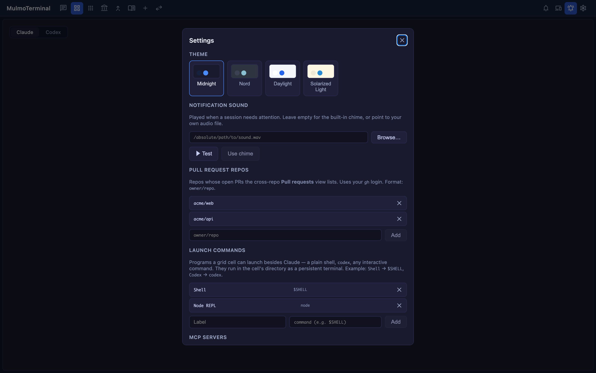
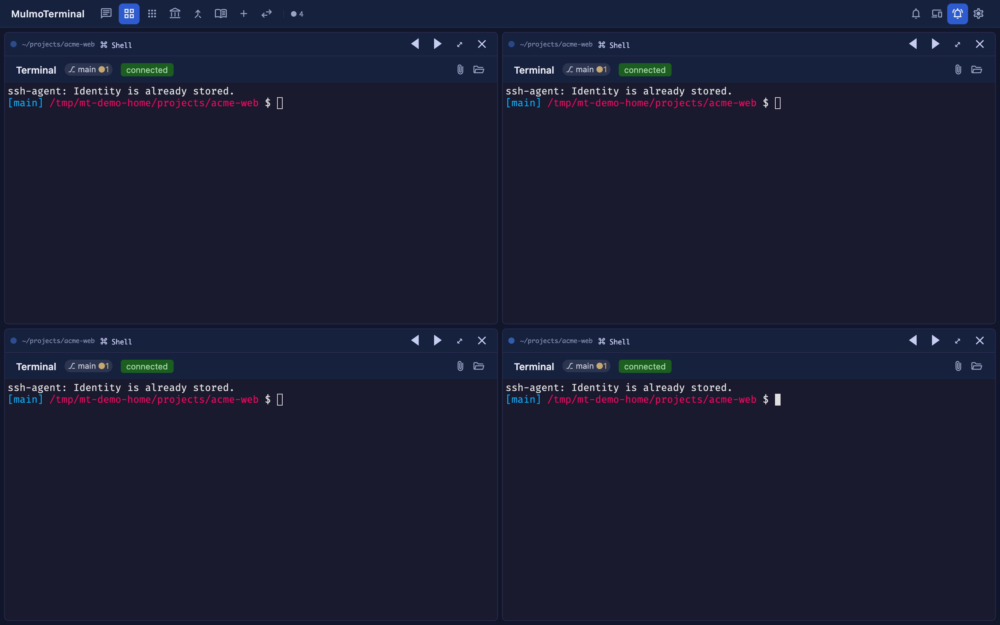

# 2.2.0 で変わったこと
{: .no_toc }

**2026-07-27 時点。** このページはリリース時点のスナップショットです。あとから変わるものに
ついては、リンク先の本編ガイドを見てください。

- TOC
{:toc}

---

## ターミナルの隣でファイルを編集する

アプリ内のファイルエクスプローラは、これまで**全画面**でした。ファイルを読むために、その
ファイルを読む理由になったターミナルを覆う、という状態です。隣に置けるようになりました。

**4 ステップで試せます。**

1. グリッドでセルを **⤢** で拡大します。
2. ヘッダーに**フォルダ**アイコンが出ます。押すと拡大領域が割れて、左がターミナル、右が
   エクスプローラ + エディタになります。root は**そのセルのディレクトリ**です。
3. 区切りをドラッグして幅を変えます。クリックしてから **←/→**・**Home**・**End** でも動きます。
4. 拡大を別のターミナルに移してみてください（ズームのキー、またはフィルムストリップの
   サムネイル）。ペインもついていき、**離れたセルで開いていたものを覚えています**。

開閉状態と幅はブラウザごとに記憶されます。ズームの**2 つの表示**（ロースターと
フィルムストリップ）どちらでも動きます。ロースター表示では 3 カラムになるのでノート PC では
窮屈です。幅がほしければツールバーの表示切り替えでフィルムストリップにしてください。

全画面ビューは無くなっていません。**Files** ヘッダーボタンや、エージェントが出力したファイル
パスのクリックから、これまでどおり開きます。

### フォルダアイコンが出ないとき

**Files** ボタンとペインのトグルは別物ですが、どちらもセルのヘッダーが要ります。
`~/.mulmoterminal/config.json` で `buttons` を設定していると、それが既定のセットを**丸ごと
置き換えます** — このリリース以前に書いた設定には、そもそも Files ボタンが入っていません。
足してください:

```json
{ "id": "files", "icon": "folder_open", "label": "Browse files in the app", "run": "open", "open": { "files": "${dir}" } }
```

そのあとサーバーを再起動します。`buttons` は起動時にメモリへ読み込まれ、更新されるのは
Settings の保存時だけです。ボタンの記法は[設定ガイド](config.html)にあります。


## エージェントとの編集競合に対して安全になった

こちらは有効化する UI がありません。エディタは**エージェントが同じファイルを書いている**
ディレクトリで動くので、その足元で 3 つ変わりました。

**保存がエージェントの書き込みを上書きしなくなりました。** ファイルを開くと version を記録し、
保存時にそれを送ります。その間にディスク側が変わっていれば保存は拒否され、バナーで
「読み直す」か「このまま上書き」を選べます。これ以前は「ファイルを開く → Claude が書き換える
→ ⌘S」で、**Claude が書いた内容が黙って消えていました**。

**開いているファイルから離れると保存されます。** 別ファイルを開く / 拡大を移す / ペインを
閉じる / 画面を離れる / タブを閉じる。ダイアログは出ません。なぜなら —

**エディタが触ったファイルは 3 世代残ります**。`~/.mulmoterminal/backups/` に、ファイルを
開いたときと、上書きする直前に取ります。**プロジェクト外**なので、`.bak` が `git status` や
エージェントの視界に入ることはありません。

```
~/.mulmoterminal/backups/<hash>/
  source.txt                     # どのファイルのものか
  <timestamp>-<n>-<name>.bak     # 新しい方から 3 つ
```

知っておくと良いこと: 3 世代は「3 日分」ではなく「3 回の保存分」です。同じファイルを何度か
開いて編集すると、古いものから押し出されます。バージョン管理下のファイルなら、取り消しは
`git` の方が確実です。

**そして、保存する前に変更に気づきます。** 開いているファイルがディスク上で動いたとき、
Claude が書いたなら即座に、それ以外でも 30 秒以内に拾います（Codex・`git`・ビルド・他の
エディタはこちらです）。編集していなければペインが新しい内容をそのまま取り込みます —
エージェントの作業が見える生きたビューになります。編集中なら、勝手に決めずにバナーを出します。

## マウスでページが拡大しなくなった

`Ctrl`+ホイールとトラックパッドのピンチは、これまでページ全体を拡大し、レイアウトも
ターミナルの fit も一緒に引きずっていました。どちらも無視します。キーボードのズーム
（`Cmd`/`Ctrl` `+` / `-`）は意図して使えば効きますし、スマホの指ピンチはそのままです。

ターミナルの文字を大きくしたいときは Settings のフォントサイズか、ディレクトリの
`.mulmoterminal.json` の `fontSize` を使ってください。こちらは PTY に再 fit が伝わります
（ブラウザのズームでは伝わりませんでした）。

## キーボードでのコピー / ペースト

[`keymap`](config.html#keymap) に `copy` と `paste` の 2 アクションが増え
ました。**既定では何も割り当てていません** — 割り当てたキーは、下にいるターミナルから奪う
ことになるからです。`~/.mulmoterminal/config.json` に:

```json
{
  "keymap": {
    "copy": "Ctrl+Shift+C",
    "paste": "Ctrl+Shift+V"
  }
}
```

## 通知音を種類ごとに

**finished** と **waiting** で音を鳴らし分けられるようになり、それぞれ個別に切れます。
プリセット音源が同梱されたので、自前のファイルを用意する必要もありません。
[通知](notifications.html)を参照してください。

あわせて修正が 1 つ。**サブエージェント**の完了で「呼ばれている」通知が飛ばなくなりました
（メインがまだ動いている最中に鳴っていたのが、長時間の実行で通知の嵐になる原因でした）。



## グリッドの並び順を自分で決める

ディレクトリの `.mulmoterminal.json` の `orderPriority` が、そのセルがグリッドのどこに座るかを
決めます（小さい方が先）。設定していないディレクトリはこれまでどおりです。

```json
{ "orderPriority": 10 }
```



## 細かいもの

- **Shell / Command セル**にもディレクトリ名バッジが出て、そのディレクトリのテーマとフォントに
  従うようになりました（ターミナルセルは以前からそうでした）。
- **`addDirs`**（`.mulmoterminal.json`）でエージェントに `--add-dir` を追加で渡せます。
- **ターミナルのフォントが設定可能**になり（`fontFamily`）、既定のスタックに CJK フェイスが
  入りました。ターミナルの日本語で罫線がずれることがなくなります。
- **コレクションを Google カレンダーへ push** できます。
- 狭いセルで **git チップ**が潰れて「空のバッジ」に見える問題と、リクエスト失敗時に
  サーバーが返した理由ではなく一般的なエラーが出る問題を直しました。

---

本編は[ガイド](index.html)です。このページは 2026-07-27 に変わったことだけを扱います。
**何が・なぜ**変わったかは
[changelog](https://github.com/receptron/mulmoterminal/blob/main/docs/ChangeLog.md) にあります。
