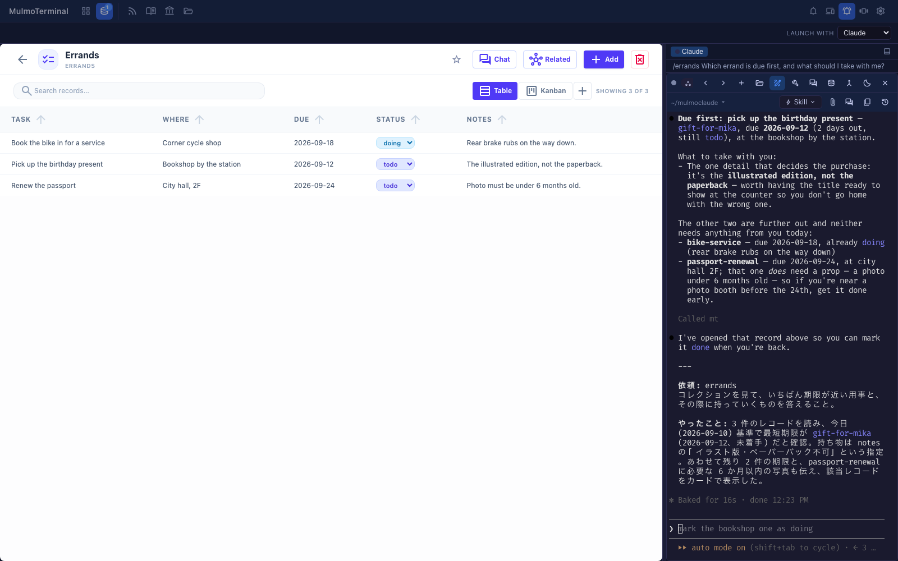
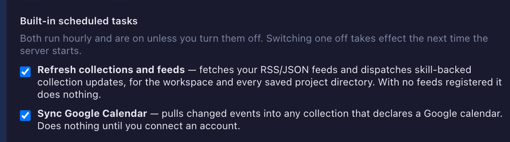

# 4.19.0 — コレクションを見たまま、そのチャットを進める

**4.19.0（2026-09-10 リリース）時点のスナップショットです。** アプリが進むにつれて古くなります
——それは織り込み済みで、生きたリファレンスは各節からリンクしているガイドの方です。

```bash
npx mulmoterminal@latest
```

**ここに書いてあることに、オンにする必要のあるものはありません。** 画面の形が変わったものが 2 つ、
壊れていて直ったものが 2 つ。後者の片方は**あなたのプロジェクトにファイルを書き続けていた**ので、
直っているか確かめる価値があります。

## コレクションのペイン: チャットを始めても、読んでいたものが閉じない

コレクションのカードやテンプレートからチャットを始めると、セッションがグリッドセルに置かれて
画面が移動し、**読んでいたコレクションがその場で閉じて**いました。

これからは、チャットは変わらず普通のグリッドセルのまま、コレクションを開いている間はその
**同じ端末**をコレクションの下のペインで操作します。コピーでも受け渡しでもありません。セルを
ペインへ *Teleport* しているだけで、これは拡大したセルをズーム表示へ動かしているのと同じ仕組みです。
ソケットも xterm もスクロールバックも 1 つのまま、描かれる場所だけが変わります。



- **複数のチャットはタブ**になります。色も 1 行要約も、コクピットのロースターと同じものです。
  **Collections** ボタンには開いている数が出ます。
- **下と横のどちらにも置けます。** それぞれ別々に大きさを覚えます。ドラッグでもキーボードでも
  リサイズできます。
- **リロードしても残ります。** どのチャットがどのコレクションのものかはブラウザが覚えています。
- **「Move to the grid」は無くなりました。** 動かすものがもうありません。グリッドを開けば、同じ
  セッションがそのセルに居ます。

コレクション以外から始めたチャット（Settings の skill ボタンなど）は、従来どおりグリッドへ移動します。

→ リファレンス: [コレクションと GUI パネル](features.html)。

## コレクション発のセルに、どのコレクションかが出る

コレクションから開いたチャットはワークスペースで動くので、**どれも同じプロジェクトの favicon** に
なっていました。グリッドに何枚か並ぶと、どのセルがどのコレクションの用で開いたのか読めません。

セルのヘッダーに、**そのコレクション自身のアイコン**が出るようになりました。ステータスドットの
すぐ後ろ、タイル表示でも拡大表示でも、ロースターとフィルムストリップでも同じです。

セルのタイトルのすぐ左を見てください。これまで全部おなじだったところに、コレクションごとの
グリフと差し色が出ます — Collections ランチャーで見えているのと同じアイコンです。

**設定は要りません。** ブラウザ側の推測でもありません。コレクションはセッション開始時に一度だけ
解決されてサーバ側にセッションと並べて記録されるので、リロードしても、別のタブでも、スマホから
見ても正しいままです。プロジェクトの favicon はそのまま残しています——「どのディレクトリか」と
「どのコレクションか」は別の問いだからです。

→ リファレンス: [セルのヘッダー](header-reference.html)。

## 修正: 固まったセルを直すボタンが、セルを殺していた

固まったセルの修復を押して、**前より完全に無反応になった**経験があるなら、原因はこれです。
入っているか確かめる価値があります。

canvas renderer の dispose が例外を投げていて（コンソールの
`Cannot read properties of undefined (reading 'onShowLinkUnderline')` — 見た目に反して**ノイズでは
ありませんでした**）、修復の経路がそれを catch していませんでした。ソケットを繋ぎ直す行が実行されず、
**接続先の無い真新しい端末**だけが残っていたわけです。

**入っているかの確かめ方:** ブラウザのコンソールを開いた状態でセルを修復してみてください。
4.19.0 では `onShowLinkUnderline` のエラーが出ず、セルはプロンプトが動く状態で戻ります。
オンにするものはありません。

## 修正: MulmoTerminal が自分の状態をあなたのプロジェクトに書いていた

これはファイルが残るので、確認する価値がいちばん高いものです。

`npx mulmoterminal` は**実行したディレクトリ**をワークスペースにします。これまではそこへ
MulmoTerminal 自身の記録が書かれていました:

```
<あなたのプロジェクト>/config/scheduler/state.json
<あなたのプロジェクト>/data/scheduler/logs/
<あなたのプロジェクト>/data/notifier/
```

消しても無駄でした——1 時間以内に定期タスクがまた書いていたからです。

これらは `~/.mulmoterminal/workspaces/<workspace-key>/` の下、ワークスペースごとに 1 ディレクトリで
持つようになりました。**managed ワークスペース**（`~/mulmoclaude`、または
`MULMOCLAUDE_WORKSPACE_PATH`）だけは意図的に変えていません。MulmoClaude が同じファイルを読むためです。

**入っているかの確かめ方:** MulmoTerminal を動かしたことのないディレクトリで
`npx mulmoterminal@latest` を実行し、少し待ってから中を見てください。4.19.0 では何も増えません。

**古いバージョンが残したものの片付け方:**

```bash
# 古いバージョンを動かしたプロジェクトディレクトリで
rm -f  config/scheduler/state.json
rm -rf data/scheduler data/notifier
```

**`config/scheduler/tasks.json` は消さないでください。** これはあなたが書くファイルで、今も
ワークスペースから読まれています。消すと登録した定期タスクが消えます。空になった
`config/scheduler/` と `data/` は、他にあなたのものが入っていなければ消して構いません。

## 新しい設定: 組み込みの定期タスクを切る

1 時間ごとに動く組み込みタスクが 2 つあります。**コレクション/フィードの更新**と
**Google カレンダーの同期**です。フィードを登録しておらず Google も繋いでいなければ何もしませんが、
それでも動いていて、止める手段がありませんでした。

`~/.mulmoterminal/config.json` に:

```json
{
  "feedRefreshEnabled": false,
  "calendarSyncEnabled": false
}
```

または **Settings → Sessions** の *Built-in scheduled tasks* でチェックを外します:



- **どちらも既定でオン**で、明示的に `false` と書いたときだけ切れます。キーが無い場合——4.19.0 より
  前に書かれた設定はすべてこれです——は動いたままなので、アップグレードで挙動は変わりません。
- **反映はサーバの次回起動から。** スケジューラは起動時に一度だけタスクを登録するためです。
- **あなた自身の定期タスクには影響しません。** `config/scheduler/tasks.json` で有効にしてある
  ものは、組み込みを 3 つとも切っても登録され、動き続けます。
- どちらのタスクもトークンを消費しません。消費するのは定期の**開発作業ログ**（エージェントの
  セッションを起動します）で、そちらには以前から `worklogEnabled` という専用のスイッチがあります。

→ リファレンス: [設定](config.html)。

## そのほか

- 依存の更新: Markdown パーサ、スキーマ検証、`@types/node`、コード解析、TypeScript の lint 一式。
- Codex 自動レビューの CI は、PR ごとではなく必要なときに手で回す形になりました。

---

このリリースの全変更の詳細: [ChangeLog](https://github.com/receptron/mulmoterminal/blob/main/docs/ChangeLog.md)。
