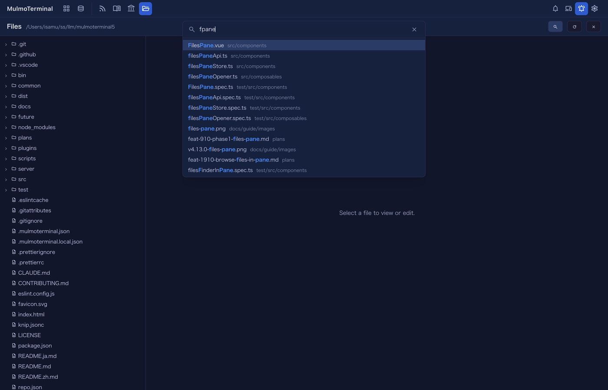
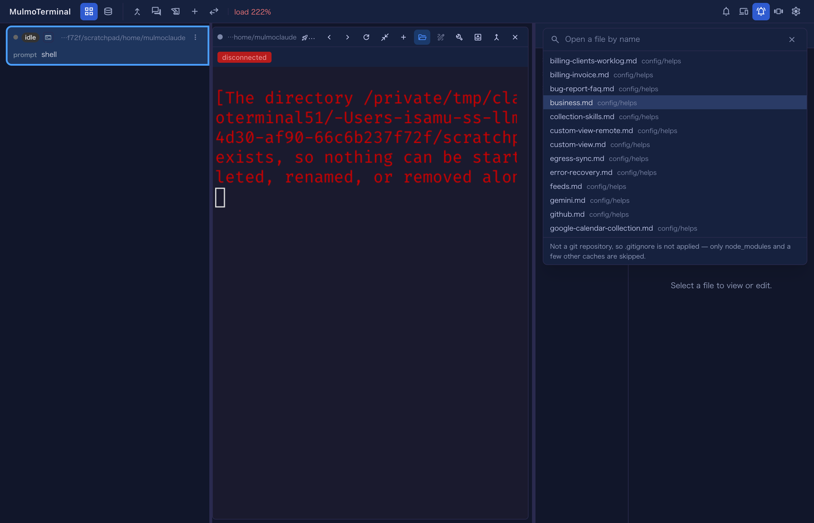

# 4.27.0 — ファイルペインで、ファイル名から開く

**4.27.0 時点のスナップショットです（2026-09-17 リリース）。** アプリが進めば古くなります — それは
織り込み済みで、生きているリファレンスは各節からリンクしているガイドのほうです。

**機能を使うだけなら設定は要りません。** ボタンがあるので、上げればそこにあります:

```bash
npx mulmoterminal@latest
```

キーボードショートカットだけは任意で、[その節](#bind-a-key)がこのページで唯一
設定ファイルを触るところです。

---

## 何ができるようになったか {#the-feature}

ファイルツリーはディレクトリを 1 階層ずつ開きます。探しながら見るときはそれでよいのですが、
**名前は分かっていてディレクトリだけ思い出せない**ときには向いていません。打てば済むはずのものに
たどり着くために、ツリーを順番に歩くことになります。

ペインのヘッダーに**検索ボタン**が入りました。押して、名前やパスの一部を打って、候補から選びます。



使う前に知っておくとよいことが 3 つあります。

**あいまい一致で、順位には意図があります。** 名前の連続した一部を打つ必要はありません。`fpane` で
`FilesPane.vue` に当たりますし、`srccompfp` でも当たります。順位は、**文字が途切れずに続くこと**、
**語の先頭に当たること**（`/` `-` `_` `.` の直後、または camelCase の切れ目）、そして
**ディレクトリ側ではなくファイル名そのものに当たること**を優先します。当たった文字は色が付くので、
なぜその行がそこにいるのかが見て分かります。

**選ぶと、ツリーもそのファイルの位置まで開きます。** 「開く」ではなく「見せる」です —— 探していた
ファイルの**周辺**へ移るにはツリーが要るので、ツリーを閉じたまま開いても元の場所に取り残されます。

**上下キーと Enter が使えます。** クリックでも選べます。`Esc` は何も開かずに閉じます。`Home` と
`End` は入力欄のもの（カーソル移動）のままです。

生きているリファレンスは[基本編 → ファイルツリー](basics.html)です。

## 候補に「出ていないもの」について {#not-in-the-list}

黙って取りこぼす検索は、何も見つからない検索より質が悪いので、**一覧が全部ではないときはパネルが
そう言います**。下に出る但し書きは 2 種類あります。

**「Not a git repository, so .gitignore is not applied — only node_modules and a few other caches
are skipped.」** git リポジトリなら候補は git 自身から取るので、効いている `.gitignore` は
すべて尊重されます —— ルートのものも、階層の途中に置いたものも、`.git/info/exclude` も、
グローバル設定も。`node_modules` は出てきません。**git リポジトリでないディレクトリ**にはその
判断をしてくれる相手がいないので、ツリーをそのまま走査します。除外されるのは、手では書かない
ディレクトリの短いリストだけです。

**「The finder may not be listing every file here.」** 一覧には上限があり、走査には予算があります。
どちらかで打ち切られた場合、短い一覧を「全部」と読ませないためにこの但し書きが出ます。名前をもう
少し絞れば出てきます。

## キーを割り当てる {#bind-a-key}

既定の割り当てはありません。割り当てたキーは、ターミナルの中で動いているプログラムに届かなく
なるからです。`~/.mulmoterminal/config.json` の
[`keymap`](config.html#keymap) に追加してください:

```json
{
  "keymap": {
    "zoom-toggle": "F8",
    "files-find": "F9"
  }
}
```

サーバを再起動してタブを再読み込みすると、`F9` で検索パネルが開きます。**Files ペインを開いて
いない状態**で押した場合は、いま見ているターミナルのディレクトリで**ペインごと開いて**から
検索欄が出ます。



キーを選ぶときに 2 点:

- **`files-find` は拡大中のターミナルを必要とします。** Files ペインは拡大した行にしか無いためです。
  上の例に `zoom-toggle` が入っているのはそのためで、拡大する手段を割り当てていないと、
  ショートカットにはペインを置く場所がありません。何も拡大していないときは、変なことをせずに
  キーをターミナルへ通します。
- **`Cmd+P` は使えません。** ブラウザが印刷に取っています。`Ctrl+P` もターミナルの中では
  シェルの履歴（前の行）なので向きません。ファンクションキーか `Ctrl+Alt+P` あたりが現実的です。

[設定の「キーボードショートカット」](config.html#keymap)には、割り当ての有無にかかわらず全アクションが
並びます。**ショートカットを設定する…** ボタンを押すと、既にある割り当てや、ブラウザ / Mac が
届けてくれない組み合わせと突き合わせたうえで、エージェントが書き込みます。

## 入っているかの見分け方 {#how-to-tell}

Files ペインを開いて（ターミナルのヘッダーの**フォルダ**ボタン、またはツールバーの **Files**）、
ヘッダーを見てください。再読み込みボタンの隣に**虫めがね**があれば 4.27.0 です。

## そのほかの変更 {#also}

どれも、あなたの側ですることはありません。

- **Windows の描画テストの不安定さが、無関係な PR を止めなくなりました。** ラスタライズの 3 ケースが
  Windows の日次実行の約 4 割で落ちており、必須チェックでも落ちることがあったため、描画と何の関係も
  ない PR がそれで止まることがありました。影響があったのは開発側だけです。
- **ヘッドレスのプレビュー実行に、全体としての制限時間が付きました。** それまでは 1 フェーズずつしか
  制限が無く、「30 秒」と書いてある予算に対して 45 秒使い得る状態でした。
- **Collections のヘッダーボタンが Google Calendar のコレクションを同期できるようになりました。**
  それまで **Sync** を押すと `400 … is not a feed (no ingest config)` が返っていました。
  → [機能編 → コレクションを見たまま進める](features.html)
- **明るいテーマでカーソル位置の文字が読めるようになり**、テーマから xterm のパレット（カーソルの
  2 色・選択範囲の文字色・ANSI 16 色）を
  [`themes[].term`](config.html#theme-term) でそのまま指定できるようになりました。これは 4.26.0 の
  期間に入ったものですが、記録はこちらにあります。
