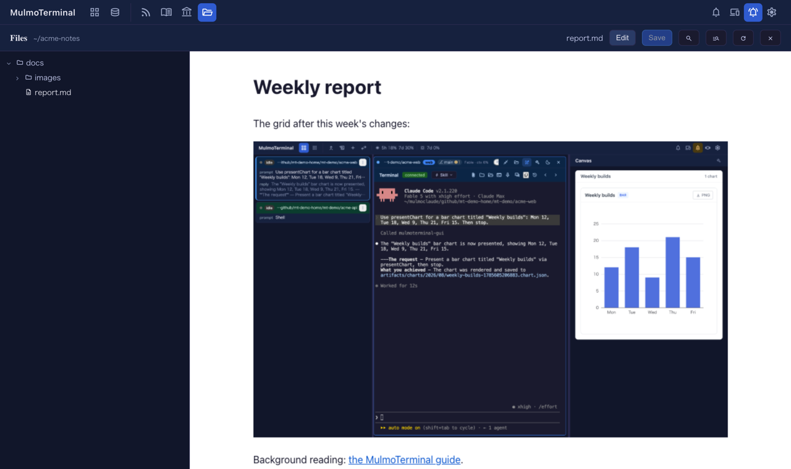

# 6.3.0 — Markdown のプレビューが、書いたとおりに映る

**6.3.0 時点（2026-09-26 リリース）のスナップショットです。** アプリが進むにつれて古くなりますが、それは想定どおりです。常に最新の説明は、各節からリンクしているガイドにあります。

設定は要りません。以下はすべて、拡大したセルの横の Files ペインと、全画面の Files ビューでの話です。

## Markdown のプレビュー

`.md` を開いて **Preview** を押してください。

- **相対パスの画像が出ます。** `` や `` は、これまでプレビューでは画像が壊れていました。今は文書と同じ場所から読み込みます。ペインのルートより上に出るパスの画像と、セルのディレクトリの外から開いた文書の中の画像は、今も出ません。
- **front matter を本文として描きません。** 先頭の `---` で囲んだ YAML（Jekyll・Hugo・Obsidian の書き方）は、これまで区切り線と `title: …` でできた見出しとして出ていました。今は本文から始まります。YAML として読めたときだけ外すので（Canvas と同じ決まり）、ただ `---` の区切り線で始まる文書はそのまま残ります。
- **外部リンクは、ブラウザの新しいタブで開きます。** サイトへのリンクは、これまでプレビューの枠の中で開き、たいていのサイトでは「refused to connect」と出ていました。今はプレビューは文書のまま残ります。プロジェクト内の別ファイルへのリンクは、今までどおりの動きです。
- **未保存の編集もプレビューに映ります。** 未保存の変更があるときに **Preview** を押すと、先に保存してから、保存したファイルを映します。その間にディスク上のファイルが変わっていたら、いつもの衝突のバナーを出して編集画面に留まります。保存に失敗したときは、その理由を出して編集画面に留まります。保存中は Preview ボタンを押せません。

**確かめ方。** front matter と相対パスの画像を含む文書（たとえばこのリポジトリの `docs/guide/ja/basics.md`）を開いて **Preview** を押してください。最初の見出しから始まり、スクリーンショットが表示されます。

mermaid の図と数式は、このプレビューでは今もコードとして出ます。これは意図した動きです。それらはペインの見出しにある **Canvas** で開いてください。

## セルの外のパスも、クリックで開く

エージェントはよく `/tmp` や `~/Downloads`、隣のリポジトリにファイルを書きます。そうしたパスをターミナルでクリックすると、これまでは `{"error":"path escapes the project root"}` と書かれたページが開いていました。今は、文書は描画されて開き、ソースはそのファイルのディレクトリをルートにした全画面の Files ビューで開きます。セルのディレクトリの外にある画像・PDF・動画は、これまでどおり開けません。

一つだけ動きが変わっています。`~/…` のパスは、セルのディレクトリの中にあっても、セルの横のペインでは開かなくなりました。ブラウザには `~` がどこを指すか分からないためです。代わりに新しいタブで開きます。

## 修正: ファイルを開いた直後の Undo

ファイルを開いてすぐに Cmd/Ctrl+Z を押すと、エディタが空になり（あるいは直前に開いていたファイルの中身に戻り）、未保存の印が付いて、次に移るときにペインがそれを保存していました。今は、編集するまで Undo は何もしません。履歴はファイルごとに始まります。

**直っているかの確かめ方。** ファイルを開いて Cmd/Ctrl+Z を押してください。何も変わらず、`●` も付きません。

エディタと保存の仕組みについては [できること](features.html) を参照してください。
