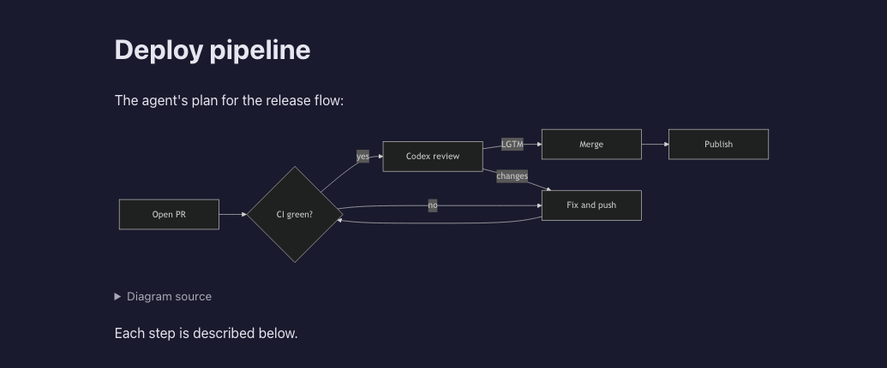

# 9.9.0 — ファイルのプレビューで Mermaid の図が描かれる

**9.9.0（2026-10-10 リリース）時点のスナップショットです。** アプリが変わればこのページは古くなります。それは
想定どおりで、最新の説明は各節がリンクしているガイドにあります。

## 新機能

### mermaid のフェンスがプレビューで図になる

エージェントが書く設計書・計画書・README には、フローチャート、シーケンス図、状態遷移図、クラス図などが
` ```mermaid ` のフェンスで入っていることがよくあります。これまでファイルペインのプレビューではコードのまま表示され、
図を見るには別のツールに貼る必要がありました。これからはその場で描かれます
([#2994](https://github.com/receptron/mulmoterminal/pull/2994)、
[#2991](https://github.com/receptron/mulmoterminal/issues/2991))。



試すには:

1. ` ```mermaid ` のフェンスを含む Markdown を、ファイルペインで開きます。セルのヘッダーの **Files** ボタンか、
   拡大したセルの横のペインです。
2. **Preview** を押します。フェンスごとに図になります。横並び表示でも描かれます。
3. 各図の下に **図のソース** があります。開くと、フェンスがコードブロックとして見え、ほかのコードブロックと同じ
   コピーボタンが付いています。長い文書が読みやすいように、最初は畳まれています。

こうなります:

- 図の色はアプリのテーマに従います。暗いテーマでは暗く、明るいテーマでは明るく描かれます。
- mermaid が読めないフェンスは、図の代わりに赤い文字でエラーが出て、その下にコードが開いたまま残るので、どの行のことか
  分かります。ページのほかの部分には影響しません。
- 最初の図は少し待ちます。mermaid は最初に必要になったときにアプリ自身から読み込まれ、フェンスのある文書でしか
  読み込まれません。図の種類ごとに分けて読み込むので、フローチャートだけの文書が他の種類の分まで取りに行くことは
  ありません。
- 数式はプレビューではこれまでどおりコードのままです。ペインのヘッダーの **Canvas** なら、これまでどおり両方とも描かれます。

設定は要りません。詳しくは: [機能リファレンス](features.html)。

## 画面の変化

- **プレビューの各図の下に「図のソース」の行**が、畳まれた状態で付きます。ほかは動きません。
- ターミナルのパスをクリックして**ブラウザの新しいタブ**に開いた `.md` では、mermaid のフェンスは今までどおりコードのままです。
  あの文書はスクリプトを一切動かさない作りで、それは意図したものです。

## 見えない変化

- **再読み込みしても bracketed paste が保たれます。** 起動時に bracketed paste を有効にしたプログラムは、ブラウザの
  再読み込みや再接続のあとでそれを失い、複数行の貼り付けが 1 行ごとに Enter を押したように届いていました。このモードも
  ほかのモードと一緒に tmux から読み戻すようになりました
  ([#2992](https://github.com/receptron/mulmoterminal/pull/2992)、
  [#2990](https://github.com/receptron/mulmoterminal/issues/2990))。**対応するのは最新の tmux だけです。** この読み戻しには
  tmux 3.7 以降（このリリース時点の最新は 3.8）が必要で、古い tmux では何も起きません。`tmux -V` で確かめてください。
  ディストリビューションのパッケージは最新より古いことがよくあります。設定は要りません。
- **sandbox 付きのプレビューに mermaid が入る仕組み**
  ([#2994](https://github.com/receptron/mulmoterminal/pull/2994)): プレビューのセキュリティポリシーは変えていません。
  アプリが mermaid のファイルを `/api/files/mermaid/` の下で配り、プレビューの文書は自分のスクリプトが元から持っている
  使い捨ての鍵で読み込みます。あなたのファイルの中身がそのスクリプトに渡ることはありません。

詳しくは: [設定](config.html)、[機能一覧](feature-list.html)。

**入っているか確かめるには:** ` ```mermaid ` のフェンスを含む Markdown をファイルペインで開いて Preview を押すと、図が出て、
その下に「図のソース」の行があります。
